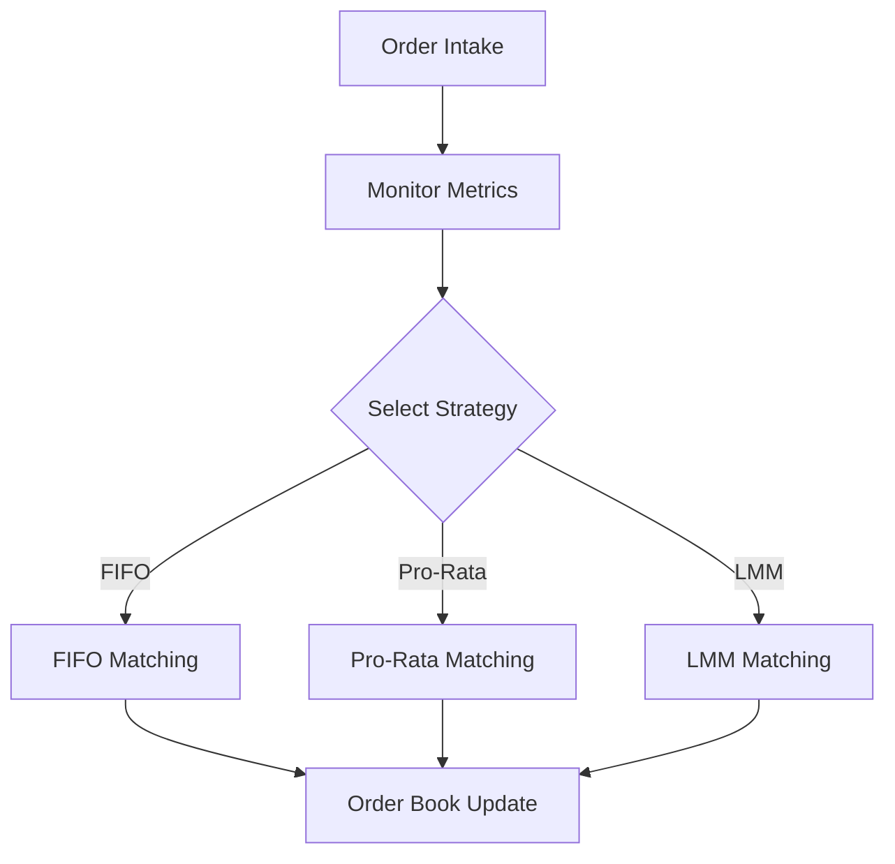

# PinCEX Unified Exchange – Advanced Features Documentation

## Table of Contents
1. Adaptive Matching Engine
    - Overview
    - Matching Strategies (FIFO, Pro-Rata, LMM Migration)
    - Algorithmic Design & Migration Logic
    - Triggers & Decision Criteria
    - Examples Under Market Conditions
    - Diagrams & Flowcharts
    - Troubleshooting & Best Practices
2. AML Risk Algorithms
    - Overview
    - Detection Mechanisms
    - Asynchronous Risk Processing Workflow
    - Circuit-Breaker & Error Handling
    - Diagrams & Flowcharts
    - Troubleshooting & Best Practices
3. WebSocket Sharding
    - Architecture Overview
    - Shard Configuration & Routing
    - Scalability & Tuning
    - Message Replay & Recovery
    - Diagrams & Flowcharts
    - Troubleshooting & Best Practices

---

## 1. Adaptive Matching Engine

### Overview
The PinCEX Adaptive Matching Engine dynamically selects and migrates between multiple order matching strategies to optimize for liquidity, latency, and fairness. Supported strategies include FIFO (First-In-First-Out), Pro-Rata, and Liquidity Maker Migration (LMM).

### Matching Strategies
- **FIFO (First-In-First-Out):**
  - Orders are matched in the order they arrive.
  - Ensures fairness and predictability.
- **Pro-Rata:**
  - Orders at the same price level are matched proportionally to their size.
  - Optimizes for high-liquidity environments.
- **LMM (Liquidity Maker Migration):**
  - Dynamically migrates liquidity to designated market makers during periods of low liquidity or high volatility.
  - Prioritizes stability and tight spreads.

#### Internal Algorithm (Pseudocode)
```
if market_volatility > threshold:
    use LMM
elif order_book_depth > pro_rata_min_depth:
    use Pro-Rata
else:
    use FIFO
```

### Migration Logic & Triggers
- **Triggers:**
  - Sudden changes in order book depth
  - Volatility spikes (measured by price variance)
  - Liquidity provider activity
- **Decision Criteria:**
  - Predefined thresholds for volatility, depth, and spread
  - Real-time monitoring of market conditions
- **Migration Process:**
  1. Monitor metrics in real-time.
  2. On trigger, freeze new order intake momentarily.
  3. Migrate in-memory order book to new matching logic.
  4. Resume order intake and matching.

#### Example: Market Condition Behaviors
- **Stable Market:** FIFO is used for fairness.
- **High Liquidity:** Pro-Rata is activated for efficient matching.
- **Volatile/Thin Market:** LMM is triggered to stabilize spreads.

#### Diagram: Adaptive Matching Flow
```
[Order Intake] → [Monitor Metrics] → [Select Strategy]
                                 ↘
                        [Migration Logic]
                                 ↘
                        [Apply Matching]
```

#### Troubleshooting & Best Practices
- Monitor migration logs for delays or errors.
- Tune thresholds based on historical market data.
- Test migration logic in shadow mode before production rollout.

---

## 2. AML Risk Algorithms

### Overview
PinCEX employs a multi-layered AML and risk management system, combining real-time and asynchronous detection for market abuse and suspicious activity.

### Detection Mechanisms
- **Wash Trading:**
  - Detects self-matching and circular trading patterns.
  - Uses graph analysis and time-windowed order correlation.
- **Spoofing:**
  - Identifies large, rapidly canceled orders that manipulate market perception.
  - Monitors order placement/cancellation ratios and depth impact.
- **Layering:**
  - Detects multiple orders at different price levels designed to mislead.
  - Analyzes order book layering patterns and cancellation clusters.
- **Multi-Factor Risk Scoring:**
  - Aggregates user behavior, trade velocity, counterparty risk, and KYC data.
  - Assigns dynamic risk scores to accounts and transactions.

### Asynchronous Risk Processing Workflow
1. **Event Ingestion:** Trade/order events are queued for risk analysis.
2. **Parallel Processing:** Multiple risk engines process events asynchronously.
3. **Retries:** Failed analyses are retried up to N times with exponential backoff.
4. **Circuit-Breaker:** If error rate exceeds threshold, risk engine enters safe mode and alerts ops.
5. **Error Handling:** All errors are logged with context; critical failures trigger incident response.

#### Diagram: AML Risk Workflow
```
[Event Queue] → [Risk Engine(s)] → [Scoring/Detection]
         ↘                ↘
   [Retry Logic]     [Circuit-Breaker]
```

#### Troubleshooting & Best Practices
- Monitor error and retry logs for persistent failures.
- Regularly update detection rules and scoring models.
- Use shadow mode for new detection logic before enforcement.

---

## 3. WebSocket Sharding

### Architecture Overview
PinCEX uses a hub-spoke sharding model for WebSocket connections, enabling horizontal scaling and high availability.

### Shard Configuration & Routing
- **Shards:** Each shard is a stateless WebSocket server responsible for a subset of users or markets.
- **Hub:** Central router that directs new connections to the appropriate shard based on user ID, market, or load.
- **Routing Logic:**
  - Consistent hashing or round-robin assignment.
  - Supports sticky sessions for stateful subscriptions.

### Scalability & Tuning
- **Horizontal Scaling:** Add/remove shards dynamically based on load.
- **Tuning:**
  - Adjust shard count for peak/off-peak hours.
  - Monitor per-shard connection and message rates.

### Message Replay & Recovery
- **Replay Buffer:** Each shard maintains a rolling buffer of recent messages (e.g., 30s-2min).
- **Recovery:** On reconnect, clients request missed messages from the buffer.
- **Failover:** Hub reroutes clients to healthy shards if a shard fails.

#### Diagram: WebSocket Sharding
```
[Client] → [Hub Router] → [Shard 1] ↔ [Replay Buffer]
                        → [Shard 2] ↔ [Replay Buffer]
                        → [Shard N] ↔ [Replay Buffer]
```

### Troubleshooting & Best Practices
- Monitor shard health and buffer utilization.
- Use automated failover and health checks for shards.
- Tune buffer size to balance memory usage and recovery needs.
- Test recovery and failover scenarios regularly.

---

## Visual Aids
- For production documentation, use tools like [Mermaid](https://mermaid-js.github.io/) or [draw.io] to create and embed diagrams.
- Example Mermaid flowchart for Adaptive Matching:



---

## Production Management Guidelines
- **Monitoring:** Integrate with advanced monitoring (see deployment docs) for all components.
- **Scaling:** Use rolling updates and connection draining for zero-downtime scaling.
- **Updating:** Deploy new logic in shadow/test mode before production.
- **Incident Response:** Document and rehearse recovery procedures for each advanced feature.

---

For further details, see `ZERO_DOWNTIME_DEPLOYMENT.md` and `DEPLOYMENT_RUNBOOK.md`.
