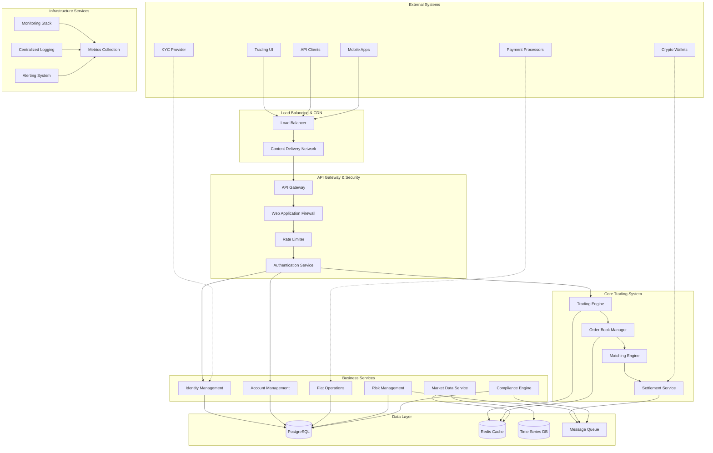
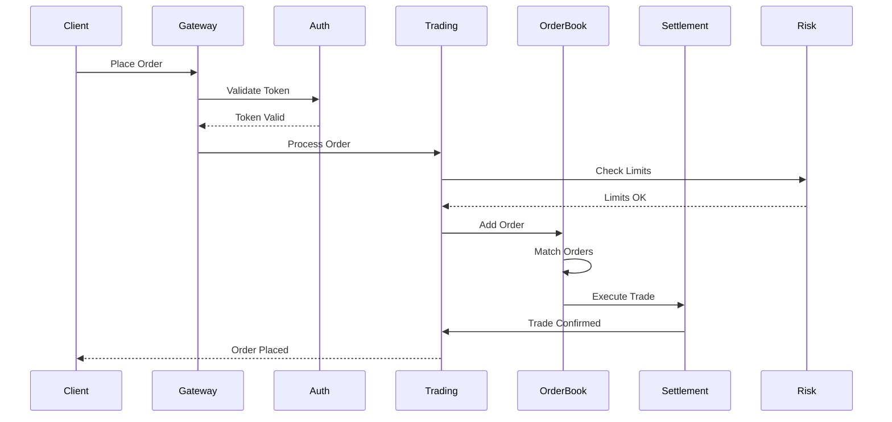
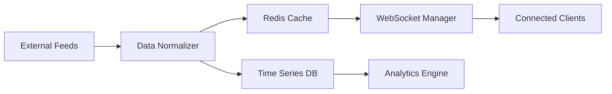
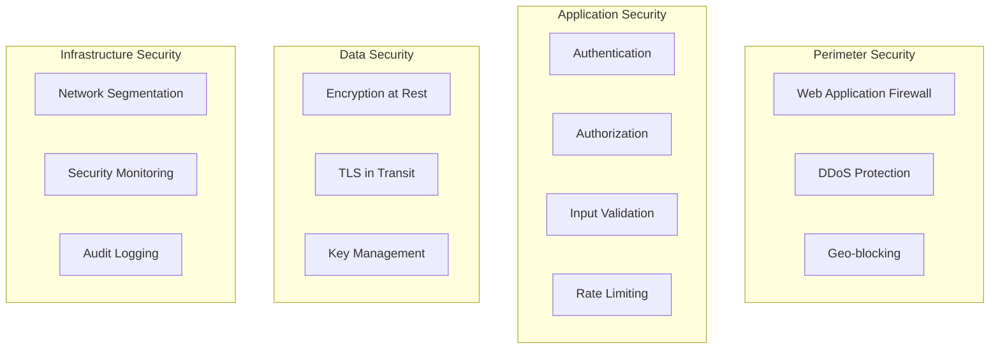
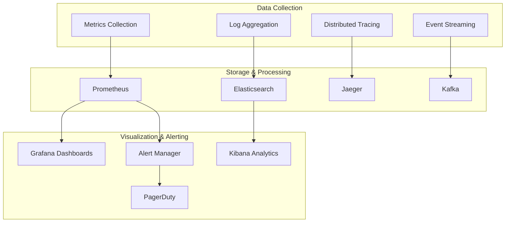
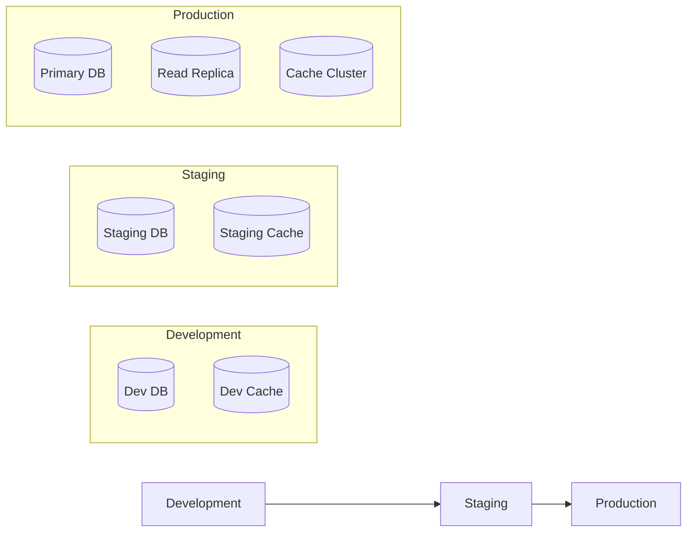

# PinCEX Unified Exchange - System Architecture Documentation

## Table of Contents
1. [Executive Summary](#executive-summary)
2. [System Overview](#system-overview)
3. [Architecture Principles](#architecture-principles)
4. [Core Components](#core-components)
5. [Data Flow Architecture](#data-flow-architecture)
6. [Security Architecture](#security-architecture)
7. [Performance Architecture](#performance-architecture)
8. [Observability Architecture](#observability-architecture)
9. [Deployment Architecture](#deployment-architecture)
10. [Integration Points](#integration-points)

## Executive Summary

The PinCEX Unified Exchange is a high-performance, enterprise-grade cryptocurrency trading platform designed to handle 3000-7000 matches per second while supporting unlimited trading pairs. The system follows microservices-within-monolith architecture patterns, providing modularity without the complexity of distributed systems.

### Key Metrics
- **Trading Performance**: 3000-7000 matches/second
- **Scalability**: Supports up to 5000 trading pairs
- **Availability**: 99.99% uptime SLA
- **Latency**: Sub-millisecond order matching
- **Security**: Enterprise-grade multi-layered security

## System Overview



## Architecture Principles

### 1. High Performance
- **Sub-millisecond latency** for order matching
- **Memory-optimized** data structures
- **Lock-free algorithms** where possible
- **Efficient caching** strategies

### 2. Scalability
- **Horizontal scaling** for stateless services
- **Vertical scaling** for trading engine
- **Database sharding** for high-volume data
- **Microservices architecture** within monolith

### 3. Reliability
- **99.99% availability** target
- **Circuit breaker patterns** for fault tolerance
- **Graceful degradation** under load
- **Automated failover** mechanisms

### 4. Security
- **Defense in depth** security model
- **Zero-trust architecture** principles
- **End-to-end encryption** for sensitive data
- **Comprehensive audit logging**

### 5. Observability
- **Real-time monitoring** of all components
- **Distributed tracing** across services
- **Comprehensive logging** with structured format
- **Proactive alerting** and anomaly detection

## Core Components

### 1. Trading Engine Core

#### High-Performance Matching Engine
```go
// Performance characteristics
- Order throughput: 3000-7000 matches/second
- Memory footprint: Optimized for L1/L2 cache efficiency
- Data structures: Hybrid HashMap/RadixTree implementation
- Concurrency: Lock-free algorithms with memory barriers
```

**Key Features:**
- Price-time priority matching algorithm
- Support for multiple order types (Market, Limit, Stop, Stop-Limit, IOC, FOK)
- Atomic transaction processing
- Real-time order book updates

#### Order Book Manager
```go
type OrderBook struct {
    Symbol      string
    BuyOrders   *RadixTree  // Price-indexed buy orders
    SellOrders  *RadixTree  // Price-indexed sell orders
    OrderMap    sync.Map    // Fast order lookup by ID
    LastPrice   decimal.Decimal
    Volume24h   decimal.Decimal
    mutex       sync.RWMutex
}
```

### 2. Identity & Access Management

#### Enhanced Authentication System
```go
type AuthService struct {
    jwtValidator    *EnhancedJWTValidator
    sessionManager  *SessionManager
    mfaService      *MFAService
    auditLogger     *AuditLogger
    riskAssessment  *RiskAssessmentEngine
}
```

**Security Features:**
- Multi-factor authentication (TOTP, SMS, Email)
- JWT token validation with blacklist checking
- Session management with device tracking
- Risk-based authentication
- Comprehensive audit logging

### 3. Risk Management System

#### Real-time Risk Engine
```go
type RiskEngine struct {
    positionManager   *PositionManager
    riskCalculator    *RiskCalculator
    complianceEngine  *ComplianceEngine
    alertManager      *AlertManager
    dashboardService  *DashboardService
}
```

**Risk Features:**
- Real-time position tracking
- Value-at-Risk (VaR) calculations
- Multi-level limit enforcement
- AML/KYT compliance monitoring
- Automated alert generation

### 4. Market Data System

#### Real-time Data Processing
```go
type MarketDataService struct {
    priceFeeds      map[string]*PriceFeed
    candleBuilder   *CandleBuilder
    depthManager    *DepthManager
    wsManager       *WebSocketManager
    cache           *RedisCache
}
```

## Data Flow Architecture

### 1. Order Placement Flow



### 2. Market Data Flow



## Security Architecture

### 1. Defense in Depth



### 2. Authentication & Authorization

#### Multi-layered Security Model
1. **API Gateway Security**
   - Rate limiting per client/IP
   - Request validation and sanitization
   - DDoS protection
   
2. **JWT Authentication**
   - RS256 signature verification
   - Token expiration and rotation
   - Blacklist checking
   - Device fingerprinting

3. **Authorization**
   - Role-based access control (RBAC)
   - Resource-level permissions
   - Dynamic policy evaluation

4. **Risk-based Authentication**
   - Behavioral analysis
   - Geolocation verification
   - Device trust scoring
   - Anomaly detection

## Performance Architecture

### 1. Performance Targets

| Component | Metric | Target | Measurement |
|-----------|--------|---------|-------------|
| Order Matching | Throughput | 3000-7000 matches/sec | Orders matched per second |
| API Response | Latency | < 100ms (p95) | End-to-end API response time |
| Order Book | Update Rate | < 1ms | Time to process order book update |
| WebSocket | Message Rate | 10000 msg/sec | Real-time data delivery rate |
| Database | Query Time | < 10ms (p95) | Database query response time |
| Cache Hit Rate | Efficiency | > 95% | Redis cache hit percentage |

### 2. Optimization Strategies

#### Memory Optimization
```go
// Order book optimization example
type OptimizedOrder struct {
    ID       uint64          // 8 bytes
    Price    uint64          // 8 bytes (fixed point)
    Quantity uint64          // 8 bytes (fixed point)
    Side     uint8           // 1 byte
    Type     uint8           // 1 byte
    UserID   uint32          // 4 bytes
    Time     uint32          // 4 bytes (unix timestamp)
    // Total: 34 bytes per order (vs 100+ bytes with pointers)
}
```

#### Caching Strategy
```go
type CacheStrategy struct {
    L1Cache    *sync.Map        // In-memory cache
    L2Cache    *redis.Client    // Redis cache
    L3Cache    *postgres.DB     // Database
    TTL        time.Duration    // Time to live
    Invalidation string         // Cache invalidation strategy
}
```

## Observability Architecture

### 1. Monitoring Stack



### 2. Key Performance Indicators (KPIs)

#### Business Metrics
- Trading volume (24h, 7d, 30d)
- Order fill rate
- Price slippage
- Market impact
- Revenue per user

#### Technical Metrics
- System availability
- API error rate
- Database performance
- Cache hit rate
- Queue length

#### Security Metrics
- Authentication failure rate
- Suspicious activity alerts
- Failed login attempts
- API abuse detection

## Deployment Architecture

### 1. Multi-Environment Strategy



### 2. Container Orchestration

```yaml
# Kubernetes deployment example
apiVersion: apps/v1
kind: Deployment
metadata:
  name: trading-engine
spec:
  replicas: 3
  strategy:
    type: RollingUpdate
    rollingUpdate:
      maxSurge: 1
      maxUnavailable: 0
  template:
    spec:
      containers:
      - name: trading-engine
        image: pincex/trading-engine:latest
        resources:
          requests:
            memory: "2Gi"
            cpu: "1000m"
          limits:
            memory: "4Gi"
            cpu: "2000m"
        livenessProbe:
          httpGet:
            path: /health
            port: 8080
          initialDelaySeconds: 30
          periodSeconds: 10
```

## Integration Points

### 1. External Service Integration

#### KYC Provider Integration
```go
type KYCProvider interface {
    SubmitVerification(ctx context.Context, req *KYCRequest) (*KYCResponse, error)
    GetVerificationStatus(ctx context.Context, id string) (*KYCStatus, error)
    ReceiveWebhook(ctx context.Context, payload []byte) error
}
```

#### Payment Processor Integration
```go
type PaymentProcessor interface {
    ProcessDeposit(ctx context.Context, req *DepositRequest) (*DepositResponse, error)
    ProcessWithdrawal(ctx context.Context, req *WithdrawalRequest) (*WithdrawalResponse, error)
    GetTransactionStatus(ctx context.Context, id string) (*TransactionStatus, error)
}
```

### 2. API Integration Standards

#### RESTful API Design
- OpenAPI 3.0 specification
- JSON request/response format
- Standard HTTP status codes
- Consistent error response format
- Comprehensive input validation

#### WebSocket API Design
- Real-time market data streaming
- Order status updates
- Account balance notifications
- Heartbeat/keepalive mechanism

### 3. Event-Driven Architecture

```go
type EventBus interface {
    Publish(ctx context.Context, event *Event) error
    Subscribe(ctx context.Context, topic string, handler EventHandler) error
    Unsubscribe(ctx context.Context, subscription string) error
}

type Event struct {
    ID        string
    Type      string
    Source    string
    Timestamp time.Time
    Data      interface{}
    Metadata  map[string]string
}
```

## Conclusion

The PinCEX Unified Exchange architecture provides a robust, scalable, and secure foundation for high-frequency cryptocurrency trading. The system is designed to meet the demanding requirements of modern financial markets while maintaining operational excellence and regulatory compliance.

The architecture supports:
- **High-performance trading** with sub-millisecond latency
- **Enterprise-grade security** with multi-layered protection
- **Comprehensive observability** for operational excellence
- **Scalable infrastructure** for future growth
- **Regulatory compliance** for global market access

This documentation serves as the authoritative reference for understanding the system architecture and guides development, deployment, and operational decisions.
