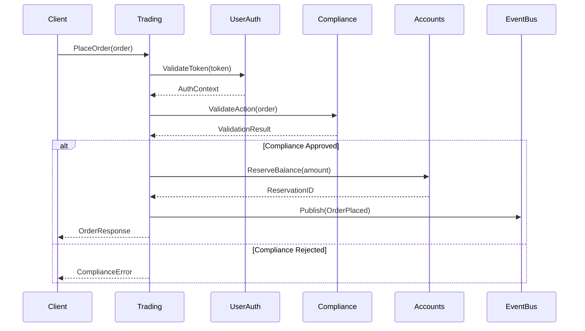
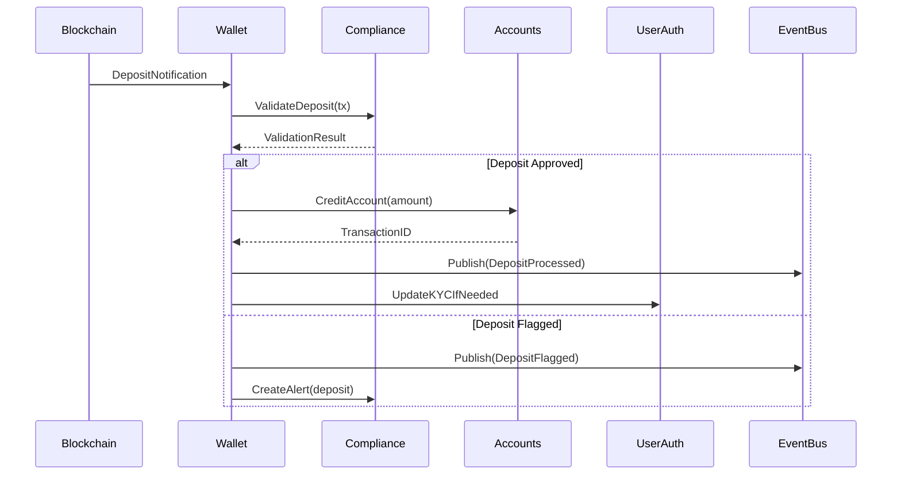

# Pincex Enterprise-Grade Modular Cryptocurrency Exchange - Implementation Blueprint

## Executive Summary

This comprehensive implementation blueprint provides a complete redesign of the Pincex cryptocurrency exchange platform, addressing all critical issues identified in the previous audit while implementing a modern, enterprise-grade modular architecture.

**Key Improvements from Audit Findings:**
- Complete elimination of stub implementations
- Full KYC/AML compliance integration
- Enterprise-grade security framework
- Comprehensive error handling and monitoring
- Production-ready testing infrastructure
- Industry-standard performance optimization

## Architecture Overview

The new Pincex platform is designed as a microservices-based system with 9 distinct modules, each responsible for specific business domains while maintaining clear separation of concerns and high cohesion.

### Module Structure

```
Pincex Platform
├── wallet          # Blockchain operations & Fireblocks integration
├── userauth         # Authentication, JWT, KYC integration
├── trading          # Spot trading, matching engine, order management
├── marketmaking     # Liquidity management & automated strategies
├── fiat             # Fiat operations & payment integrations
├── compliance       # Risk management & fraud detection
├── accounts         # Internal bookkeeping & balance management
├── database         # High-performance data layer
└── infrastructure   # Core infrastructure & observability
```

### Design Principles

1. **Security First**: Every component designed with security as primary concern
2. **Regulatory Compliance**: Built-in compliance with global financial regulations
3. **High Performance**: Optimized for >10,000 trades/second throughput
4. **Fault Tolerance**: Comprehensive error handling and recovery mechanisms
5. **Observability**: Full monitoring, logging, and alerting capabilities
6. **Scalability**: Horizontal and vertical scaling support
7. **Maintainability**: Clean code, comprehensive testing, clear documentation

## Phase 1: Module Architecture Design and Core Functions

### 1.1 Wallet Module

**Purpose**: Manage all blockchain deposit/withdrawal operations with Fireblocks integration

#### Core Functions & Specifications

**1.1.1 Deposit Management**
```go
type DepositManager interface {
    // InitiateDeposit creates a new deposit address for user
    InitiateDeposit(ctx context.Context, req *DepositRequest) (*DepositResponse, error)
    
    // ProcessDeposit handles incoming blockchain deposits
    ProcessDeposit(ctx context.Context, deposit *BlockchainDeposit) error
    
    // GetDepositStatus retrieves current deposit status
    GetDepositStatus(ctx context.Context, depositID string) (*DepositStatus, error)
    
    // ListDeposits returns paginated deposit history
    ListDeposits(ctx context.Context, userID string, filter *DepositFilter) (*DepositList, error)
}

type DepositRequest struct {
    UserID      string    `json:"user_id" validate:"required,uuid"`
    Currency    string    `json:"currency" validate:"required,oneof=BTC ETH USDT"`
    Network     string    `json:"network" validate:"required"`
    Amount      *big.Int  `json:"amount,omitempty"`
    ExpiresAt   time.Time `json:"expires_at,omitempty"`
}

type DepositResponse struct {
    DepositID   string    `json:"deposit_id"`
    Address     string    `json:"address"`
    QRCode      string    `json:"qr_code"`
    ExpiresAt   time.Time `json:"expires_at"`
    MinAmount   *big.Int  `json:"min_amount"`
    Network     string    `json:"network"`
}
```

**Business Logic Requirements:**
- Generate unique deposit addresses per user/currency combination
- Support multi-signature and smart contract deposits
- Implement deposit confirmation thresholds (6 confirmations for BTC, 12 for ETH)
- Handle deposit address reuse policies and expiration
- Integrate with Fireblocks Vault API for address generation

**Security Requirements:**
- All deposit addresses generated through Fireblocks HSM
- Implement deposit amount limits and velocity checks
- Monitor for suspicious deposit patterns
- Encrypt all sensitive data at rest and in transit

**Failover Handling:**
- Retry failed Fireblocks API calls with exponential backoff
- Maintain local cache of deposit addresses for availability
- Implement circuit breaker pattern for external API calls
- Queue deposit processing for offline scenarios

**1.1.2 Withdrawal Management**
```go
type WithdrawalManager interface {
    // InitiateWithdrawal creates withdrawal request with compliance checks
    InitiateWithdrawal(ctx context.Context, req *WithdrawalRequest) (*WithdrawalResponse, error)
    
    // ProcessWithdrawal executes approved withdrawal through Fireblocks
    ProcessWithdrawal(ctx context.Context, withdrawalID string) error
    
    // CancelWithdrawal cancels pending withdrawal
    CancelWithdrawal(ctx context.Context, withdrawalID string, reason string) error
    
    // GetWithdrawalStatus retrieves withdrawal status and transaction details
    GetWithdrawalStatus(ctx context.Context, withdrawalID string) (*WithdrawalStatus, error)
}

type WithdrawalRequest struct {
    UserID          string            `json:"user_id" validate:"required,uuid"`
    Currency        string            `json:"currency" validate:"required"`
    Amount          *big.Int          `json:"amount" validate:"required,gt=0"`
    DestinationAddr string            `json:"destination_address" validate:"required"`
    Network         string            `json:"network" validate:"required"`
    TwoFactorToken  string            `json:"two_factor_token" validate:"required"`
    Memo            string            `json:"memo,omitempty"`
    Priority        WithdrawalPriority `json:"priority"`
}
```

**Business Logic Requirements:**
- Implement multi-level approval workflow for large withdrawals
- Support batch withdrawal processing for efficiency
- Handle gas fee estimation and optimization
- Implement withdrawal limits based on user KYC level
- Support scheduled and recurring withdrawals

**Security Requirements:**
- Mandatory 2FA verification for all withdrawals
- Implement withdrawal whitelist functionality
- Email/SMS confirmation for new addresses
- Time-locked withdrawals for high-risk users
- Integration with compliance module for AML checks

**1.1.3 Fireblocks Integration Layer**
```go
type FireblocksClient interface {
    // CreateVaultAccount creates new vault account for user
    CreateVaultAccount(ctx context.Context, userID string) (*VaultAccount, error)
    
    // GenerateAddress creates deposit address for specific asset
    GenerateAddress(ctx context.Context, vaultID, assetID string) (*Address, error)
    
    // CreateTransaction initiates blockchain transaction
    CreateTransaction(ctx context.Context, req *TransactionRequest) (*Transaction, error)
    
    // GetTransactionStatus retrieves transaction status
    GetTransactionStatus(ctx context.Context, txID string) (*TransactionStatus, error)
    
    // EstimateFee calculates transaction fees
    EstimateFee(ctx context.Context, req *FeeEstimateRequest) (*FeeEstimate, error)
}
```

**Integration Requirements:**
- Implement Fireblocks SDK with proper error handling
- Support webhook notifications for transaction updates
- Implement transaction signing with MPC technology
- Handle Fireblocks rate limiting and API quotas
- Support both testnet and mainnet configurations

### 1.2 UserAuth Module

**Purpose**: Comprehensive user authentication, profile management, and KYC integration

#### Core Functions & Specifications

**1.2.1 Authentication Management**
```go
type AuthManager interface {
    // Register creates new user account with email verification
    Register(ctx context.Context, req *RegisterRequest) (*RegisterResponse, error)
    
    // Login authenticates user and returns JWT tokens
    Login(ctx context.Context, req *LoginRequest) (*LoginResponse, error)
    
    // RefreshToken generates new access token using refresh token
    RefreshToken(ctx context.Context, refreshToken string) (*TokenResponse, error)
    
    // Logout invalidates user session and tokens
    Logout(ctx context.Context, userID string, tokenID string) error
    
    // ChangePassword updates user password with proper validation
    ChangePassword(ctx context.Context, req *ChangePasswordRequest) error
}

type RegisterRequest struct {
    Email           string `json:"email" validate:"required,email"`
    Password        string `json:"password" validate:"required,min=8,max=128"`
    FirstName       string `json:"first_name" validate:"required,min=1,max=50"`
    LastName        string `json:"last_name" validate:"required,min=1,max=50"`
    CountryCode     string `json:"country_code" validate:"required,iso3166_1_alpha2"`
    PhoneNumber     string `json:"phone_number" validate:"required,e164"`
    DateOfBirth     string `json:"date_of_birth" validate:"required,datetime=2006-01-02"`
    AcceptTerms     bool   `json:"accept_terms" validate:"required,eq=true"`
    ReferralCode    string `json:"referral_code,omitempty"`
}

type LoginRequest struct {
    Email          string `json:"email" validate:"required,email"`
    Password       string `json:"password" validate:"required"`
    TwoFactorToken string `json:"two_factor_token,omitempty"`
    DeviceID       string `json:"device_id" validate:"required"`
    IPAddress      string `json:"ip_address"`
    UserAgent      string `json:"user_agent"`
}
```

**Security Requirements:**
- Implement bcrypt password hashing with cost factor 12
- JWT tokens with RS256 signing and 15-minute access token expiry
- Mandatory 2FA for all users after 7-day grace period
- Device fingerprinting and suspicious login detection
- Rate limiting: 5 failed attempts per email per hour
- Session management with concurrent session limits

**1.2.2 Two-Factor Authentication**
```go
type TwoFactorManager interface {
    // EnableTOTP generates TOTP secret and QR code for user
    EnableTOTP(ctx context.Context, userID string) (*TOTPSetup, error)
    
    // VerifyTOTP validates TOTP token and activates 2FA
    VerifyTOTP(ctx context.Context, userID, token string) (*BackupCodes, error)
    
    // DisableTOTP deactivates 2FA with password confirmation
    DisableTOTP(ctx context.Context, userID, password, token string) error
    
    // ValidateToken verifies TOTP or backup code
    ValidateToken(ctx context.Context, userID, token string) (bool, error)
    
    // RegenerateBackupCodes creates new backup codes
    RegenerateBackupCodes(ctx context.Context, userID string) (*BackupCodes, error)
}

type TOTPSetup struct {
    Secret      string   `json:"secret"`
    QRCodeURL   string   `json:"qr_code_url"`
    BackupCodes []string `json:"backup_codes"`
    Issuer      string   `json:"issuer"`
    AccountName string   `json:"account_name"`
}
```

**Implementation Requirements:**
- Use RFC 6238 TOTP standard with 30-second time windows
- Generate cryptographically secure backup codes (8 codes, 8 characters each)
- Support time drift tolerance (±1 time window)
- Implement backup code usage tracking and regeneration
- Integration with Google Authenticator, Authy, and other TOTP apps

**1.2.3 KYC Integration**
```go
type KYCManager interface {
    // InitiateKYC starts KYC process with third-party provider
    InitiateKYC(ctx context.Context, userID string, level KYCLevel) (*KYCSession, error)
    
    // SubmitDocuments uploads identity documents for verification
    SubmitDocuments(ctx context.Context, req *DocumentSubmission) error
    
    // GetKYCStatus retrieves current verification status
    GetKYCStatus(ctx context.Context, userID string) (*KYCStatus, error)
    
    // HandleWebhook processes KYC provider webhook notifications
    HandleWebhook(ctx context.Context, payload []byte, signature string) error
    
    // UpdateKYCLevel manually updates user KYC level (admin only)
    UpdateKYCLevel(ctx context.Context, userID string, level KYCLevel, reason string) error
}

type KYCLevel int

const (
    KYCLevelNone KYCLevel = iota
    KYCLevelBasic    // Email + Phone verification
    KYCLevelStandard // ID document verification
    KYCLevelAdvanced // Enhanced due diligence
    KYCLevelPro      // Institutional verification
)

type KYCSession struct {
    SessionID   string    `json:"session_id"`
    RedirectURL string    `json:"redirect_url"`
    ExpiresAt   time.Time `json:"expires_at"`
    Level       KYCLevel  `json:"level"`
}
```

**Third-Party Integration (Recommended: Jumio or Onfido)**
- Implement webhook handling for real-time status updates
- Support document types: passport, driver's license, national ID
- Implement liveness detection and biometric verification
- Handle multi-jurisdiction compliance requirements
- Support both web and mobile SDK integration

### 1.3 Trading Module

**Purpose**: High-performance spot trading with advanced matching engine

#### Core Functions & Specifications

**1.3.1 Order Management**
```go
type OrderManager interface {
    // PlaceOrder creates new trading order with validation
    PlaceOrder(ctx context.Context, req *OrderRequest) (*OrderResponse, error)
    
    // CancelOrder cancels active order
    CancelOrder(ctx context.Context, userID, orderID string) error
    
    // CancelAllOrders cancels all orders for user/symbol
    CancelAllOrders(ctx context.Context, userID, symbol string) error
    
    // GetOrder retrieves order details
    GetOrder(ctx context.Context, userID, orderID string) (*Order, error)
    
    // ListOrders returns paginated order history
    ListOrders(ctx context.Context, req *OrderListRequest) (*OrderList, error)
    
    // GetOrderBook returns current order book snapshot
    GetOrderBook(ctx context.Context, symbol string, depth int) (*OrderBook, error)
}

type OrderRequest struct {
    UserID      string          `json:"user_id" validate:"required,uuid"`
    Symbol      string          `json:"symbol" validate:"required,trading_pair"`
    Side        OrderSide       `json:"side" validate:"required,oneof=buy sell"`
    Type        OrderType       `json:"type" validate:"required"`
    Quantity    decimal.Decimal `json:"quantity" validate:"required,gt=0"`
    Price       decimal.Decimal `json:"price,omitempty"`
    TimeInForce TimeInForce     `json:"time_in_force"`
    ClientID    string          `json:"client_id,omitempty"`
    StopPrice   decimal.Decimal `json:"stop_price,omitempty"`
}

type OrderType int

const (
    OrderTypeMarket OrderType = iota
    OrderTypeLimit
    OrderTypeStopLoss
    OrderTypeStopLossLimit
    OrderTypeTakeProfit
    OrderTypeTakeProfitLimit
    OrderTypeIceberg
    OrderTypeOCO // One-Cancels-Other
)
```

**Performance Requirements:**
- Order processing latency: <1ms average, <5ms 99th percentile
- Throughput: >10,000 orders/second sustained
- Order book updates: <100μs for price level changes
- Memory usage: <50MB per trading pair order book
- Support for 1000+ concurrent trading pairs

**1.3.2 Matching Engine**
```go
type MatchingEngine interface {
    // ProcessOrder matches incoming order against order book
    ProcessOrder(ctx context.Context, order *Order) (*MatchResult, error)
    
    // GetOrderBook returns current order book state
    GetOrderBook(symbol string) *OrderBook
    
    // AddTradingPair creates new trading pair
    AddTradingPair(pair *TradingPair) error
    
    // PauseTradingPair temporarily halts trading
    PauseTradingPair(symbol string) error
    
    // ResumeTradingPair resumes trading
    ResumeTradingPair(symbol string) error
}

type MatchResult struct {
    Order       *Order   `json:"order"`
    Trades      []*Trade `json:"trades"`
    RemainingQty decimal.Decimal `json:"remaining_qty"`
    Status      OrderStatus `json:"status"`
    UpdatedAt   time.Time `json:"updated_at"`
}

type Trade struct {
    ID          string          `json:"id"`
    Symbol      string          `json:"symbol"`
    BuyOrderID  string          `json:"buy_order_id"`
    SellOrderID string          `json:"sell_order_id"`
    BuyUserID   string          `json:"buy_user_id"`
    SellUserID  string          `json:"sell_user_id"`
    Price       decimal.Decimal `json:"price"`
    Quantity    decimal.Decimal `json:"quantity"`
    Timestamp   time.Time       `json:"timestamp"`
    TakerSide   OrderSide       `json:"taker_side"`
}
```

**Matching Algorithm Requirements:**
- Price-time priority matching (FIFO at same price level)
- Support for partial fills and order splitting
- Atomic trade execution with rollback capability
- Self-trade prevention for same user orders
- Market impact protection and circuit breakers

**1.3.3 Risk Management Integration**
```go
type TradingRiskManager interface {
    // ValidateOrder checks order against risk parameters
    ValidateOrder(ctx context.Context, order *OrderRequest) error
    
    // CheckPosition validates position limits
    CheckPosition(ctx context.Context, userID, symbol string, qty decimal.Decimal) error
    
    // MonitorExposure tracks user's total exposure
    MonitorExposure(ctx context.Context, userID string) (*ExposureReport, error)
    
    // TriggerCircuitBreaker halts trading on unusual activity
    TriggerCircuitBreaker(ctx context.Context, symbol string, reason string) error
}

type RiskLimits struct {
    MaxOrderSize     decimal.Decimal `json:"max_order_size"`
    MaxPositionSize  decimal.Decimal `json:"max_position_size"`
    MaxDailyVolume   decimal.Decimal `json:"max_daily_volume"`
    MaxOpenOrders    int             `json:"max_open_orders"`
    MinOrderSize     decimal.Decimal `json:"min_order_size"`
    PriceDeviation   decimal.Decimal `json:"price_deviation"` // Max % from market price
}
```

### 1.4 MarketMaking Module

**Purpose**: Automated liquidity provision and market making strategies

#### Core Functions & Specifications

**1.4.1 Liquidity Management**
```go
type LiquidityManager interface {
    // CreateMarketMaker initializes new market making strategy
    CreateMarketMaker(ctx context.Context, req *MarketMakerRequest) (*MarketMaker, error)
    
    // UpdateStrategy modifies existing market making parameters
    UpdateStrategy(ctx context.Context, makerID string, strategy *Strategy) error
    
    // StartMarketMaking begins automated order placement
    StartMarketMaking(ctx context.Context, makerID string) error
    
    // StopMarketMaking halts strategy and cancels orders
    StopMarketMaking(ctx context.Context, makerID string) error
    
    // GetPerformance returns strategy performance metrics
    GetPerformance(ctx context.Context, makerID string, period TimePeriod) (*Performance, error)
}

type MarketMakerRequest struct {
    UserID          string            `json:"user_id" validate:"required,uuid"`
    Symbol          string            `json:"symbol" validate:"required"`
    Strategy        StrategyType      `json:"strategy" validate:"required"`
    Parameters      map[string]interface{} `json:"parameters"`
    MaxInventory    decimal.Decimal   `json:"max_inventory"`
    MinSpread       decimal.Decimal   `json:"min_spread"`
    MaxSpread       decimal.Decimal   `json:"max_spread"`
    OrderSize       decimal.Decimal   `json:"order_size"`
    RefreshInterval time.Duration     `json:"refresh_interval"`
}

type StrategyType int

const (
    StrategyGridTrading StrategyType = iota
    StrategyMeanReversion
    StrategyTrendFollowing
    StrategyArbitrage
    StrategyDeltaNeutral
)
```

**Strategy Implementation Requirements:**
- Grid trading with configurable price levels and spacing
- Mean reversion based on statistical indicators
- Trend following with momentum indicators
- Cross-exchange arbitrage opportunities
- Delta-neutral strategies for reduced directional risk

**1.4.2 Automated Trading Engine**
```go
type AutoTradingEngine interface {
    // ExecuteStrategy runs market making algorithm
    ExecuteStrategy(ctx context.Context, strategy *Strategy) error
    
    // CalculateQuotes determines bid/ask prices and sizes
    CalculateQuotes(ctx context.Context, req *QuoteRequest) (*Quote, error)
    
    // ManageInventory adjusts positions based on inventory levels
    ManageInventory(ctx context.Context, makerID string) error
    
    // HandleMarketData processes real-time market updates
    HandleMarketData(ctx context.Context, data *MarketData) error
}

type Quote struct {
    Symbol    string          `json:"symbol"`
    BidPrice  decimal.Decimal `json:"bid_price"`
    BidSize   decimal.Decimal `json:"bid_size"`
    AskPrice  decimal.Decimal `json:"ask_price"`
    AskSize   decimal.Decimal `json:"ask_size"`
    Spread    decimal.Decimal `json:"spread"`
    Timestamp time.Time       `json:"timestamp"`
}

type MarketData struct {
    Symbol      string          `json:"symbol"`
    LastPrice   decimal.Decimal `json:"last_price"`
    Volume24h   decimal.Decimal `json:"volume_24h"`
    PriceChange decimal.Decimal `json:"price_change"`
    OrderBook   *OrderBook      `json:"order_book"`
    Trades      []*Trade        `json:"recent_trades"`
    Timestamp   time.Time       `json:"timestamp"`
}
```

### 1.5 Fiat Module

**Purpose**: Fiat currency operations and payment processing

#### Core Functions & Specifications

**1.5.1 Fiat Deposit Management**
```go
type FiatDepositManager interface {
    // InitiateDeposit creates fiat deposit request
    InitiateDeposit(ctx context.Context, req *FiatDepositRequest) (*FiatDepositResponse, error)
    
    // ProcessDeposit handles incoming fiat payment
    ProcessDeposit(ctx context.Context, deposit *FiatDeposit) error
    
    // GetDepositStatus retrieves deposit status
    GetDepositStatus(ctx context.Context, depositID string) (*FiatDepositStatus, error)
    
    // ListDeposits returns deposit history
    ListDeposits(ctx context.Context, userID string, filter *DepositFilter) (*FiatDepositList, error)
}

type FiatDepositRequest struct {
    UserID      string          `json:"user_id" validate:"required,uuid"`
    Currency    string          `json:"currency" validate:"required,iso4217"`
    Amount      decimal.Decimal `json:"amount" validate:"required,gt=0"`
    Method      PaymentMethod   `json:"method" validate:"required"`
    ReturnURL   string          `json:"return_url,omitempty"`
}

type PaymentMethod int

const (
    PaymentMethodBankTransfer PaymentMethod = iota
    PaymentMethodCreditCard
    PaymentMethodDebitCard
    PaymentMethodACH
    PaymentMethodSEPA
    PaymentMethodWire
    PaymentMethodApplePay
    PaymentMethodGooglePay
)
```

**Third-Party Integration Requirements:**
- Primary: Stripe Connect for card payments
- Secondary: Plaid for ACH/bank transfers
- Regional: SEPA for European transfers
- Compliance: PCI DSS Level 1 certification required
- Fraud detection: Integration with Stripe Radar

**1.5.2 Fiat Withdrawal Management**
```go
type FiatWithdrawalManager interface {
    // InitiateWithdrawal creates fiat withdrawal request
    InitiateWithdrawal(ctx context.Context, req *FiatWithdrawalRequest) (*FiatWithdrawalResponse, error)
    
    // ProcessWithdrawal executes approved withdrawal
    ProcessWithdrawal(ctx context.Context, withdrawalID string) error
    
    // CancelWithdrawal cancels pending withdrawal
    CancelWithdrawal(ctx context.Context, withdrawalID string, reason string) error
    
    // GetWithdrawalStatus retrieves withdrawal status
    GetWithdrawalStatus(ctx context.Context, withdrawalID string) (*FiatWithdrawalStatus, error)
}

type FiatWithdrawalRequest struct {
    UserID          string          `json:"user_id" validate:"required,uuid"`
    Currency        string          `json:"currency" validate:"required,iso4217"`
    Amount          decimal.Decimal `json:"amount" validate:"required,gt=0"`
    BankAccountID   string          `json:"bank_account_id" validate:"required"`
    TwoFactorToken  string          `json:"two_factor_token" validate:"required"`
    Reference       string          `json:"reference,omitempty"`
}
```

**Compliance Requirements:**
- KYC verification required for all fiat operations
- AML screening for large transactions (>$10,000)
- OFAC sanctions list checking
- Transaction monitoring and reporting
- Bank Secrecy Act (BSA) compliance

### 1.6 Compliance Module

**Purpose**: Risk management, fraud detection, and regulatory compliance

#### Core Functions & Specifications

**1.6.1 Risk Assessment Engine**
```go
type RiskAssessmentEngine interface {
    // AssessUserRisk evaluates user risk profile
    AssessUserRisk(ctx context.Context, userID string) (*RiskProfile, error)
    
    // AssessTransactionRisk evaluates transaction risk
    AssessTransactionRisk(ctx context.Context, tx *Transaction) (*RiskScore, error)
    
    // UpdateRiskParameters modifies risk assessment rules
    UpdateRiskParameters(ctx context.Context, params *RiskParameters) error
    
    // GenerateRiskReport creates compliance report
    GenerateRiskReport(ctx context.Context, req *ReportRequest) (*RiskReport, error)
}

type RiskProfile struct {
    UserID          string          `json:"user_id"`
    RiskLevel       RiskLevel       `json:"risk_level"`
    Score           int             `json:"score"` // 0-100
    Factors         []RiskFactor    `json:"factors"`
    LastUpdated     time.Time       `json:"last_updated"`
    ReviewRequired  bool            `json:"review_required"`
}

type RiskLevel int

const (
    RiskLevelLow RiskLevel = iota
    RiskLevelMedium
    RiskLevelHigh
    RiskLevelCritical
)

type RiskFactor struct {
    Type        string  `json:"type"`
    Description string  `json:"description"`
    Weight      float64 `json:"weight"`
    Value       float64 `json:"value"`
}
```

**Risk Assessment Criteria:**
- Geographic risk (country-based sanctions)
- Transaction velocity and patterns
- Device and IP reputation
- KYC verification level
- Historical compliance violations
- Behavioral analysis and anomaly detection

**1.6.2 Fraud Detection System**
```go
type FraudDetectionSystem interface {
    // DetectFraud analyzes activity for fraudulent patterns
    DetectFraud(ctx context.Context, activity *UserActivity) (*FraudAlert, error)
    
    // ReportSuspiciousActivity files SAR (Suspicious Activity Report)
    ReportSuspiciousActivity(ctx context.Context, report *SARReport) error
    
    // BlockUser temporarily suspends user account
    BlockUser(ctx context.Context, userID string, reason string) error
    
    // WhitelistActivity marks activity as legitimate
    WhitelistActivity(ctx context.Context, activityID string) error
}

type UserActivity struct {
    UserID      string            `json:"user_id"`
    ActivityType ActivityType     `json:"activity_type"`
    Amount      decimal.Decimal   `json:"amount,omitempty"`
    Currency    string            `json:"currency,omitempty"`
    IPAddress   string            `json:"ip_address"`
    DeviceID    string            `json:"device_id"`
    Timestamp   time.Time         `json:"timestamp"`
    Metadata    map[string]interface{} `json:"metadata"`
}

type ActivityType int

const (
    ActivityLogin ActivityType = iota
    ActivityDeposit
    ActivityWithdrawal
    ActivityTrade
    ActivityTransfer
    ActivityPasswordChange
    ActivityKYCSubmission
)
```

**Fraud Detection Rules:**
- Multiple failed login attempts from different IPs
- Unusual trading patterns (pump and dump schemes)
- Rapid succession of deposits and withdrawals
- Geographic impossibility (logins from distant locations)
- Device fingerprint anomalies
- Velocity checks on transaction amounts

**1.6.3 Anti-Bot and Anti-Phishing Protection**
```go
type SecurityProtection interface {
    // DetectBot identifies automated trading behavior
    DetectBot(ctx context.Context, userID string, activity *TradingActivity) (*BotDetection, error)
    
    // ValidateCaptcha verifies human interaction
    ValidateCaptcha(ctx context.Context, token string, action string) error
    
    // CheckPhishingDomain validates domain reputation
    CheckPhishingDomain(ctx context.Context, domain string) (*DomainReputation, error)
    
    // ReportPhishing handles phishing reports from users
    ReportPhishing(ctx context.Context, report *PhishingReport) error
}

type BotDetection struct {
    IsBot       bool      `json:"is_bot"`
    Confidence  float64   `json:"confidence"` // 0.0-1.0
    Indicators  []string  `json:"indicators"`
    Action      BotAction `json:"recommended_action"`
}

type BotAction int

const (
    BotActionAllow BotAction = iota
    BotActionChallenge
    BotActionBlock
    BotActionReview
)
```

### 1.7 Accounts Module

**Purpose**: Internal bookkeeping and balance management

#### Core Functions & Specifications

**1.7.1 Balance Management**
```go
type BalanceManager interface {
    // GetBalance retrieves user balance for specific currency
    GetBalance(ctx context.Context, userID, currency string) (*Balance, error)
    
    // GetAllBalances returns all user balances
    GetAllBalances(ctx context.Context, userID string) (*BalanceSheet, error)
    
    // ReserveBalance locks funds for pending orders
    ReserveBalance(ctx context.Context, req *ReserveRequest) error
    
    // ReleaseReservation unlocks reserved funds
    ReleaseReservation(ctx context.Context, reservationID string) error
    
    // TransferBalance moves funds between accounts
    TransferBalance(ctx context.Context, req *TransferRequest) error
}

type Balance struct {
    UserID      string          `json:"user_id"`
    Currency    string          `json:"currency"`
    Available   decimal.Decimal `json:"available"`
    Reserved    decimal.Decimal `json:"reserved"`
    Total       decimal.Decimal `json:"total"`
    UpdatedAt   time.Time       `json:"updated_at"`
}

type ReserveRequest struct {
    UserID        string          `json:"user_id" validate:"required,uuid"`
    Currency      string          `json:"currency" validate:"required"`
    Amount        decimal.Decimal `json:"amount" validate:"required,gt=0"`
    ReservationType ReservationType `json:"type" validate:"required"`
    ReferenceID   string          `json:"reference_id" validate:"required"`
    ExpiresAt     time.Time       `json:"expires_at,omitempty"`
}

type ReservationType int

const (
    ReservationTypeOrder ReservationType = iota
    ReservationTypeWithdrawal
    ReservationTypeTransfer
    ReservationTypeFee
)
```

**ACID Transaction Requirements:**
- All balance operations must be atomic
- Implement optimistic locking for concurrent updates
- Maintain audit trail for all balance changes
- Support transaction rollback and recovery
- Implement double-entry bookkeeping principles

**1.7.2 Transaction Ledger**
```go
type TransactionLedger interface {
    // RecordTransaction creates new ledger entry
    RecordTransaction(ctx context.Context, tx *LedgerTransaction) error
    
    // GetTransactionHistory returns paginated transaction history
    GetTransactionHistory(ctx context.Context, req *HistoryRequest) (*TransactionHistory, error)
    
    // ReconcileBalances verifies balance integrity
    ReconcileBalances(ctx context.Context, userID string) (*ReconciliationReport, error)
    
    // GenerateStatement creates account statement
    GenerateStatement(ctx context.Context, req *StatementRequest) (*Statement, error)
}

type LedgerTransaction struct {
    ID            string          `json:"id"`
    UserID        string          `json:"user_id"`
    Type          TransactionType `json:"type"`
    Currency      string          `json:"currency"`
    Amount        decimal.Decimal `json:"amount"`
    Balance       decimal.Decimal `json:"balance_after"`
    ReferenceID   string          `json:"reference_id"`
    Description   string          `json:"description"`
    Timestamp     time.Time       `json:"timestamp"`
    Metadata      map[string]interface{} `json:"metadata"`
}

type TransactionType int

const (
    TransactionTypeDeposit TransactionType = iota
    TransactionTypeWithdrawal
    TransactionTypeTrade
    TransactionTypeFee
    TransactionTypeTransfer
    TransactionTypeAdjustment
)
```

### 1.8 Database Module

**Purpose**: High-performance data layer with optimization and high availability

#### Core Functions & Specifications

**1.8.1 Connection Management**
```go
type DatabaseManager interface {
    // GetReadConnection returns read-optimized database connection
    GetReadConnection(ctx context.Context) (*sql.DB, error)
    
    // GetWriteConnection returns write-optimized database connection
    GetWriteConnection(ctx context.Context) (*sql.DB, error)
    
    // GetShardedConnection returns connection for specific shard
    GetShardedConnection(ctx context.Context, shardKey string) (*sql.DB, error)
    
    // ExecuteTransaction runs function within database transaction
    ExecuteTransaction(ctx context.Context, fn func(*sql.Tx) error) error
    
    // HealthCheck verifies database connectivity and performance
    HealthCheck(ctx context.Context) (*DatabaseHealth, error)
}

type DatabaseConfig struct {
    // Primary database configuration
    Primary struct {
        Host     string `yaml:"host"`
        Port     int    `yaml:"port"`
        Database string `yaml:"database"`
        Username string `yaml:"username"`
        Password string `yaml:"password"`
        SSLMode  string `yaml:"ssl_mode"`
    } `yaml:"primary"`
    
    // Read replica configuration
    ReadReplicas []struct {
        Host     string `yaml:"host"`
        Port     int    `yaml:"port"`
        Weight   int    `yaml:"weight"` // Load balancing weight
    } `yaml:"read_replicas"`
    
    // Connection pool settings
    Pool struct {
        MaxOpenConns    int           `yaml:"max_open_conns"`
        MaxIdleConns    int           `yaml:"max_idle_conns"`
        ConnMaxLifetime time.Duration `yaml:"conn_max_lifetime"`
        ConnMaxIdleTime time.Duration `yaml:"conn_max_idle_time"`
    } `yaml:"pool"`
}
```

**Performance Requirements:**
- Read queries: <10ms average response time
- Write queries: <50ms average response time
- Connection pool: 100 max connections per instance
- Query timeout: 30 seconds maximum
- Support for 10,000+ concurrent connections

**1.8.2 Caching Layer**
```go
type CacheManager interface {
    // Get retrieves value from cache
    Get(ctx context.Context, key string) ([]byte, error)
    
    // Set stores value in cache with TTL
    Set(ctx context.Context, key string, value []byte, ttl time.Duration) error
    
    // Delete removes value from cache
    Delete(ctx context.Context, key string) error
    
    // GetMulti retrieves multiple values
    GetMulti(ctx context.Context, keys []string) (map[string][]byte, error)
    
    // SetMulti stores multiple values
    SetMulti(ctx context.Context, items map[string][]byte, ttl time.Duration) error
    
    // Invalidate removes cache entries by pattern
    Invalidate(ctx context.Context, pattern string) error
}

type CacheConfig struct {
    Redis struct {
        Addresses []string `yaml:"addresses"` // Redis cluster nodes
        Password  string   `yaml:"password"`
        DB        int      `yaml:"db"`
        
        // Connection pool settings
        PoolSize     int           `yaml:"pool_size"`
        MinIdleConns int           `yaml:"min_idle_conns"`
        DialTimeout  time.Duration `yaml:"dial_timeout"`
        ReadTimeout  time.Duration `yaml:"read_timeout"`
        WriteTimeout time.Duration `yaml:"write_timeout"`
        
        // Cluster settings
        MaxRetries      int           `yaml:"max_retries"`
        RetryBackoff    time.Duration `yaml:"retry_backoff"`
        FailoverTimeout time.Duration `yaml:"failover_timeout"`
    } `yaml:"redis"`
    
    // Cache policies
    Policies struct {
        UserData    time.Duration `yaml:"user_data_ttl"`
        OrderBook   time.Duration `yaml:"order_book_ttl"`
        MarketData  time.Duration `yaml:"market_data_ttl"`
        Balances    time.Duration `yaml:"balances_ttl"`
    } `yaml:"policies"`
}
```

**Caching Strategy:**
- L1 Cache: In-memory application cache (5-minute TTL)
- L2 Cache: Redis cluster (1-hour TTL for user data)
- Cache-aside pattern for read operations
- Write-through caching for critical data
- Cache warming for frequently accessed data

**1.8.3 Data Partitioning and Sharding**
```go
type ShardingManager interface {
    // GetShardForUser determines shard for user data
    GetShardForUser(userID string) (int, error)
    
    // GetShardForSymbol determines shard for trading pair
    GetShardForSymbol(symbol string) (int, error)
    
    // ExecuteShardedQuery runs query across multiple shards
    ExecuteShardedQuery(ctx context.Context, query string, args []interface{}) (*ShardedResult, error)
    
    // RebalanceShards redistributes data across shards
    RebalanceShards(ctx context.Context, plan *RebalancePlan) error
}

type ShardingStrategy int

const (
    ShardingByUserID ShardingStrategy = iota
    ShardingBySymbol
    ShardingByTimestamp
    ShardingByHash
)
```

### 1.9 Infrastructure Module

**Purpose**: Core infrastructure, networking, deployment, and observability

#### Core Functions & Specifications

**1.9.1 Service Discovery and Load Balancing**
```go
type ServiceDiscovery interface {
    // RegisterService registers service instance
    RegisterService(ctx context.Context, service *ServiceInstance) error
    
    // DeregisterService removes service instance
    DeregisterService(ctx context.Context, serviceID string) error
    
    // DiscoverServices finds available service instances
    DiscoverServices(ctx context.Context, serviceName string) ([]*ServiceInstance, error)
    
    // HealthCheck performs service health verification
    HealthCheck(ctx context.Context, serviceID string) (*HealthStatus, error)
}

type ServiceInstance struct {
    ID       string            `json:"id"`
    Name     string            `json:"name"`
    Address  string            `json:"address"`
    Port     int               `json:"port"`
    Tags     []string          `json:"tags"`
    Metadata map[string]string `json:"metadata"`
    Health   HealthStatus      `json:"health"`
}

type LoadBalancer interface {
    // SelectInstance chooses service instance using load balancing algorithm
    SelectInstance(ctx context.Context, serviceName string) (*ServiceInstance, error)
    
    // UpdateWeights modifies load balancing weights
    UpdateWeights(ctx context.Context, weights map[string]int) error
    
    // SetStrategy changes load balancing strategy
    SetStrategy(strategy LoadBalancingStrategy) error
}

type LoadBalancingStrategy int

const (
    StrategyRoundRobin LoadBalancingStrategy = iota
    StrategyWeightedRoundRobin
    StrategyLeastConnections
    StrategyIPHash
    StrategyRandom
)
```

**1.9.2 Monitoring and Observability**
```go
type ObservabilityManager interface {
    // RecordMetric records custom metric
    RecordMetric(ctx context.Context, metric *Metric) error
    
    // CreateAlert defines monitoring alert
    CreateAlert(ctx context.Context, alert *AlertRule) error
    
    // SendNotification dispatches alert notification
    SendNotification(ctx context.Context, notification *Notification) error
    
    // GetMetrics retrieves metrics for time range
    GetMetrics(ctx context.Context, query *MetricQuery) (*MetricResult, error)
}

type Metric struct {
    Name      string            `json:"name"`
    Value     float64           `json:"value"`
    Tags      map[string]string `json:"tags"`
    Timestamp time.Time         `json:"timestamp"`
    Type      MetricType        `json:"type"`
}

type MetricType int

const (
    MetricTypeCounter MetricType = iota
    MetricTypeGauge
    MetricTypeHistogram
    MetricTypeSummary
)

type AlertRule struct {
    Name        string        `json:"name"`
    Query       string        `json:"query"`
    Condition   string        `json:"condition"`
    Threshold   float64       `json:"threshold"`
    Duration    time.Duration `json:"duration"`
    Severity    AlertSeverity `json:"severity"`
    Recipients  []string      `json:"recipients"`
}
```

**Monitoring Stack:**
- Metrics: Prometheus with custom exporters
- Logging: ELK Stack (Elasticsearch, Logstash, Kibana)
- Tracing: Jaeger for distributed tracing
- Alerting: AlertManager with PagerDuty integration
- Dashboards: Grafana with custom dashboards

**1.9.3 Configuration Management**
```go
type ConfigurationManager interface {
    // GetConfig retrieves configuration value
    GetConfig(ctx context.Context, key string) (interface{}, error)
    
    // SetConfig updates configuration value
    SetConfig(ctx context.Context, key string, value interface{}) error
    
    // WatchConfig monitors configuration changes
    WatchConfig(ctx context.Context, key string) (<-chan ConfigChange, error)
    
    // ValidateConfig verifies configuration integrity
    ValidateConfig(ctx context.Context, config map[string]interface{}) error
}

type ConfigChange struct {
    Key       string      `json:"key"`
    OldValue  interface{} `json:"old_value"`
    NewValue  interface{} `json:"new_value"`
    Timestamp time.Time   `json:"timestamp"`
}
```

**Configuration Sources:**
- Environment variables for secrets
- Consul KV store for dynamic configuration
- Kubernetes ConfigMaps for static configuration
- Vault for sensitive configuration data
- Git repository for version-controlled configuration


## Phase 2: Integration and Interface Requirements Design

### 2.1 Inter-Module Communication Architecture

The Pincex platform uses a hybrid communication model combining synchronous API calls for real-time operations and asynchronous event-driven messaging for non-blocking processes.

#### 2.1.1 Communication Patterns

**Synchronous Communication (gRPC)**
- Used for: Real-time queries, critical operations requiring immediate response
- Modules: UserAuth ↔ Trading, Accounts ↔ Trading, Compliance ↔ All modules
- Timeout: 5 seconds maximum
- Retry policy: 3 attempts with exponential backoff

**Asynchronous Communication (Message Queue)**
- Used for: Event notifications, background processing, audit logging
- Technology: Apache Kafka with 3 brokers minimum
- Topics: Partitioned by module and event type
- Retention: 7 days for events, 30 days for audit logs

**Direct Database Access**
- Limited to: Same-module operations only
- Cross-module: Prohibited (must use APIs)
- Transactions: Distributed transactions via 2PC protocol

#### 2.1.2 Service Mesh Architecture

```go
type ServiceMesh interface {
    // RegisterService adds service to mesh
    RegisterService(ctx context.Context, service *ServiceDefinition) error
    
    // RouteRequest handles inter-service routing
    RouteRequest(ctx context.Context, req *ServiceRequest) (*ServiceResponse, error)
    
    // ApplyPolicy enforces security and traffic policies
    ApplyPolicy(ctx context.Context, policy *TrafficPolicy) error
    
    // GetServiceHealth returns service health metrics
    GetServiceHealth(ctx context.Context, serviceName string) (*HealthMetrics, error)
}

type ServiceDefinition struct {
    Name        string            `json:"name"`
    Version     string            `json:"version"`
    Endpoints   []Endpoint        `json:"endpoints"`
    Dependencies []string         `json:"dependencies"`
    Policies    []PolicyRef       `json:"policies"`
    Metadata    map[string]string `json:"metadata"`
}

type TrafficPolicy struct {
    ServiceName     string        `json:"service_name"`
    RateLimiting    *RateLimit    `json:"rate_limiting,omitempty"`
    CircuitBreaker  *CircuitBreaker `json:"circuit_breaker,omitempty"`
    Retry          *RetryPolicy   `json:"retry,omitempty"`
    Timeout        time.Duration  `json:"timeout,omitempty"`
}
```

### 2.2 Module Integration Specifications

#### 2.2.1 UserAuth ↔ All Modules Integration

**Authentication Flow:**
```go
type AuthenticationMiddleware struct {
    userAuthClient UserAuthServiceClient
    cache         CacheManager
    logger        *zap.Logger
}

func (m *AuthenticationMiddleware) ValidateRequest(ctx context.Context, req *http.Request) (*AuthContext, error) {
    // Extract JWT token from Authorization header
    token := extractBearerToken(req.Header.Get("Authorization"))
    if token == "" {
        return nil, ErrMissingToken
    }
    
    // Check cache first for performance
    cacheKey := fmt.Sprintf("auth:token:%s", hashToken(token))
    if cached, err := m.cache.Get(ctx, cacheKey); err == nil {
        var authCtx AuthContext
        if err := json.Unmarshal(cached, &authCtx); err == nil {
            return &authCtx, nil
        }
    }
    
    // Validate token with UserAuth service
    validateReq := &ValidateTokenRequest{Token: token}
    resp, err := m.userAuthClient.ValidateToken(ctx, validateReq)
    if err != nil {
        return nil, fmt.Errorf("token validation failed: %w", err)
    }
    
    authCtx := &AuthContext{
        UserID:      resp.UserID,
        Email:       resp.Email,
        Permissions: resp.Permissions,
        KYCLevel:    resp.KYCLevel,
        ExpiresAt:   resp.ExpiresAt,
    }
    
    // Cache valid token for 5 minutes
    if cached, err := json.Marshal(authCtx); err == nil {
        m.cache.Set(ctx, cacheKey, cached, 5*time.Minute)
    }
    
    return authCtx, nil
}

type AuthContext struct {
    UserID      string    `json:"user_id"`
    Email       string    `json:"email"`
    Permissions []string  `json:"permissions"`
    KYCLevel    int       `json:"kyc_level"`
    ExpiresAt   time.Time `json:"expires_at"`
}
```

**Permission Validation:**
```go
type PermissionValidator interface {
    // HasPermission checks if user has specific permission
    HasPermission(ctx context.Context, userID, permission string) (bool, error)
    
    // RequireKYCLevel validates minimum KYC level
    RequireKYCLevel(ctx context.Context, userID string, minLevel KYCLevel) error
    
    // CheckRateLimit validates user rate limits
    CheckRateLimit(ctx context.Context, userID, action string) error
}

// Permission constants
const (
    PermissionTrade           = "trade"
    PermissionWithdraw        = "withdraw"
    PermissionDeposit         = "deposit"
    PermissionViewBalance     = "view_balance"
    PermissionManageProfile   = "manage_profile"
    PermissionAdminAccess     = "admin_access"
)
```

#### 2.2.2 Trading ↔ Accounts Integration

**Balance Reservation Flow:**
```go
type TradingAccountsIntegration struct {
    accountsClient AccountsServiceClient
    eventBus      EventBus
    logger        *zap.Logger
}

func (t *TradingAccountsIntegration) ProcessOrderPlacement(ctx context.Context, order *Order) error {
    // Calculate required balance for order
    requiredBalance := t.calculateRequiredBalance(order)
    
    // Reserve balance atomically
    reserveReq := &ReserveBalanceRequest{
        UserID:      order.UserID,
        Currency:    order.QuoteCurrency,
        Amount:      requiredBalance,
        OrderID:     order.ID,
        ReservationType: ReservationTypeOrder,
        ExpiresAt:   time.Now().Add(24 * time.Hour),
    }
    
    resp, err := t.accountsClient.ReserveBalance(ctx, reserveReq)
    if err != nil {
        return fmt.Errorf("insufficient balance: %w", err)
    }
    
    order.ReservationID = resp.ReservationID
    
    // Publish order placement event
    event := &OrderPlacedEvent{
        OrderID:       order.ID,
        UserID:        order.UserID,
        Symbol:        order.Symbol,
        Amount:        order.Quantity,
        ReservationID: resp.ReservationID,
        Timestamp:     time.Now(),
    }
    
    return t.eventBus.Publish(ctx, "trading.order.placed", event)
}

func (t *TradingAccountsIntegration) ProcessTrade(ctx context.Context, trade *Trade) error {
    // Start distributed transaction
    txID := uuid.New().String()
    
    // Update buyer balance
    buyerUpdate := &BalanceUpdateRequest{
        TransactionID: txID,
        UserID:       trade.BuyerID,
        Updates: []BalanceChange{
            {
                Currency: trade.BaseCurrency,
                Amount:   trade.Quantity,
                Type:     BalanceChangeTypeCredit,
            },
            {
                Currency: trade.QuoteCurrency,
                Amount:   trade.Total.Neg(),
                Type:     BalanceChangeTypeDebit,
            },
        },
    }
    
    // Update seller balance
    sellerUpdate := &BalanceUpdateRequest{
        TransactionID: txID,
        UserID:       trade.SellerID,
        Updates: []BalanceChange{
            {
                Currency: trade.BaseCurrency,
                Amount:   trade.Quantity.Neg(),
                Type:     BalanceChangeTypeDebit,
            },
            {
                Currency: trade.QuoteCurrency,
                Amount:   trade.Total,
                Type:     BalanceChangeTypeCredit,
            },
        },
    }
    
    // Execute atomic balance updates
    if err := t.executeAtomicBalanceUpdate(ctx, txID, buyerUpdate, sellerUpdate); err != nil {
        return fmt.Errorf("trade settlement failed: %w", err)
    }
    
    // Publish trade executed event
    event := &TradeExecutedEvent{
        TradeID:   trade.ID,
        BuyerID:   trade.BuyerID,
        SellerID:  trade.SellerID,
        Symbol:    trade.Symbol,
        Quantity:  trade.Quantity,
        Price:     trade.Price,
        Timestamp: time.Now(),
    }
    
    return t.eventBus.Publish(ctx, "trading.trade.executed", event)
}
```

#### 2.2.3 Wallet ↔ Accounts Integration

**Deposit Processing Flow:**
```go
type WalletAccountsIntegration struct {
    accountsClient AccountsServiceClient
    complianceClient ComplianceServiceClient
    eventBus       EventBus
    logger         *zap.Logger
}

func (w *WalletAccountsIntegration) ProcessDeposit(ctx context.Context, deposit *BlockchainDeposit) error {
    // Validate deposit with compliance module
    complianceReq := &ValidateTransactionRequest{
        UserID:    deposit.UserID,
        Type:      TransactionTypeDeposit,
        Currency:  deposit.Currency,
        Amount:    deposit.Amount,
        Source:    deposit.FromAddress,
        TxHash:    deposit.TransactionHash,
    }
    
    complianceResp, err := w.complianceClient.ValidateTransaction(ctx, complianceReq)
    if err != nil {
        return fmt.Errorf("compliance validation failed: %w", err)
    }
    
    if complianceResp.Status == ComplianceStatusBlocked {
        // Handle blocked deposit
        return w.handleBlockedDeposit(ctx, deposit, complianceResp.Reason)
    }
    
    // Credit user account
    creditReq := &CreditAccountRequest{
        UserID:      deposit.UserID,
        Currency:    deposit.Currency,
        Amount:      deposit.Amount,
        Type:        TransactionTypeDeposit,
        ReferenceID: deposit.TransactionHash,
        Description: fmt.Sprintf("Blockchain deposit - %s", deposit.TransactionHash),
        Metadata: map[string]interface{}{
            "blockchain":     deposit.Blockchain,
            "confirmations":  deposit.Confirmations,
            "from_address":   deposit.FromAddress,
            "to_address":     deposit.ToAddress,
        },
    }
    
    _, err = w.accountsClient.CreditAccount(ctx, creditReq)
    if err != nil {
        return fmt.Errorf("account credit failed: %w", err)
    }
    
    // Publish deposit processed event
    event := &DepositProcessedEvent{
        DepositID:       deposit.ID,
        UserID:          deposit.UserID,
        Currency:        deposit.Currency,
        Amount:          deposit.Amount,
        TransactionHash: deposit.TransactionHash,
        Confirmations:   deposit.Confirmations,
        Timestamp:       time.Now(),
    }
    
    return w.eventBus.Publish(ctx, "wallet.deposit.processed", event)
}
```

#### 2.2.4 Compliance ↔ All Modules Integration

**Real-time Risk Assessment:**
```go
type ComplianceIntegration struct {
    riskEngine    RiskAssessmentEngine
    fraudDetector FraudDetectionSystem
    eventBus      EventBus
    logger        *zap.Logger
}

func (c *ComplianceIntegration) ValidateUserAction(ctx context.Context, req *ActionValidationRequest) (*ValidationResult, error) {
    // Assess user risk profile
    riskProfile, err := c.riskEngine.AssessUserRisk(ctx, req.UserID)
    if err != nil {
        return nil, fmt.Errorf("risk assessment failed: %w", err)
    }
    
    // Check for fraudulent patterns
    activity := &UserActivity{
        UserID:       req.UserID,
        ActivityType: req.ActivityType,
        Amount:       req.Amount,
        Currency:     req.Currency,
        IPAddress:    req.IPAddress,
        DeviceID:     req.DeviceID,
        Timestamp:    time.Now(),
        Metadata:     req.Metadata,
    }
    
    fraudAlert, err := c.fraudDetector.DetectFraud(ctx, activity)
    if err != nil {
        c.logger.Error("Fraud detection failed", zap.Error(err))
        // Continue with elevated risk score
        riskProfile.Score += 20
    }
    
    result := &ValidationResult{
        UserID:      req.UserID,
        ActionType:  req.ActivityType,
        RiskScore:   riskProfile.Score,
        RiskLevel:   riskProfile.RiskLevel,
        Approved:    true,
        Conditions:  []string{},
        Timestamp:   time.Now(),
    }
    
    // Apply risk-based controls
    switch riskProfile.RiskLevel {
    case RiskLevelHigh:
        result.Conditions = append(result.Conditions, "enhanced_monitoring")
        if req.Amount.GreaterThan(decimal.NewFromFloat(10000)) {
            result.Conditions = append(result.Conditions, "manual_review")
        }
    case RiskLevelCritical:
        result.Approved = false
        result.Reason = "High risk user - manual review required"
    }
    
    // Check fraud alerts
    if fraudAlert != nil && fraudAlert.IsBot {
        switch fraudAlert.Action {
        case BotActionBlock:
            result.Approved = false
            result.Reason = "Automated behavior detected"
        case BotActionChallenge:
            result.Conditions = append(result.Conditions, "captcha_required")
        }
    }
    
    // Publish compliance event
    event := &ComplianceValidationEvent{
        UserID:     req.UserID,
        Action:     req.ActivityType,
        RiskScore:  riskProfile.Score,
        Approved:   result.Approved,
        Conditions: result.Conditions,
        Timestamp:  time.Now(),
    }
    
    c.eventBus.Publish(ctx, "compliance.validation.completed", event)
    
    return result, nil
}

type ActionValidationRequest struct {
    UserID       string                 `json:"user_id"`
    ActivityType ActivityType           `json:"activity_type"`
    Amount       decimal.Decimal        `json:"amount,omitempty"`
    Currency     string                 `json:"currency,omitempty"`
    IPAddress    string                 `json:"ip_address"`
    DeviceID     string                 `json:"device_id"`
    Metadata     map[string]interface{} `json:"metadata"`
}

type ValidationResult struct {
    UserID      string      `json:"user_id"`
    ActionType  ActivityType `json:"action_type"`
    RiskScore   int         `json:"risk_score"`
    RiskLevel   RiskLevel   `json:"risk_level"`
    Approved    bool        `json:"approved"`
    Reason      string      `json:"reason,omitempty"`
    Conditions  []string    `json:"conditions"`
    Timestamp   time.Time   `json:"timestamp"`
}
```

### 2.3 Event-Driven Architecture

#### 2.3.1 Event Bus Implementation

```go
type EventBus interface {
    // Publish sends event to specified topic
    Publish(ctx context.Context, topic string, event interface{}) error
    
    // Subscribe registers event handler for topic
    Subscribe(ctx context.Context, topic string, handler EventHandler) error
    
    // Unsubscribe removes event handler
    Unsubscribe(ctx context.Context, topic string, handlerID string) error
    
    // CreateTopic creates new event topic
    CreateTopic(ctx context.Context, config *TopicConfig) error
}

type EventHandler interface {
    Handle(ctx context.Context, event *Event) error
    GetID() string
}

type Event struct {
    ID        string                 `json:"id"`
    Type      string                 `json:"type"`
    Source    string                 `json:"source"`
    Subject   string                 `json:"subject"`
    Data      interface{}            `json:"data"`
    Timestamp time.Time              `json:"timestamp"`
    Metadata  map[string]interface{} `json:"metadata"`
}

type TopicConfig struct {
    Name              string        `json:"name"`
    Partitions        int           `json:"partitions"`
    ReplicationFactor int           `json:"replication_factor"`
    RetentionPeriod   time.Duration `json:"retention_period"`
    CompactionPolicy  string        `json:"compaction_policy"`
}
```

#### 2.3.2 Event Topics and Schemas

**Core Event Topics:**
```yaml
topics:
  # User Authentication Events
  userauth.user.registered:
    schema: UserRegisteredEvent
    partitions: 3
    retention: 30d
    
  userauth.user.login:
    schema: UserLoginEvent
    partitions: 3
    retention: 7d
    
  userauth.kyc.updated:
    schema: KYCUpdatedEvent
    partitions: 3
    retention: 365d
    
  # Trading Events
  trading.order.placed:
    schema: OrderPlacedEvent
    partitions: 10
    retention: 30d
    
  trading.order.matched:
    schema: OrderMatchedEvent
    partitions: 10
    retention: 30d
    
  trading.trade.executed:
    schema: TradeExecutedEvent
    partitions: 10
    retention: 365d
    
  # Wallet Events
  wallet.deposit.received:
    schema: DepositReceivedEvent
    partitions: 5
    retention: 365d
    
  wallet.withdrawal.initiated:
    schema: WithdrawalInitiatedEvent
    partitions: 5
    retention: 365d
    
  # Compliance Events
  compliance.alert.generated:
    schema: ComplianceAlertEvent
    partitions: 3
    retention: 2555d # 7 years
    
  compliance.transaction.flagged:
    schema: TransactionFlaggedEvent
    partitions: 3
    retention: 2555d # 7 years
```

**Event Schemas:**
```go
type UserRegisteredEvent struct {
    UserID      string    `json:"user_id"`
    Email       string    `json:"email"`
    CountryCode string    `json:"country_code"`
    Timestamp   time.Time `json:"timestamp"`
    IPAddress   string    `json:"ip_address"`
    UserAgent   string    `json:"user_agent"`
}

type OrderPlacedEvent struct {
    OrderID       string          `json:"order_id"`
    UserID        string          `json:"user_id"`
    Symbol        string          `json:"symbol"`
    Side          OrderSide       `json:"side"`
    Type          OrderType       `json:"type"`
    Quantity      decimal.Decimal `json:"quantity"`
    Price         decimal.Decimal `json:"price,omitempty"`
    ReservationID string          `json:"reservation_id"`
    Timestamp     time.Time       `json:"timestamp"`
}

type TradeExecutedEvent struct {
    TradeID     string          `json:"trade_id"`
    BuyOrderID  string          `json:"buy_order_id"`
    SellOrderID string          `json:"sell_order_id"`
    BuyerID     string          `json:"buyer_id"`
    SellerID    string          `json:"seller_id"`
    Symbol      string          `json:"symbol"`
    Quantity    decimal.Decimal `json:"quantity"`
    Price       decimal.Decimal `json:"price"`
    BuyerFee    decimal.Decimal `json:"buyer_fee"`
    SellerFee   decimal.Decimal `json:"seller_fee"`
    Timestamp   time.Time       `json:"timestamp"`
}
```

### 2.4 Data Flow Specifications

#### 2.4.1 Order Placement Flow



#### 2.4.2 Deposit Processing Flow



### 2.5 Security Boundaries and Authentication

#### 2.5.1 Inter-Service Authentication

```go
type ServiceAuthenticator interface {
    // GenerateServiceToken creates JWT for service-to-service communication
    GenerateServiceToken(ctx context.Context, serviceID string, scopes []string) (*ServiceToken, error)
    
    // ValidateServiceToken verifies service token
    ValidateServiceToken(ctx context.Context, token string) (*ServiceClaims, error)
    
    // RefreshServiceToken generates new token before expiry
    RefreshServiceToken(ctx context.Context, oldToken string) (*ServiceToken, error)
}

type ServiceToken struct {
    Token     string    `json:"token"`
    ExpiresAt time.Time `json:"expires_at"`
    Scopes    []string  `json:"scopes"`
}

type ServiceClaims struct {
    ServiceID string    `json:"service_id"`
    Scopes    []string  `json:"scopes"`
    IssuedAt  time.Time `json:"issued_at"`
    ExpiresAt time.Time `json:"expires_at"`
}

// Service-to-service authentication middleware
func ServiceAuthMiddleware(authenticator ServiceAuthenticator) gin.HandlerFunc {
    return func(c *gin.Context) {
        token := c.GetHeader("X-Service-Token")
        if token == "" {
            c.AbortWithStatusJSON(401, gin.H{"error": "missing service token"})
            return
        }
        
        claims, err := authenticator.ValidateServiceToken(c.Request.Context(), token)
        if err != nil {
            c.AbortWithStatusJSON(401, gin.H{"error": "invalid service token"})
            return
        }
        
        c.Set("service_id", claims.ServiceID)
        c.Set("service_scopes", claims.Scopes)
        c.Next()
    }
}
```

#### 2.5.2 Data Encryption and Security

```go
type SecurityManager interface {
    // EncryptSensitiveData encrypts PII and financial data
    EncryptSensitiveData(ctx context.Context, data []byte) ([]byte, error)
    
    // DecryptSensitiveData decrypts encrypted data
    DecryptSensitiveData(ctx context.Context, encryptedData []byte) ([]byte, error)
    
    // HashSensitiveData creates one-way hash for lookups
    HashSensitiveData(ctx context.Context, data []byte) (string, error)
    
    // ValidateDataIntegrity verifies data hasn't been tampered
    ValidateDataIntegrity(ctx context.Context, data []byte, signature string) (bool, error)
}

// Encryption configuration
type EncryptionConfig struct {
    // AES-256-GCM for data encryption
    DataEncryption struct {
        Algorithm string `yaml:"algorithm"` // "AES-256-GCM"
        KeyID     string `yaml:"key_id"`
    } `yaml:"data_encryption"`
    
    // RSA-4096 for key exchange
    KeyExchange struct {
        Algorithm string `yaml:"algorithm"` // "RSA-4096"
        PublicKey string `yaml:"public_key"`
    } `yaml:"key_exchange"`
    
    // HMAC-SHA256 for integrity
    Integrity struct {
        Algorithm string `yaml:"algorithm"` // "HMAC-SHA256"
        SecretKey string `yaml:"secret_key"`
    } `yaml:"integrity"`
}
```

### 2.6 Error Propagation and Handling

#### 2.6.1 Standardized Error Format

```go
type ServiceError struct {
    Code      string                 `json:"code"`
    Message   string                 `json:"message"`
    Details   map[string]interface{} `json:"details,omitempty"`
    Timestamp time.Time              `json:"timestamp"`
    TraceID   string                 `json:"trace_id"`
    Service   string                 `json:"service"`
}

func (e *ServiceError) Error() string {
    return fmt.Sprintf("[%s] %s: %s", e.Service, e.Code, e.Message)
}

// Error codes by category
const (
    // Authentication errors (1000-1099)
    ErrCodeInvalidToken     = "AUTH_1001"
    ErrCodeTokenExpired     = "AUTH_1002"
    ErrCodeInsufficientPerm = "AUTH_1003"
    
    // Trading errors (2000-2099)
    ErrCodeInvalidOrder     = "TRADE_2001"
    ErrCodeInsufficientBalance = "TRADE_2002"
    ErrCodeMarketClosed     = "TRADE_2003"
    
    // Compliance errors (3000-3099)
    ErrCodeComplianceBlock  = "COMP_3001"
    ErrCodeKYCRequired      = "COMP_3002"
    ErrCodeSuspiciousActivity = "COMP_3003"
    
    // System errors (9000-9099)
    ErrCodeInternalError    = "SYS_9001"
    ErrCodeServiceUnavailable = "SYS_9002"
    ErrCodeTimeout          = "SYS_9003"
)
```

#### 2.6.2 Circuit Breaker Pattern

```go
type CircuitBreaker interface {
    // Execute runs function with circuit breaker protection
    Execute(ctx context.Context, fn func() (interface{}, error)) (interface{}, error)
    
    // GetState returns current circuit breaker state
    GetState() CircuitState
    
    // Reset manually resets circuit breaker
    Reset() error
}

type CircuitState int

const (
    CircuitStateClosed CircuitState = iota
    CircuitStateOpen
    CircuitStateHalfOpen
)

type CircuitBreakerConfig struct {
    MaxRequests     uint32        `yaml:"max_requests"`
    Interval        time.Duration `yaml:"interval"`
    Timeout         time.Duration `yaml:"timeout"`
    ReadyToTrip     func(counts Counts) bool
    OnStateChange   func(name string, from CircuitState, to CircuitState)
}

// Circuit breaker implementation for inter-service calls
func NewServiceCircuitBreaker(serviceName string, config *CircuitBreakerConfig) CircuitBreaker {
    return &serviceCircuitBreaker{
        name:   serviceName,
        config: config,
        state:  CircuitStateClosed,
        counts: Counts{},
        mutex:  sync.RWMutex{},
    }
}
```

### 2.7 Rate Limiting and Traffic Control

#### 2.7.1 Distributed Rate Limiting

```go
type RateLimiter interface {
    // Allow checks if request is within rate limit
    Allow(ctx context.Context, key string, limit int, window time.Duration) (bool, error)
    
    // AllowN checks if N requests are within rate limit
    AllowN(ctx context.Context, key string, n int, limit int, window time.Duration) (bool, error)
    
    // GetRemaining returns remaining requests in current window
    GetRemaining(ctx context.Context, key string, limit int, window time.Duration) (int, error)
    
    // Reset clears rate limit for key
    Reset(ctx context.Context, key string) error
}

// Rate limiting configuration per service
type RateLimitConfig struct {
    Global struct {
        RequestsPerSecond int `yaml:"requests_per_second"`
        BurstSize        int `yaml:"burst_size"`
    } `yaml:"global"`
    
    PerUser struct {
        RequestsPerMinute int `yaml:"requests_per_minute"`
        RequestsPerHour   int `yaml:"requests_per_hour"`
        RequestsPerDay    int `yaml:"requests_per_day"`
    } `yaml:"per_user"`
    
    PerService struct {
        Trading struct {
            OrdersPerSecond   int `yaml:"orders_per_second"`
            OrdersPerMinute   int `yaml:"orders_per_minute"`
        } `yaml:"trading"`
        
        Wallet struct {
            WithdrawalsPerHour int `yaml:"withdrawals_per_hour"`
            WithdrawalsPerDay  int `yaml:"withdrawals_per_day"`
        } `yaml:"wallet"`
    } `yaml:"per_service"`
}
```

#### 2.7.2 Load Balancing and Service Discovery

```go
type LoadBalancedClient struct {
    serviceName string
    discovery   ServiceDiscovery
    balancer    LoadBalancer
    circuitBreaker CircuitBreaker
    rateLimiter RateLimiter
    logger      *zap.Logger
}

func (c *LoadBalancedClient) Call(ctx context.Context, method string, req interface{}) (interface{}, error) {
    // Check rate limit
    allowed, err := c.rateLimiter.Allow(ctx, c.serviceName, 100, time.Minute)
    if err != nil {
        return nil, fmt.Errorf("rate limiter error: %w", err)
    }
    if !allowed {
        return nil, ErrRateLimitExceeded
    }
    
    // Execute with circuit breaker
    return c.circuitBreaker.Execute(ctx, func() (interface{}, error) {
        // Discover service instances
        instances, err := c.discovery.DiscoverServices(ctx, c.serviceName)
        if err != nil {
            return nil, fmt.Errorf("service discovery failed: %w", err)
        }
        
        if len(instances) == 0 {
            return nil, ErrNoServiceInstances
        }
        
        // Select instance using load balancer
        instance, err := c.balancer.SelectInstance(ctx, c.serviceName)
        if err != nil {
            return nil, fmt.Errorf("load balancing failed: %w", err)
        }
        
        // Make actual service call
        return c.makeServiceCall(ctx, instance, method, req)
    })
}
```


## Phase 3: API and Endpoint Specifications

### 3.1 API Design Standards

#### 3.1.1 RESTful API Guidelines

**Base URL Structure:**
```
https://api.pincex.com/v1/{module}/{resource}
```

**HTTP Methods:**
- `GET`: Retrieve resources (idempotent)
- `POST`: Create new resources
- `PUT`: Update entire resource (idempotent)
- `PATCH`: Partial resource update
- `DELETE`: Remove resource (idempotent)

**Response Format:**
```go
type APIResponse struct {
    Success   bool        `json:"success"`
    Data      interface{} `json:"data,omitempty"`
    Error     *APIError   `json:"error,omitempty"`
    Metadata  *Metadata   `json:"metadata,omitempty"`
    Timestamp time.Time   `json:"timestamp"`
}

type APIError struct {
    Code    string `json:"code"`
    Message string `json:"message"`
    Details string `json:"details,omitempty"`
}

type Metadata struct {
    RequestID   string `json:"request_id"`
    RateLimit   *RateLimit `json:"rate_limit,omitempty"`
    Pagination  *Pagination `json:"pagination,omitempty"`
}

type RateLimit struct {
    Limit     int       `json:"limit"`
    Remaining int       `json:"remaining"`
    ResetAt   time.Time `json:"reset_at"`
}

type Pagination struct {
    Page      int `json:"page"`
    PageSize  int `json:"page_size"`
    Total     int `json:"total"`
    TotalPages int `json:"total_pages"`
}
```

#### 3.1.2 Authentication and Authorization

**Authentication Headers:**
```http
Authorization: Bearer <jwt_token>
X-API-Key: <api_key>
X-Signature: <hmac_signature>
X-Timestamp: <unix_timestamp>
```

**Request Signing (for sensitive operations):**
```go
func SignRequest(apiSecret, method, path, body string, timestamp int64) string {
    message := fmt.Sprintf("%s%s%s%d", method, path, body, timestamp)
    mac := hmac.New(sha256.New, []byte(apiSecret))
    mac.Write([]byte(message))
    return hex.EncodeToString(mac.Sum(nil))
}
```

### 3.2 UserAuth Module API Specifications

#### 3.2.1 Authentication Endpoints

**POST /v1/userauth/register**
```go
type RegisterRequest struct {
    Email           string `json:"email" validate:"required,email"`
    Password        string `json:"password" validate:"required,min=8,max=128"`
    FirstName       string `json:"first_name" validate:"required,min=1,max=50"`
    LastName        string `json:"last_name" validate:"required,min=1,max=50"`
    CountryCode     string `json:"country_code" validate:"required,iso3166_1_alpha2"`
    PhoneNumber     string `json:"phone_number" validate:"required,e164"`
    DateOfBirth     string `json:"date_of_birth" validate:"required,datetime=2006-01-02"`
    AcceptTerms     bool   `json:"accept_terms" validate:"required,eq=true"`
    ReferralCode    string `json:"referral_code,omitempty"`
    CaptchaToken    string `json:"captcha_token" validate:"required"`
}

type RegisterResponse struct {
    UserID          string `json:"user_id"`
    Email           string `json:"email"`
    EmailVerified   bool   `json:"email_verified"`
    VerificationURL string `json:"verification_url,omitempty"`
    Message         string `json:"message"`
}
```

**Rate Limiting:** 5 requests per IP per hour
**Security:** reCAPTCHA v3 required, email verification mandatory

**POST /v1/userauth/login**
```go
type LoginRequest struct {
    Email          string `json:"email" validate:"required,email"`
    Password       string `json:"password" validate:"required"`
    TwoFactorToken string `json:"two_factor_token,omitempty"`
    DeviceID       string `json:"device_id" validate:"required"`
    RememberMe     bool   `json:"remember_me"`
}

type LoginResponse struct {
    AccessToken    string    `json:"access_token"`
    RefreshToken   string    `json:"refresh_token"`
    ExpiresAt      time.Time `json:"expires_at"`
    TokenType      string    `json:"token_type"`
    User           *UserInfo `json:"user"`
    RequiresTwoFA  bool      `json:"requires_two_fa"`
    TwoFAMethods   []string  `json:"two_fa_methods,omitempty"`
}

type UserInfo struct {
    UserID        string    `json:"user_id"`
    Email         string    `json:"email"`
    FirstName     string    `json:"first_name"`
    LastName      string    `json:"last_name"`
    KYCLevel      int       `json:"kyc_level"`
    EmailVerified bool      `json:"email_verified"`
    PhoneVerified bool      `json:"phone_verified"`
    TwoFAEnabled  bool      `json:"two_fa_enabled"`
    CreatedAt     time.Time `json:"created_at"`
    LastLoginAt   time.Time `json:"last_login_at"`
}
```

**Rate Limiting:** 10 requests per IP per minute, 5 failed attempts per email per hour
**Security:** Account lockout after 5 failed attempts, device fingerprinting

#### 3.2.2 Two-Factor Authentication Endpoints

**POST /v1/userauth/2fa/enable**
```go
type Enable2FARequest struct {
    Password string `json:"password" validate:"required"`
}

type Enable2FAResponse struct {
    Secret      string   `json:"secret"`
    QRCodeURL   string   `json:"qr_code_url"`
    BackupCodes []string `json:"backup_codes"`
    SetupKey    string   `json:"setup_key"`
}
```

**POST /v1/userauth/2fa/verify**
```go
type Verify2FARequest struct {
    Token string `json:"token" validate:"required,len=6"`
}

type Verify2FAResponse struct {
    Enabled     bool     `json:"enabled"`
    BackupCodes []string `json:"backup_codes"`
    Message     string   `json:"message"`
}
```

#### 3.2.3 KYC Management Endpoints

**POST /v1/userauth/kyc/initiate**
```go
type InitiateKYCRequest struct {
    Level       int    `json:"level" validate:"required,min=1,max=4"`
    RedirectURL string `json:"redirect_url,omitempty"`
}

type InitiateKYCResponse struct {
    SessionID   string    `json:"session_id"`
    RedirectURL string    `json:"redirect_url"`
    ExpiresAt   time.Time `json:"expires_at"`
    Level       int       `json:"level"`
    Provider    string    `json:"provider"`
}
```

**GET /v1/userauth/kyc/status**
```go
type KYCStatusResponse struct {
    UserID       string    `json:"user_id"`
    CurrentLevel int       `json:"current_level"`
    Status       string    `json:"status"` // pending, approved, rejected, expired
    SubmittedAt  time.Time `json:"submitted_at,omitempty"`
    ReviewedAt   time.Time `json:"reviewed_at,omitempty"`
    ExpiresAt    time.Time `json:"expires_at,omitempty"`
    Documents    []KYCDocument `json:"documents,omitempty"`
    Limits       *KYCLimits `json:"limits"`
}

type KYCDocument struct {
    Type      string    `json:"type"`
    Status    string    `json:"status"`
    UploadedAt time.Time `json:"uploaded_at"`
}

type KYCLimits struct {
    DailyWithdrawal  decimal.Decimal `json:"daily_withdrawal"`
    MonthlyWithdrawal decimal.Decimal `json:"monthly_withdrawal"`
    DailyDeposit     decimal.Decimal `json:"daily_deposit"`
    MonthlyDeposit   decimal.Decimal `json:"monthly_deposit"`
}
```

### 3.3 Trading Module API Specifications

#### 3.3.1 Order Management Endpoints

**POST /v1/trading/orders**
```go
type PlaceOrderRequest struct {
    Symbol       string          `json:"symbol" validate:"required,trading_pair"`
    Side         string          `json:"side" validate:"required,oneof=buy sell"`
    Type         string          `json:"type" validate:"required,oneof=market limit stop_loss stop_loss_limit"`
    Quantity     decimal.Decimal `json:"quantity" validate:"required,gt=0"`
    Price        decimal.Decimal `json:"price,omitempty"`
    StopPrice    decimal.Decimal `json:"stop_price,omitempty"`
    TimeInForce  string          `json:"time_in_force" validate:"oneof=GTC IOC FOK"`
    ClientOrderID string         `json:"client_order_id,omitempty"`
    ReduceOnly   bool            `json:"reduce_only,omitempty"`
}

type PlaceOrderResponse struct {
    OrderID       string          `json:"order_id"`
    ClientOrderID string          `json:"client_order_id,omitempty"`
    Symbol        string          `json:"symbol"`
    Side          string          `json:"side"`
    Type          string          `json:"type"`
    Quantity      decimal.Decimal `json:"quantity"`
    Price         decimal.Decimal `json:"price,omitempty"`
    Status        string          `json:"status"`
    TimeInForce   string          `json:"time_in_force"`
    CreatedAt     time.Time       `json:"created_at"`
    Fills         []OrderFill     `json:"fills,omitempty"`
}

type OrderFill struct {
    TradeID   string          `json:"trade_id"`
    Price     decimal.Decimal `json:"price"`
    Quantity  decimal.Decimal `json:"quantity"`
    Fee       decimal.Decimal `json:"fee"`
    FeeAsset  string          `json:"fee_asset"`
    Timestamp time.Time       `json:"timestamp"`
}
```

**Rate Limiting:** 100 orders per minute per user
**Security:** Signature required for all order operations

**GET /v1/trading/orders**
```go
type ListOrdersRequest struct {
    Symbol    string    `query:"symbol,omitempty"`
    Status    string    `query:"status,omitempty"` // open, filled, cancelled, expired
    Side      string    `query:"side,omitempty"`
    StartTime time.Time `query:"start_time,omitempty"`
    EndTime   time.Time `query:"end_time,omitempty"`
    Page      int       `query:"page,omitempty"`
    PageSize  int       `query:"page_size,omitempty"`
}

type ListOrdersResponse struct {
    Orders []Order `json:"orders"`
}

type Order struct {
    OrderID         string          `json:"order_id"`
    ClientOrderID   string          `json:"client_order_id,omitempty"`
    Symbol          string          `json:"symbol"`
    Side            string          `json:"side"`
    Type            string          `json:"type"`
    Quantity        decimal.Decimal `json:"quantity"`
    Price           decimal.Decimal `json:"price,omitempty"`
    StopPrice       decimal.Decimal `json:"stop_price,omitempty"`
    ExecutedQty     decimal.Decimal `json:"executed_qty"`
    CumulativeQuote decimal.Decimal `json:"cumulative_quote"`
    Status          string          `json:"status"`
    TimeInForce     string          `json:"time_in_force"`
    CreatedAt       time.Time       `json:"created_at"`
    UpdatedAt       time.Time       `json:"updated_at"`
    Fills           []OrderFill     `json:"fills,omitempty"`
}
```

**DELETE /v1/trading/orders/{order_id}**
```go
type CancelOrderResponse struct {
    OrderID       string          `json:"order_id"`
    ClientOrderID string          `json:"client_order_id,omitempty"`
    Symbol        string          `json:"symbol"`
    Status        string          `json:"status"`
    ExecutedQty   decimal.Decimal `json:"executed_qty"`
    RemainingQty  decimal.Decimal `json:"remaining_qty"`
    CancelledAt   time.Time       `json:"cancelled_at"`
}
```

#### 3.3.2 Market Data Endpoints

**GET /v1/trading/orderbook/{symbol}**
```go
type OrderBookRequest struct {
    Symbol string `path:"symbol" validate:"required"`
    Depth  int    `query:"depth,omitempty"` // Default: 100, Max: 1000
}

type OrderBookResponse struct {
    Symbol    string           `json:"symbol"`
    Bids      []PriceLevel     `json:"bids"`
    Asks      []PriceLevel     `json:"asks"`
    Timestamp time.Time        `json:"timestamp"`
    LastUpdateID int64         `json:"last_update_id"`
}

type PriceLevel struct {
    Price    decimal.Decimal `json:"price"`
    Quantity decimal.Decimal `json:"quantity"`
    Count    int             `json:"count,omitempty"` // Number of orders at this level
}
```

**GET /v1/trading/trades/{symbol}**
```go
type RecentTradesRequest struct {
    Symbol string `path:"symbol" validate:"required"`
    Limit  int    `query:"limit,omitempty"` // Default: 100, Max: 1000
}

type RecentTradesResponse struct {
    Symbol string  `json:"symbol"`
    Trades []Trade `json:"trades"`
}

type Trade struct {
    TradeID   string          `json:"trade_id"`
    Price     decimal.Decimal `json:"price"`
    Quantity  decimal.Decimal `json:"quantity"`
    Timestamp time.Time       `json:"timestamp"`
    IsBuyerMaker bool         `json:"is_buyer_maker"`
}
```

### 3.4 Wallet Module API Specifications

#### 3.4.1 Deposit Management Endpoints

**POST /v1/wallet/deposits**
```go
type CreateDepositRequest struct {
    Currency string          `json:"currency" validate:"required,oneof=BTC ETH USDT"`
    Network  string          `json:"network" validate:"required"`
    Amount   decimal.Decimal `json:"amount,omitempty"`
}

type CreateDepositResponse struct {
    DepositID   string    `json:"deposit_id"`
    Address     string    `json:"address"`
    QRCode      string    `json:"qr_code"`
    Network     string    `json:"network"`
    Currency    string    `json:"currency"`
    MinAmount   decimal.Decimal `json:"min_amount"`
    ExpiresAt   time.Time `json:"expires_at"`
    Instructions string   `json:"instructions"`
}
```

**GET /v1/wallet/deposits**
```go
type ListDepositsRequest struct {
    Currency  string    `query:"currency,omitempty"`
    Status    string    `query:"status,omitempty"` // pending, confirming, completed, failed
    StartTime time.Time `query:"start_time,omitempty"`
    EndTime   time.Time `query:"end_time,omitempty"`
    Page      int       `query:"page,omitempty"`
    PageSize  int       `query:"page_size,omitempty"`
}

type ListDepositsResponse struct {
    Deposits []Deposit `json:"deposits"`
}

type Deposit struct {
    DepositID       string          `json:"deposit_id"`
    Currency        string          `json:"currency"`
    Network         string          `json:"network"`
    Amount          decimal.Decimal `json:"amount"`
    Address         string          `json:"address"`
    TxHash          string          `json:"tx_hash,omitempty"`
    Confirmations   int             `json:"confirmations"`
    RequiredConfirmations int       `json:"required_confirmations"`
    Status          string          `json:"status"`
    CreatedAt       time.Time       `json:"created_at"`
    CompletedAt     time.Time       `json:"completed_at,omitempty"`
}
```

#### 3.4.2 Withdrawal Management Endpoints

**POST /v1/wallet/withdrawals**
```go
type CreateWithdrawalRequest struct {
    Currency        string          `json:"currency" validate:"required"`
    Amount          decimal.Decimal `json:"amount" validate:"required,gt=0"`
    Address         string          `json:"address" validate:"required"`
    Network         string          `json:"network" validate:"required"`
    Memo            string          `json:"memo,omitempty"`
    TwoFactorToken  string          `json:"two_factor_token" validate:"required"`
    Priority        string          `json:"priority,omitempty"` // low, normal, high
}

type CreateWithdrawalResponse struct {
    WithdrawalID string          `json:"withdrawal_id"`
    Currency     string          `json:"currency"`
    Amount       decimal.Decimal `json:"amount"`
    Fee          decimal.Decimal `json:"fee"`
    NetAmount    decimal.Decimal `json:"net_amount"`
    Address      string          `json:"address"`
    Network      string          `json:"network"`
    Status       string          `json:"status"`
    EstimatedTime string         `json:"estimated_time"`
    CreatedAt    time.Time       `json:"created_at"`
}
```

**Rate Limiting:** 10 withdrawals per hour per user
**Security:** 2FA required, email confirmation for new addresses

### 3.5 Accounts Module API Specifications

#### 3.5.1 Balance Management Endpoints

**GET /v1/accounts/balances**
```go
type GetBalancesResponse struct {
    Balances []Balance `json:"balances"`
    UpdatedAt time.Time `json:"updated_at"`
}

type Balance struct {
    Currency  string          `json:"currency"`
    Available decimal.Decimal `json:"available"`
    Reserved  decimal.Decimal `json:"reserved"`
    Total     decimal.Decimal `json:"total"`
}
```

**GET /v1/accounts/balances/{currency}**
```go
type GetBalanceResponse struct {
    Currency  string          `json:"currency"`
    Available decimal.Decimal `json:"available"`
    Reserved  decimal.Decimal `json:"reserved"`
    Total     decimal.Decimal `json:"total"`
    UpdatedAt time.Time       `json:"updated_at"`
}
```

#### 3.5.2 Transaction History Endpoints

**GET /v1/accounts/transactions**
```go
type ListTransactionsRequest struct {
    Currency  string    `query:"currency,omitempty"`
    Type      string    `query:"type,omitempty"` // deposit, withdrawal, trade, fee
    StartTime time.Time `query:"start_time,omitempty"`
    EndTime   time.Time `query:"end_time,omitempty"`
    Page      int       `query:"page,omitempty"`
    PageSize  int       `query:"page_size,omitempty"`
}

type ListTransactionsResponse struct {
    Transactions []Transaction `json:"transactions"`
}

type Transaction struct {
    TransactionID string          `json:"transaction_id"`
    Type          string          `json:"type"`
    Currency      string          `json:"currency"`
    Amount        decimal.Decimal `json:"amount"`
    Balance       decimal.Decimal `json:"balance_after"`
    Description   string          `json:"description"`
    ReferenceID   string          `json:"reference_id,omitempty"`
    Timestamp     time.Time       `json:"timestamp"`
    Status        string          `json:"status"`
}
```

### 3.6 Fiat Module API Specifications

#### 3.6.1 Fiat Deposit Endpoints

**POST /v1/fiat/deposits**
```go
type CreateFiatDepositRequest struct {
    Currency    string          `json:"currency" validate:"required,iso4217"`
    Amount      decimal.Decimal `json:"amount" validate:"required,gt=0"`
    Method      string          `json:"method" validate:"required,oneof=bank_transfer credit_card debit_card"`
    ReturnURL   string          `json:"return_url,omitempty"`
}

type CreateFiatDepositResponse struct {
    DepositID   string    `json:"deposit_id"`
    Currency    string    `json:"currency"`
    Amount      decimal.Decimal `json:"amount"`
    Method      string    `json:"method"`
    PaymentURL  string    `json:"payment_url,omitempty"`
    Instructions string   `json:"instructions,omitempty"`
    ExpiresAt   time.Time `json:"expires_at"`
    Status      string    `json:"status"`
}
```

#### 3.6.2 Fiat Withdrawal Endpoints

**POST /v1/fiat/withdrawals**
```go
type CreateFiatWithdrawalRequest struct {
    Currency       string          `json:"currency" validate:"required,iso4217"`
    Amount         decimal.Decimal `json:"amount" validate:"required,gt=0"`
    BankAccountID  string          `json:"bank_account_id" validate:"required"`
    TwoFactorToken string          `json:"two_factor_token" validate:"required"`
    Reference      string          `json:"reference,omitempty"`
}

type CreateFiatWithdrawalResponse struct {
    WithdrawalID  string          `json:"withdrawal_id"`
    Currency      string          `json:"currency"`
    Amount        decimal.Decimal `json:"amount"`
    Fee           decimal.Decimal `json:"fee"`
    NetAmount     decimal.Decimal `json:"net_amount"`
    BankAccount   *BankAccount    `json:"bank_account"`
    Status        string          `json:"status"`
    EstimatedTime string          `json:"estimated_time"`
    CreatedAt     time.Time       `json:"created_at"`
}

type BankAccount struct {
    ID            string `json:"id"`
    AccountName   string `json:"account_name"`
    AccountNumber string `json:"account_number_masked"`
    BankName      string `json:"bank_name"`
    RoutingNumber string `json:"routing_number,omitempty"`
    IBAN          string `json:"iban,omitempty"`
}
```

### 3.7 Compliance Module API Specifications

#### 3.7.1 Risk Assessment Endpoints

**GET /v1/compliance/risk-profile**
```go
type GetRiskProfileResponse struct {
    UserID      string      `json:"user_id"`
    RiskLevel   string      `json:"risk_level"` // low, medium, high, critical
    Score       int         `json:"score"`
    Factors     []RiskFactor `json:"factors"`
    LastUpdated time.Time   `json:"last_updated"`
    NextReview  time.Time   `json:"next_review"`
}

type RiskFactor struct {
    Type        string  `json:"type"`
    Description string  `json:"description"`
    Weight      float64 `json:"weight"`
    Value       float64 `json:"value"`
    Impact      string  `json:"impact"`
}
```

#### 3.7.2 Transaction Monitoring Endpoints

**POST /v1/compliance/validate-transaction**
```go
type ValidateTransactionRequest struct {
    Type        string          `json:"type" validate:"required"`
    Currency    string          `json:"currency" validate:"required"`
    Amount      decimal.Decimal `json:"amount" validate:"required,gt=0"`
    Destination string          `json:"destination,omitempty"`
    Source      string          `json:"source,omitempty"`
    Metadata    map[string]interface{} `json:"metadata,omitempty"`
}

type ValidateTransactionResponse struct {
    Approved   bool     `json:"approved"`
    RiskScore  int      `json:"risk_score"`
    Conditions []string `json:"conditions,omitempty"`
    Reason     string   `json:"reason,omitempty"`
    ReviewID   string   `json:"review_id,omitempty"`
}
```

### 3.8 MarketMaking Module API Specifications

#### 3.8.1 Strategy Management Endpoints

**POST /v1/marketmaking/strategies**
```go
type CreateStrategyRequest struct {
    Name            string            `json:"name" validate:"required"`
    Symbol          string            `json:"symbol" validate:"required"`
    StrategyType    string            `json:"strategy_type" validate:"required,oneof=grid mean_reversion trend_following"`
    Parameters      map[string]interface{} `json:"parameters" validate:"required"`
    MaxInventory    decimal.Decimal   `json:"max_inventory" validate:"required,gt=0"`
    MinSpread       decimal.Decimal   `json:"min_spread" validate:"required,gt=0"`
    MaxSpread       decimal.Decimal   `json:"max_spread" validate:"required,gt=0"`
    OrderSize       decimal.Decimal   `json:"order_size" validate:"required,gt=0"`
    RefreshInterval int               `json:"refresh_interval" validate:"required,min=1"`
}

type CreateStrategyResponse struct {
    StrategyID   string    `json:"strategy_id"`
    Name         string    `json:"name"`
    Symbol       string    `json:"symbol"`
    Status       string    `json:"status"`
    CreatedAt    time.Time `json:"created_at"`
}
```

**GET /v1/marketmaking/strategies/{strategy_id}/performance**
```go
type GetPerformanceResponse struct {
    StrategyID      string          `json:"strategy_id"`
    Period          string          `json:"period"`
    TotalVolume     decimal.Decimal `json:"total_volume"`
    TotalTrades     int             `json:"total_trades"`
    PnL             decimal.Decimal `json:"pnl"`
    ROI             decimal.Decimal `json:"roi"`
    Sharpe          decimal.Decimal `json:"sharpe_ratio"`
    MaxDrawdown     decimal.Decimal `json:"max_drawdown"`
    WinRate         decimal.Decimal `json:"win_rate"`
    AvgSpread       decimal.Decimal `json:"avg_spread"`
    InventoryTurnover decimal.Decimal `json:"inventory_turnover"`
    UpdatedAt       time.Time       `json:"updated_at"`
}
```

### 3.9 Infrastructure Module API Specifications

#### 3.9.1 Health Check Endpoints

**GET /v1/health**
```go
type HealthCheckResponse struct {
    Status    string             `json:"status"` // healthy, degraded, unhealthy
    Version   string             `json:"version"`
    Timestamp time.Time          `json:"timestamp"`
    Services  map[string]ServiceHealth `json:"services"`
    Metrics   *SystemMetrics     `json:"metrics,omitempty"`
}

type ServiceHealth struct {
    Status      string        `json:"status"`
    ResponseTime time.Duration `json:"response_time"`
    LastCheck   time.Time     `json:"last_check"`
    Error       string        `json:"error,omitempty"`
}

type SystemMetrics struct {
    CPUUsage    float64 `json:"cpu_usage"`
    MemoryUsage float64 `json:"memory_usage"`
    DiskUsage   float64 `json:"disk_usage"`
    Connections int     `json:"active_connections"`
    Uptime      int64   `json:"uptime_seconds"`
}
```

#### 3.9.2 Configuration Management Endpoints

**GET /v1/admin/config**
```go
type GetConfigResponse struct {
    Configuration map[string]interface{} `json:"configuration"`
    LastUpdated   time.Time              `json:"last_updated"`
    Version       string                 `json:"version"`
}
```

**PUT /v1/admin/config**
```go
type UpdateConfigRequest struct {
    Configuration map[string]interface{} `json:"configuration" validate:"required"`
    Reason        string                 `json:"reason" validate:"required"`
}

type UpdateConfigResponse struct {
    Success     bool      `json:"success"`
    Version     string    `json:"version"`
    UpdatedAt   time.Time `json:"updated_at"`
    ChangedKeys []string  `json:"changed_keys"`
}
```

### 3.10 WebSocket API Specifications

#### 3.10.1 Real-time Market Data

**Connection:** `wss://ws.pincex.com/v1/stream`

**Authentication:**
```json
{
    "method": "SUBSCRIBE",
    "params": {
        "streams": ["btcusdt@ticker", "btcusdt@depth"],
        "auth": {
            "token": "jwt_token_here"
        }
    },
    "id": 1
}
```

**Market Data Streams:**
```go
// Ticker Stream
type TickerStream struct {
    Stream string `json:"stream"`
    Data   struct {
        Symbol             string          `json:"symbol"`
        PriceChange        decimal.Decimal `json:"price_change"`
        PriceChangePercent decimal.Decimal `json:"price_change_percent"`
        WeightedAvgPrice   decimal.Decimal `json:"weighted_avg_price"`
        PrevClosePrice     decimal.Decimal `json:"prev_close_price"`
        LastPrice          decimal.Decimal `json:"last_price"`
        LastQty            decimal.Decimal `json:"last_qty"`
        BidPrice           decimal.Decimal `json:"bid_price"`
        BidQty             decimal.Decimal `json:"bid_qty"`
        AskPrice           decimal.Decimal `json:"ask_price"`
        AskQty             decimal.Decimal `json:"ask_qty"`
        OpenPrice          decimal.Decimal `json:"open_price"`
        HighPrice          decimal.Decimal `json:"high_price"`
        LowPrice           decimal.Decimal `json:"low_price"`
        Volume             decimal.Decimal `json:"volume"`
        QuoteVolume        decimal.Decimal `json:"quote_volume"`
        OpenTime           int64           `json:"open_time"`
        CloseTime          int64           `json:"close_time"`
        Count              int             `json:"count"`
    } `json:"data"`
}

// Order Book Stream
type OrderBookStream struct {
    Stream string `json:"stream"`
    Data   struct {
        Symbol       string        `json:"symbol"`
        FirstUpdateID int64        `json:"first_update_id"`
        FinalUpdateID int64        `json:"final_update_id"`
        Bids         []PriceLevel  `json:"bids"`
        Asks         []PriceLevel  `json:"asks"`
    } `json:"data"`
}
```

#### 3.10.2 User Data Streams

**Private Streams (Authenticated):**
```go
// Account Update Stream
type AccountUpdateStream struct {
    Stream string `json:"stream"`
    Data   struct {
        EventType string `json:"event_type"` // outboundAccountPosition
        EventTime int64  `json:"event_time"`
        Balances  []struct {
            Asset  string          `json:"asset"`
            Free   decimal.Decimal `json:"free"`
            Locked decimal.Decimal `json:"locked"`
        } `json:"balances"`
    } `json:"data"`
}

// Order Update Stream
type OrderUpdateStream struct {
    Stream string `json:"stream"`
    Data   struct {
        EventType         string          `json:"event_type"` // executionReport
        EventTime         int64           `json:"event_time"`
        Symbol            string          `json:"symbol"`
        ClientOrderID     string          `json:"client_order_id"`
        Side              string          `json:"side"`
        OrderType         string          `json:"order_type"`
        TimeInForce       string          `json:"time_in_force"`
        OrderQuantity     decimal.Decimal `json:"order_quantity"`
        OrderPrice        decimal.Decimal `json:"order_price"`
        ExecutionType     string          `json:"execution_type"`
        OrderStatus       string          `json:"order_status"`
        OrderRejectReason string          `json:"order_reject_reason,omitempty"`
        OrderID           string          `json:"order_id"`
        LastExecutedQty   decimal.Decimal `json:"last_executed_qty"`
        CumulativeFilledQty decimal.Decimal `json:"cumulative_filled_qty"`
        LastExecutedPrice decimal.Decimal `json:"last_executed_price"`
        CommissionAmount  decimal.Decimal `json:"commission_amount"`
        CommissionAsset   string          `json:"commission_asset"`
        TransactionTime   int64           `json:"transaction_time"`
        TradeID           string          `json:"trade_id,omitempty"`
    } `json:"data"`
}
```

### 3.11 Error Handling and Status Codes

#### 3.11.1 HTTP Status Codes

```go
const (
    // Success responses
    StatusOK           = 200 // Request successful
    StatusCreated      = 201 // Resource created
    StatusAccepted     = 202 // Request accepted for processing
    StatusNoContent    = 204 // Request successful, no content
    
    // Client error responses
    StatusBadRequest          = 400 // Invalid request format
    StatusUnauthorized        = 401 // Authentication required
    StatusForbidden           = 403 // Access denied
    StatusNotFound            = 404 // Resource not found
    StatusMethodNotAllowed    = 405 // HTTP method not allowed
    StatusConflict            = 409 // Resource conflict
    StatusUnprocessableEntity = 422 // Validation failed
    StatusTooManyRequests     = 429 // Rate limit exceeded
    
    // Server error responses
    StatusInternalServerError = 500 // Internal server error
    StatusBadGateway         = 502 // Bad gateway
    StatusServiceUnavailable = 503 // Service unavailable
    StatusGatewayTimeout     = 504 // Gateway timeout
)
```

#### 3.11.2 Error Response Format

```go
type ErrorResponse struct {
    Error struct {
        Code      string                 `json:"code"`
        Message   string                 `json:"message"`
        Details   map[string]interface{} `json:"details,omitempty"`
        RequestID string                 `json:"request_id"`
        Timestamp time.Time              `json:"timestamp"`
    } `json:"error"`
}

// Example error responses
var (
    ErrInvalidCredentials = &ErrorResponse{
        Error: struct {
            Code      string                 `json:"code"`
            Message   string                 `json:"message"`
            Details   map[string]interface{} `json:"details,omitempty"`
            RequestID string                 `json:"request_id"`
            Timestamp time.Time              `json:"timestamp"`
        }{
            Code:    "AUTH_1001",
            Message: "Invalid email or password",
            Details: map[string]interface{}{
                "field": "credentials",
                "reason": "authentication_failed",
            },
        },
    }
    
    ErrInsufficientBalance = &ErrorResponse{
        Error: struct {
            Code      string                 `json:"code"`
            Message   string                 `json:"message"`
            Details   map[string]interface{} `json:"details,omitempty"`
            RequestID string                 `json:"request_id"`
            Timestamp time.Time              `json:"timestamp"`
        }{
            Code:    "TRADE_2002",
            Message: "Insufficient balance for order",
            Details: map[string]interface{}{
                "required_balance": "1000.00",
                "available_balance": "500.00",
                "currency": "USDT",
            },
        },
    }
)
```


## Phase 4: Error Handling, Monitoring and Admin Configuration

### 4.1 Comprehensive Error Handling Framework

#### 4.1.1 Error Classification and Hierarchy

```go
// Base error interface
type PincexError interface {
    error
    Code() string
    Type() ErrorType
    Severity() ErrorSeverity
    Context() map[string]interface{}
    Retryable() bool
    UserMessage() string
}

type ErrorType int

const (
    ErrorTypeValidation ErrorType = iota
    ErrorTypeAuthentication
    ErrorTypeAuthorization
    ErrorTypeBusiness
    ErrorTypeIntegration
    ErrorTypeSystem
    ErrorTypeNetwork
    ErrorTypeDatabase
    ErrorTypeCompliance
)

type ErrorSeverity int

const (
    ErrorSeverityLow ErrorSeverity = iota
    ErrorSeverityMedium
    ErrorSeverityHigh
    ErrorSeverityCritical
)

// Concrete error implementation
type BaseError struct {
    code        string
    message     string
    userMessage string
    errorType   ErrorType
    severity    ErrorSeverity
    context     map[string]interface{}
    retryable   bool
    cause       error
    stackTrace  []uintptr
}

func (e *BaseError) Error() string {
    return fmt.Sprintf("[%s] %s", e.code, e.message)
}

func (e *BaseError) Code() string { return e.code }
func (e *BaseError) Type() ErrorType { return e.errorType }
func (e *BaseError) Severity() ErrorSeverity { return e.severity }
func (e *BaseError) Context() map[string]interface{} { return e.context }
func (e *BaseError) Retryable() bool { return e.retryable }
func (e *BaseError) UserMessage() string { return e.userMessage }
func (e *BaseError) Cause() error { return e.cause }
```

#### 4.1.2 Module-Specific Error Definitions

**UserAuth Module Errors:**
```go
var (
    ErrInvalidCredentials = &BaseError{
        code:        "AUTH_1001",
        message:     "Invalid email or password provided",
        userMessage: "Invalid credentials. Please check your email and password.",
        errorType:   ErrorTypeAuthentication,
        severity:    ErrorSeverityMedium,
        retryable:   false,
    }
    
    ErrTokenExpired = &BaseError{
        code:        "AUTH_1002",
        message:     "JWT token has expired",
        userMessage: "Your session has expired. Please log in again.",
        errorType:   ErrorTypeAuthentication,
        severity:    ErrorSeverityLow,
        retryable:   false,
    }
    
    ErrTwoFactorRequired = &BaseError{
        code:        "AUTH_1003",
        message:     "Two-factor authentication token required",
        userMessage: "Please provide your two-factor authentication code.",
        errorType:   ErrorTypeAuthentication,
        severity:    ErrorSeverityMedium,
        retryable:   false,
    }
    
    ErrKYCLevelInsufficient = &BaseError{
        code:        "AUTH_1004",
        message:     "User KYC level insufficient for requested operation",
        userMessage: "Please complete identity verification to access this feature.",
        errorType:   ErrorTypeAuthorization,
        severity:    ErrorSeverityMedium,
        retryable:   false,
    }
    
    ErrAccountLocked = &BaseError{
        code:        "AUTH_1005",
        message:     "User account is temporarily locked due to security reasons",
        userMessage: "Your account has been temporarily locked. Please contact support.",
        errorType:   ErrorTypeAuthentication,
        severity:    ErrorSeverityHigh,
        retryable:   false,
    }
)
```

**Trading Module Errors:**
```go
var (
    ErrInsufficientBalance = &BaseError{
        code:        "TRADE_2001",
        message:     "Insufficient balance for order placement",
        userMessage: "You don't have enough balance to place this order.",
        errorType:   ErrorTypeBusiness,
        severity:    ErrorSeverityMedium,
        retryable:   false,
    }
    
    ErrInvalidOrderSize = &BaseError{
        code:        "TRADE_2002",
        message:     "Order size below minimum or above maximum allowed",
        userMessage: "Order size must be within allowed limits.",
        errorType:   ErrorTypeValidation,
        severity:    ErrorSeverityLow,
        retryable:   false,
    }
    
    ErrMarketClosed = &BaseError{
        code:        "TRADE_2003",
        message:     "Trading market is currently closed",
        userMessage: "Trading is currently unavailable for this market.",
        errorType:   ErrorTypeBusiness,
        severity:    ErrorSeverityMedium,
        retryable:   true,
    }
    
    ErrOrderNotFound = &BaseError{
        code:        "TRADE_2004",
        message:     "Order not found or already processed",
        userMessage: "The specified order could not be found.",
        errorType:   ErrorTypeBusiness,
        severity:    ErrorSeverityLow,
        retryable:   false,
    }
    
    ErrSelfTradeAttempt = &BaseError{
        code:        "TRADE_2005",
        message:     "Self-trade prevention triggered",
        userMessage: "Cannot trade with your own orders.",
        errorType:   ErrorTypeBusiness,
        severity:    ErrorSeverityLow,
        retryable:   false,
    }
)
```

**Wallet Module Errors:**
```go
var (
    ErrInvalidAddress = &BaseError{
        code:        "WALLET_3001",
        message:     "Invalid cryptocurrency address format",
        userMessage: "Please provide a valid wallet address.",
        errorType:   ErrorTypeValidation,
        severity:    ErrorSeverityMedium,
        retryable:   false,
    }
    
    ErrWithdrawalLimitExceeded = &BaseError{
        code:        "WALLET_3002",
        message:     "Daily withdrawal limit exceeded",
        userMessage: "You have exceeded your daily withdrawal limit.",
        errorType:   ErrorTypeBusiness,
        severity:    ErrorSeverityMedium,
        retryable:   false,
    }
    
    ErrFireblocksIntegrationFailure = &BaseError{
        code:        "WALLET_3003",
        message:     "Fireblocks API integration failure",
        userMessage: "Wallet service is temporarily unavailable. Please try again later.",
        errorType:   ErrorTypeIntegration,
        severity:    ErrorSeverityHigh,
        retryable:   true,
    }
    
    ErrInsufficientConfirmations = &BaseError{
        code:        "WALLET_3004",
        message:     "Deposit has insufficient blockchain confirmations",
        userMessage: "Your deposit is being processed. Please wait for confirmations.",
        errorType:   ErrorTypeBusiness,
        severity:    ErrorSeverityLow,
        retryable:   true,
    }
)
```

**Compliance Module Errors:**
```go
var (
    ErrTransactionBlocked = &BaseError{
        code:        "COMP_4001",
        message:     "Transaction blocked by compliance rules",
        userMessage: "This transaction cannot be processed due to compliance requirements.",
        errorType:   ErrorTypeCompliance,
        severity:    ErrorSeverityHigh,
        retryable:   false,
    }
    
    ErrSuspiciousActivity = &BaseError{
        code:        "COMP_4002",
        message:     "Suspicious activity detected",
        userMessage: "Your account requires additional verification.",
        errorType:   ErrorTypeCompliance,
        severity:    ErrorSeverityHigh,
        retryable:   false,
    }
    
    ErrAMLScreeningFailed = &BaseError{
        code:        "COMP_4003",
        message:     "AML screening service unavailable",
        userMessage: "Transaction processing is temporarily delayed.",
        errorType:   ErrorTypeIntegration,
        severity:    ErrorSeverityHigh,
        retryable:   true,
    }
    
    ErrRiskLimitExceeded = &BaseError{
        code:        "COMP_4004",
        message:     "User risk limit exceeded for operation",
        userMessage: "This operation exceeds your current risk limits.",
        errorType:   ErrorTypeCompliance,
        severity:    ErrorSeverityMedium,
        retryable:   false,
    }
)
```

#### 4.1.3 Error Handling Middleware

```go
type ErrorHandler struct {
    logger    *zap.Logger
    metrics   MetricsCollector
    alerting  AlertManager
    config    *ErrorHandlingConfig
}

type ErrorHandlingConfig struct {
    LogLevel          zapcore.Level `yaml:"log_level"`
    IncludeStackTrace bool          `yaml:"include_stack_trace"`
    AlertOnCritical   bool          `yaml:"alert_on_critical"`
    RetryAttempts     int           `yaml:"retry_attempts"`
    RetryBackoff      time.Duration `yaml:"retry_backoff"`
}

func (h *ErrorHandler) HandleError(ctx context.Context, err error) *APIResponse {
    // Extract or wrap error as PincexError
    pincexErr := h.wrapError(err)
    
    // Log error with appropriate level
    h.logError(ctx, pincexErr)
    
    // Record metrics
    h.recordErrorMetrics(pincexErr)
    
    // Send alerts for critical errors
    if pincexErr.Severity() == ErrorSeverityCritical && h.config.AlertOnCritical {
        h.sendAlert(ctx, pincexErr)
    }
    
    // Return user-friendly response
    return &APIResponse{
        Success: false,
        Error: &APIError{
            Code:    pincexErr.Code(),
            Message: pincexErr.UserMessage(),
            Details: h.sanitizeErrorDetails(pincexErr.Context()),
        },
        Timestamp: time.Now(),
    }
}

func (h *ErrorHandler) logError(ctx context.Context, err PincexError) {
    fields := []zap.Field{
        zap.String("error_code", err.Code()),
        zap.String("error_type", err.Type().String()),
        zap.String("severity", err.Severity().String()),
        zap.Bool("retryable", err.Retryable()),
        zap.Any("context", err.Context()),
    }
    
    // Add request context
    if requestID := ctx.Value("request_id"); requestID != nil {
        fields = append(fields, zap.String("request_id", requestID.(string)))
    }
    
    if userID := ctx.Value("user_id"); userID != nil {
        fields = append(fields, zap.String("user_id", userID.(string)))
    }
    
    // Log with appropriate level based on severity
    switch err.Severity() {
    case ErrorSeverityLow:
        h.logger.Info("Low severity error", fields...)
    case ErrorSeverityMedium:
        h.logger.Warn("Medium severity error", fields...)
    case ErrorSeverityHigh:
        h.logger.Error("High severity error", fields...)
    case ErrorSeverityCritical:
        h.logger.Error("Critical error", fields...)
    }
}

func (h *ErrorHandler) recordErrorMetrics(err PincexError) {
    labels := map[string]string{
        "error_code": err.Code(),
        "error_type": err.Type().String(),
        "severity":   err.Severity().String(),
    }
    
    h.metrics.IncrementCounter("errors_total", labels)
    h.metrics.RecordHistogram("error_severity_distribution", float64(err.Severity()), labels)
}
```

### 4.2 Comprehensive Monitoring and Observability

#### 4.2.1 Metrics Collection Framework

```go
type MetricsCollector interface {
    // Counter metrics
    IncrementCounter(name string, labels map[string]string)
    IncrementCounterBy(name string, value float64, labels map[string]string)
    
    // Gauge metrics
    SetGauge(name string, value float64, labels map[string]string)
    
    // Histogram metrics
    RecordHistogram(name string, value float64, labels map[string]string)
    
    // Summary metrics
    RecordSummary(name string, value float64, labels map[string]string)
    
    // Custom metrics
    RecordCustomMetric(metric *CustomMetric)
}

type CustomMetric struct {
    Name      string            `json:"name"`
    Type      MetricType        `json:"type"`
    Value     float64           `json:"value"`
    Labels    map[string]string `json:"labels"`
    Timestamp time.Time         `json:"timestamp"`
    Help      string            `json:"help"`
}

// Core business metrics
var (
    // Trading metrics
    OrdersPlacedTotal = prometheus.NewCounterVec(
        prometheus.CounterOpts{
            Name: "orders_placed_total",
            Help: "Total number of orders placed",
        },
        []string{"symbol", "side", "type", "user_tier"},
    )
    
    OrderExecutionDuration = prometheus.NewHistogramVec(
        prometheus.HistogramOpts{
            Name:    "order_execution_duration_seconds",
            Help:    "Time taken to execute orders",
            Buckets: prometheus.ExponentialBuckets(0.001, 2, 15), // 1ms to 16s
        },
        []string{"symbol", "type"},
    )
    
    TradingVolumeTotal = prometheus.NewCounterVec(
        prometheus.CounterOpts{
            Name: "trading_volume_total",
            Help: "Total trading volume",
        },
        []string{"symbol", "base_currency", "quote_currency"},
    )
    
    // Wallet metrics
    DepositsProcessedTotal = prometheus.NewCounterVec(
        prometheus.CounterOpts{
            Name: "deposits_processed_total",
            Help: "Total number of deposits processed",
        },
        []string{"currency", "network", "status"},
    )
    
    WithdrawalsProcessedTotal = prometheus.NewCounterVec(
        prometheus.CounterOpts{
            Name: "withdrawals_processed_total",
            Help: "Total number of withdrawals processed",
        },
        []string{"currency", "network", "status"},
    )
    
    WalletBalanceGauge = prometheus.NewGaugeVec(
        prometheus.GaugeOpts{
            Name: "wallet_balance",
            Help: "Current wallet balances",
        },
        []string{"currency", "wallet_type"},
    )
    
    // Authentication metrics
    LoginAttemptsTotal = prometheus.NewCounterVec(
        prometheus.CounterOpts{
            Name: "login_attempts_total",
            Help: "Total number of login attempts",
        },
        []string{"status", "country", "user_tier"},
    )
    
    ActiveSessionsGauge = prometheus.NewGaugeVec(
        prometheus.GaugeOpts{
            Name: "active_sessions",
            Help: "Number of active user sessions",
        },
        []string{"user_tier"},
    )
    
    // Compliance metrics
    ComplianceChecksTotal = prometheus.NewCounterVec(
        prometheus.CounterOpts{
            Name: "compliance_checks_total",
            Help: "Total number of compliance checks performed",
        },
        []string{"check_type", "result", "risk_level"},
    )
    
    SuspiciousActivitiesTotal = prometheus.NewCounterVec(
        prometheus.CounterOpts{
            Name: "suspicious_activities_total",
            Help: "Total number of suspicious activities detected",
        },
        []string{"activity_type", "severity"},
    )
)
```

#### 4.2.2 Application Performance Monitoring

```go
type APMCollector struct {
    tracer    opentracing.Tracer
    metrics   MetricsCollector
    logger    *zap.Logger
    config    *APMConfig
}

type APMConfig struct {
    ServiceName     string        `yaml:"service_name"`
    SamplingRate    float64       `yaml:"sampling_rate"`
    TracingEnabled  bool          `yaml:"tracing_enabled"`
    MetricsInterval time.Duration `yaml:"metrics_interval"`
    JaegerEndpoint  string        `yaml:"jaeger_endpoint"`
}

func (apm *APMCollector) TraceFunction(ctx context.Context, operationName string, fn func(context.Context) error) error {
    if !apm.config.TracingEnabled {
        return fn(ctx)
    }
    
    span, ctx := opentracing.StartSpanFromContext(ctx, operationName)
    defer span.Finish()
    
    start := time.Now()
    err := fn(ctx)
    duration := time.Since(start)
    
    // Record metrics
    labels := map[string]string{
        "operation": operationName,
        "status":    "success",
    }
    
    if err != nil {
        labels["status"] = "error"
        span.SetTag("error", true)
        span.LogFields(
            log.String("error.kind", "error"),
            log.String("message", err.Error()),
        )
    }
    
    apm.metrics.RecordHistogram("operation_duration_seconds", duration.Seconds(), labels)
    apm.metrics.IncrementCounter("operations_total", labels)
    
    return err
}

// Middleware for HTTP request tracing
func (apm *APMCollector) HTTPMiddleware() gin.HandlerFunc {
    return func(c *gin.Context) {
        if !apm.config.TracingEnabled {
            c.Next()
            return
        }
        
        operationName := fmt.Sprintf("%s %s", c.Request.Method, c.FullPath())
        span := apm.tracer.StartSpan(operationName)
        defer span.Finish()
        
        // Add span to context
        ctx := opentracing.ContextWithSpan(c.Request.Context(), span)
        c.Request = c.Request.WithContext(ctx)
        
        // Add trace information to response headers
        span.SetTag("http.method", c.Request.Method)
        span.SetTag("http.url", c.Request.URL.String())
        span.SetTag("http.user_agent", c.Request.UserAgent())
        
        start := time.Now()
        c.Next()
        duration := time.Since(start)
        
        // Record response information
        span.SetTag("http.status_code", c.Writer.Status())
        span.SetTag("http.response_size", c.Writer.Size())
        
        if c.Writer.Status() >= 400 {
            span.SetTag("error", true)
        }
        
        // Record metrics
        labels := map[string]string{
            "method":     c.Request.Method,
            "endpoint":   c.FullPath(),
            "status":     fmt.Sprintf("%d", c.Writer.Status()),
        }
        
        apm.metrics.RecordHistogram("http_request_duration_seconds", duration.Seconds(), labels)
        apm.metrics.IncrementCounter("http_requests_total", labels)
    }
}
```

#### 4.2.3 Real-time Alerting System

```go
type AlertManager interface {
    // Create alert rule
    CreateAlertRule(ctx context.Context, rule *AlertRule) error
    
    // Send immediate alert
    SendAlert(ctx context.Context, alert *Alert) error
    
    // Update alert rule
    UpdateAlertRule(ctx context.Context, ruleID string, rule *AlertRule) error
    
    // Delete alert rule
    DeleteAlertRule(ctx context.Context, ruleID string) error
    
    // Get alert history
    GetAlertHistory(ctx context.Context, filter *AlertFilter) ([]*Alert, error)
}

type AlertRule struct {
    ID          string        `json:"id"`
    Name        string        `json:"name"`
    Description string        `json:"description"`
    Query       string        `json:"query"`       // PromQL query
    Condition   string        `json:"condition"`   // > < >= <= == !=
    Threshold   float64       `json:"threshold"`
    Duration    time.Duration `json:"duration"`    // How long condition must be true
    Severity    AlertSeverity `json:"severity"`
    Recipients  []Recipient   `json:"recipients"`
    Enabled     bool          `json:"enabled"`
    CreatedAt   time.Time     `json:"created_at"`
    UpdatedAt   time.Time     `json:"updated_at"`
}

type AlertSeverity int

const (
    AlertSeverityInfo AlertSeverity = iota
    AlertSeverityWarning
    AlertSeverityError
    AlertSeverityCritical
)

type Recipient struct {
    Type    RecipientType `json:"type"`
    Address string        `json:"address"`
    Enabled bool          `json:"enabled"`
}

type RecipientType int

const (
    RecipientTypeEmail RecipientType = iota
    RecipientTypeSMS
    RecipientTypeSlack
    RecipientTypePagerDuty
    RecipientTypeWebhook
)

type Alert struct {
    ID          string                 `json:"id"`
    RuleID      string                 `json:"rule_id"`
    RuleName    string                 `json:"rule_name"`
    Severity    AlertSeverity          `json:"severity"`
    Status      AlertStatus            `json:"status"`
    Message     string                 `json:"message"`
    Description string                 `json:"description"`
    Value       float64                `json:"value"`
    Threshold   float64                `json:"threshold"`
    Labels      map[string]string      `json:"labels"`
    Annotations map[string]string      `json:"annotations"`
    StartsAt    time.Time              `json:"starts_at"`
    EndsAt      time.Time              `json:"ends_at,omitempty"`
    CreatedAt   time.Time              `json:"created_at"`
}

type AlertStatus int

const (
    AlertStatusFiring AlertStatus = iota
    AlertStatusResolved
    AlertStatusSuppressed
)

// Predefined critical alert rules
var CriticalAlertRules = []*AlertRule{
    {
        Name:        "High Error Rate",
        Description: "Error rate exceeds 5% for more than 2 minutes",
        Query:       `rate(errors_total[5m]) / rate(requests_total[5m]) * 100`,
        Condition:   ">",
        Threshold:   5.0,
        Duration:    2 * time.Minute,
        Severity:    AlertSeverityCritical,
    },
    {
        Name:        "Database Connection Pool Exhausted",
        Description: "Database connection pool utilization exceeds 90%",
        Query:       `database_connections_active / database_connections_max * 100`,
        Condition:   ">",
        Threshold:   90.0,
        Duration:    1 * time.Minute,
        Severity:    AlertSeverityCritical,
    },
    {
        Name:        "Trading Engine Latency High",
        Description: "Order execution latency exceeds 100ms",
        Query:       `histogram_quantile(0.95, order_execution_duration_seconds)`,
        Condition:   ">",
        Threshold:   0.1,
        Duration:    5 * time.Minute,
        Severity:    AlertSeverityError,
    },
    {
        Name:        "Wallet Service Down",
        Description: "Wallet service health check failing",
        Query:       `up{service="wallet"}`,
        Condition:   "==",
        Threshold:   0,
        Duration:    30 * time.Second,
        Severity:    AlertSeverityCritical,
    },
    {
        Name:        "Suspicious Activity Spike",
        Description: "Suspicious activity detections increased by 300%",
        Query:       `increase(suspicious_activities_total[10m])`,
        Condition:   ">",
        Threshold:   50,
        Duration:    5 * time.Minute,
        Severity:    AlertSeverityError,
    },
}
```

### 4.3 Admin Configuration Management

#### 4.3.1 Dynamic Configuration System

```go
type ConfigurationManager interface {
    // Get configuration value
    Get(ctx context.Context, key string) (interface{}, error)
    
    // Set configuration value
    Set(ctx context.Context, key string, value interface{}, reason string) error
    
    // Get configuration with type safety
    GetString(ctx context.Context, key string) (string, error)
    GetInt(ctx context.Context, key string) (int, error)
    GetFloat(ctx context.Context, key string) (float64, error)
    GetBool(ctx context.Context, key string) (bool, error)
    GetDuration(ctx context.Context, key string) (time.Duration, error)
    
    // Watch for configuration changes
    Watch(ctx context.Context, key string) (<-chan ConfigChange, error)
    
    // Validate configuration
    Validate(ctx context.Context, config map[string]interface{}) error
    
    // Get configuration history
    GetHistory(ctx context.Context, key string) ([]*ConfigChange, error)
}

type ConfigChange struct {
    Key       string      `json:"key"`
    OldValue  interface{} `json:"old_value"`
    NewValue  interface{} `json:"new_value"`
    Reason    string      `json:"reason"`
    UserID    string      `json:"user_id"`
    Timestamp time.Time   `json:"timestamp"`
    Applied   bool        `json:"applied"`
}

// Configuration schema with validation
type ConfigSchema struct {
    Trading struct {
        MaxOrderSize struct {
            BTC  decimal.Decimal `yaml:"btc" validate:"required,gt=0"`
            ETH  decimal.Decimal `yaml:"eth" validate:"required,gt=0"`
            USDT decimal.Decimal `yaml:"usdt" validate:"required,gt=0"`
        } `yaml:"max_order_size"`
        
        MinOrderSize struct {
            BTC  decimal.Decimal `yaml:"btc" validate:"required,gt=0"`
            ETH  decimal.Decimal `yaml:"eth" validate:"required,gt=0"`
            USDT decimal.Decimal `yaml:"usdt" validate:"required,gt=0"`
        } `yaml:"min_order_size"`
        
        TradingFees struct {
            Maker decimal.Decimal `yaml:"maker" validate:"required,gte=0,lte=1"`
            Taker decimal.Decimal `yaml:"taker" validate:"required,gte=0,lte=1"`
        } `yaml:"trading_fees"`
        
        RiskLimits struct {
            MaxDailyVolume   decimal.Decimal `yaml:"max_daily_volume" validate:"required,gt=0"`
            MaxOpenOrders    int             `yaml:"max_open_orders" validate:"required,gt=0,lte=1000"`
            PriceDeviation   decimal.Decimal `yaml:"price_deviation" validate:"required,gt=0,lte=50"`
        } `yaml:"risk_limits"`
    } `yaml:"trading"`
    
    Wallet struct {
        WithdrawalLimits struct {
            Daily struct {
                BTC  decimal.Decimal `yaml:"btc" validate:"required,gt=0"`
                ETH  decimal.Decimal `yaml:"eth" validate:"required,gt=0"`
                USDT decimal.Decimal `yaml:"usdt" validate:"required,gt=0"`
            } `yaml:"daily"`
            
            Monthly struct {
                BTC  decimal.Decimal `yaml:"btc" validate:"required,gt=0"`
                ETH  decimal.Decimal `yaml:"eth" validate:"required,gt=0"`
                USDT decimal.Decimal `yaml:"usdt" validate:"required,gt=0"`
            } `yaml:"monthly"`
        } `yaml:"withdrawal_limits"`
        
        WithdrawalFees struct {
            BTC  decimal.Decimal `yaml:"btc" validate:"required,gte=0"`
            ETH  decimal.Decimal `yaml:"eth" validate:"required,gte=0"`
            USDT decimal.Decimal `yaml:"usdt" validate:"required,gte=0"`
        } `yaml:"withdrawal_fees"`
        
        MinConfirmations struct {
            BTC int `yaml:"btc" validate:"required,gte=1,lte=10"`
            ETH int `yaml:"eth" validate:"required,gte=1,lte=50"`
        } `yaml:"min_confirmations"`
    } `yaml:"wallet"`
    
    Compliance struct {
        RiskThresholds struct {
            LowRisk      int `yaml:"low_risk" validate:"required,gte=0,lte=100"`
            MediumRisk   int `yaml:"medium_risk" validate:"required,gte=0,lte=100"`
            HighRisk     int `yaml:"high_risk" validate:"required,gte=0,lte=100"`
            CriticalRisk int `yaml:"critical_risk" validate:"required,gte=0,lte=100"`
        } `yaml:"risk_thresholds"`
        
        AMLLimits struct {
            DailyTransactionLimit   decimal.Decimal `yaml:"daily_transaction_limit" validate:"required,gt=0"`
            MonthlyTransactionLimit decimal.Decimal `yaml:"monthly_transaction_limit" validate:"required,gt=0"`
            SARThreshold           decimal.Decimal `yaml:"sar_threshold" validate:"required,gt=0"`
        } `yaml:"aml_limits"`
        
        KYCRequirements struct {
            BasicVerificationLimit    decimal.Decimal `yaml:"basic_verification_limit" validate:"required,gt=0"`
            StandardVerificationLimit decimal.Decimal `yaml:"standard_verification_limit" validate:"required,gt=0"`
            AdvancedVerificationLimit decimal.Decimal `yaml:"advanced_verification_limit" validate:"required,gt=0"`
        } `yaml:"kyc_requirements"`
    } `yaml:"compliance"`
    
    RateLimiting struct {
        API struct {
            RequestsPerSecond int `yaml:"requests_per_second" validate:"required,gt=0,lte=10000"`
            BurstSize        int `yaml:"burst_size" validate:"required,gt=0,lte=1000"`
        } `yaml:"api"`
        
        Trading struct {
            OrdersPerMinute int `yaml:"orders_per_minute" validate:"required,gt=0,lte=1000"`
            OrdersPerHour   int `yaml:"orders_per_hour" validate:"required,gt=0,lte=10000"`
        } `yaml:"trading"`
        
        Wallet struct {
            WithdrawalsPerHour int `yaml:"withdrawals_per_hour" validate:"required,gt=0,lte=100"`
            WithdrawalsPerDay  int `yaml:"withdrawals_per_day" validate:"required,gt=0,lte=1000"`
        } `yaml:"wallet"`
    } `yaml:"rate_limiting"`
}
```

#### 4.3.2 Admin Dashboard Configuration

```go
type AdminDashboard struct {
    configManager ConfigurationManager
    metrics      MetricsCollector
    alertManager AlertManager
    logger       *zap.Logger
}

// Admin configuration endpoints
func (d *AdminDashboard) GetSystemStatus(c *gin.Context) {
    status := &SystemStatus{
        Services:    d.getServiceHealth(),
        Metrics:     d.getSystemMetrics(),
        Alerts:      d.getActiveAlerts(),
        Performance: d.getPerformanceMetrics(),
        Timestamp:   time.Now(),
    }
    
    c.JSON(200, APIResponse{
        Success: true,
        Data:    status,
    })
}

func (d *AdminDashboard) UpdateConfiguration(c *gin.Context) {
    var req UpdateConfigRequest
    if err := c.ShouldBindJSON(&req); err != nil {
        c.JSON(400, ErrorResponse{Error: "Invalid request format"})
        return
    }
    
    // Validate configuration
    if err := d.configManager.Validate(c.Request.Context(), req.Configuration); err != nil {
        c.JSON(422, ErrorResponse{Error: fmt.Sprintf("Configuration validation failed: %v", err)})
        return
    }
    
    // Apply configuration changes
    for key, value := range req.Configuration {
        if err := d.configManager.Set(c.Request.Context(), key, value, req.Reason); err != nil {
            c.JSON(500, ErrorResponse{Error: fmt.Sprintf("Failed to update %s: %v", key, err)})
            return
        }
    }
    
    c.JSON(200, APIResponse{
        Success: true,
        Data: map[string]interface{}{
            "message":      "Configuration updated successfully",
            "updated_keys": getKeys(req.Configuration),
            "timestamp":    time.Now(),
        },
    })
}

type SystemStatus struct {
    Services    map[string]ServiceHealth `json:"services"`
    Metrics     *SystemMetrics          `json:"metrics"`
    Alerts      []*Alert                `json:"active_alerts"`
    Performance *PerformanceMetrics     `json:"performance"`
    Timestamp   time.Time               `json:"timestamp"`
}

type PerformanceMetrics struct {
    TradingEngine struct {
        OrdersPerSecond     float64 `json:"orders_per_second"`
        AvgExecutionTime    float64 `json:"avg_execution_time_ms"`
        P95ExecutionTime    float64 `json:"p95_execution_time_ms"`
        ActiveOrders        int     `json:"active_orders"`
        TotalVolume24h      decimal.Decimal `json:"total_volume_24h"`
    } `json:"trading_engine"`
    
    Database struct {
        ConnectionsActive   int     `json:"connections_active"`
        ConnectionsMax      int     `json:"connections_max"`
        AvgQueryTime        float64 `json:"avg_query_time_ms"`
        SlowQueries         int     `json:"slow_queries"`
        ReplicationLag      float64 `json:"replication_lag_ms"`
    } `json:"database"`
    
    Cache struct {
        HitRate            float64 `json:"hit_rate"`
        MemoryUsage        float64 `json:"memory_usage_mb"`
        KeysTotal          int     `json:"keys_total"`
        EvictionsPerSecond float64 `json:"evictions_per_second"`
    } `json:"cache"`
    
    API struct {
        RequestsPerSecond  float64 `json:"requests_per_second"`
        AvgResponseTime    float64 `json:"avg_response_time_ms"`
        ErrorRate          float64 `json:"error_rate"`
        ActiveConnections  int     `json:"active_connections"`
    } `json:"api"`
}
```

#### 4.3.3 Feature Flags and Circuit Breakers

```go
type FeatureFlagManager interface {
    // Check if feature is enabled
    IsEnabled(ctx context.Context, feature string, userID string) (bool, error)
    
    // Enable feature for percentage of users
    EnableForPercentage(ctx context.Context, feature string, percentage float64) error
    
    // Enable feature for specific users
    EnableForUsers(ctx context.Context, feature string, userIDs []string) error
    
    // Disable feature completely
    DisableFeature(ctx context.Context, feature string) error
    
    // Get feature status
    GetFeatureStatus(ctx context.Context, feature string) (*FeatureStatus, error)
}

type FeatureStatus struct {
    Name        string    `json:"name"`
    Enabled     bool      `json:"enabled"`
    Percentage  float64   `json:"percentage"`
    UserIDs     []string  `json:"user_ids,omitempty"`
    Description string    `json:"description"`
    CreatedAt   time.Time `json:"created_at"`
    UpdatedAt   time.Time `json:"updated_at"`
}

// Feature flags for gradual rollouts
var FeatureFlags = map[string]*FeatureStatus{
    "advanced_order_types": {
        Name:        "advanced_order_types",
        Description: "Enable stop-loss and take-profit orders",
        Enabled:     true,
        Percentage:  100.0,
    },
    "margin_trading": {
        Name:        "margin_trading",
        Description: "Enable margin trading functionality",
        Enabled:     false,
        Percentage:  0.0,
    },
    "new_kyc_provider": {
        Name:        "new_kyc_provider",
        Description: "Use new KYC provider for verification",
        Enabled:     true,
        Percentage:  25.0, // Gradual rollout to 25% of users
    },
    "enhanced_security": {
        Name:        "enhanced_security",
        Description: "Enhanced security measures for high-risk users",
        Enabled:     true,
        Percentage:  100.0,
    },
}

// Circuit breaker configuration for external services
type CircuitBreakerConfig struct {
    Fireblocks struct {
        MaxRequests     uint32        `yaml:"max_requests"`
        Interval        time.Duration `yaml:"interval"`
        Timeout         time.Duration `yaml:"timeout"`
        FailureThreshold float64      `yaml:"failure_threshold"`
    } `yaml:"fireblocks"`
    
    KYCProvider struct {
        MaxRequests     uint32        `yaml:"max_requests"`
        Interval        time.Duration `yaml:"interval"`
        Timeout         time.Duration `yaml:"timeout"`
        FailureThreshold float64      `yaml:"failure_threshold"`
    } `yaml:"kyc_provider"`
    
    PaymentProcessor struct {
        MaxRequests     uint32        `yaml:"max_requests"`
        Interval        time.Duration `yaml:"interval"`
        Timeout         time.Duration `yaml:"timeout"`
        FailureThreshold float64      `yaml:"failure_threshold"`
    } `yaml:"payment_processor"`
}
```

### 4.4 Logging and Audit Trail

#### 4.4.1 Structured Logging Framework

```go
type AuditLogger struct {
    logger    *zap.Logger
    storage   AuditStorage
    encryptor DataEncryptor
    config    *AuditConfig
}

type AuditConfig struct {
    LogLevel        zapcore.Level `yaml:"log_level"`
    RetentionPeriod time.Duration `yaml:"retention_period"`
    EncryptPII      bool          `yaml:"encrypt_pii"`
    ComplianceMode  bool          `yaml:"compliance_mode"`
}

type AuditEvent struct {
    ID          string                 `json:"id"`
    Timestamp   time.Time              `json:"timestamp"`
    UserID      string                 `json:"user_id,omitempty"`
    SessionID   string                 `json:"session_id,omitempty"`
    Action      string                 `json:"action"`
    Resource    string                 `json:"resource"`
    Result      string                 `json:"result"` // success, failure, error
    IPAddress   string                 `json:"ip_address,omitempty"`
    UserAgent   string                 `json:"user_agent,omitempty"`
    Details     map[string]interface{} `json:"details,omitempty"`
    Severity    AuditSeverity          `json:"severity"`
    Category    AuditCategory          `json:"category"`
    Compliance  bool                   `json:"compliance_relevant"`
}

type AuditSeverity int

const (
    AuditSeverityInfo AuditSeverity = iota
    AuditSeverityWarning
    AuditSeverityError
    AuditSeverityCritical
)

type AuditCategory int

const (
    AuditCategoryAuthentication AuditCategory = iota
    AuditCategoryAuthorization
    AuditCategoryTrading
    AuditCategoryWallet
    AuditCategoryCompliance
    AuditCategoryAdmin
    AuditCategorySystem
)

func (a *AuditLogger) LogEvent(ctx context.Context, event *AuditEvent) error {
    // Set event ID and timestamp
    event.ID = uuid.New().String()
    event.Timestamp = time.Now()
    
    // Extract context information
    if userID := ctx.Value("user_id"); userID != nil {
        event.UserID = userID.(string)
    }
    
    if sessionID := ctx.Value("session_id"); sessionID != nil {
        event.SessionID = sessionID.(string)
    }
    
    // Encrypt sensitive data if required
    if a.config.EncryptPII && event.Details != nil {
        encryptedDetails, err := a.encryptSensitiveFields(event.Details)
        if err != nil {
            a.logger.Error("Failed to encrypt audit event details", zap.Error(err))
        } else {
            event.Details = encryptedDetails
        }
    }
    
    // Log to structured logger
    fields := []zap.Field{
        zap.String("audit_id", event.ID),
        zap.String("user_id", event.UserID),
        zap.String("action", event.Action),
        zap.String("resource", event.Resource),
        zap.String("result", event.Result),
        zap.String("ip_address", event.IPAddress),
        zap.Any("details", event.Details),
        zap.String("severity", event.Severity.String()),
        zap.String("category", event.Category.String()),
        zap.Bool("compliance", event.Compliance),
    }
    
    switch event.Severity {
    case AuditSeverityInfo:
        a.logger.Info("Audit event", fields...)
    case AuditSeverityWarning:
        a.logger.Warn("Audit event", fields...)
    case AuditSeverityError:
        a.logger.Error("Audit event", fields...)
    case AuditSeverityCritical:
        a.logger.Error("Critical audit event", fields...)
    }
    
    // Store in audit storage for compliance
    return a.storage.Store(ctx, event)
}

// Predefined audit event templates
func (a *AuditLogger) LogUserLogin(ctx context.Context, userID, ipAddress, userAgent string, success bool) {
    result := "success"
    if !success {
        result = "failure"
    }
    
    event := &AuditEvent{
        Action:     "user_login",
        Resource:   "authentication",
        Result:     result,
        IPAddress:  ipAddress,
        UserAgent:  userAgent,
        Severity:   AuditSeverityInfo,
        Category:   AuditCategoryAuthentication,
        Compliance: true,
        Details: map[string]interface{}{
            "login_method": "email_password",
        },
    }
    
    a.LogEvent(ctx, event)
}

func (a *AuditLogger) LogOrderPlacement(ctx context.Context, userID string, order *Order) {
    event := &AuditEvent{
        Action:     "order_placement",
        Resource:   "trading",
        Result:     "success",
        Severity:   AuditSeverityInfo,
        Category:   AuditCategoryTrading,
        Compliance: true,
        Details: map[string]interface{}{
            "order_id":   order.OrderID,
            "symbol":     order.Symbol,
            "side":       order.Side,
            "type":       order.Type,
            "quantity":   order.Quantity.String(),
            "price":      order.Price.String(),
        },
    }
    
    a.LogEvent(ctx, event)
}

func (a *AuditLogger) LogWithdrawal(ctx context.Context, userID string, withdrawal *Withdrawal) {
    event := &AuditEvent{
        Action:     "withdrawal_initiated",
        Resource:   "wallet",
        Result:     "success",
        Severity:   AuditSeverityWarning, // Higher severity for financial operations
        Category:   AuditCategoryWallet,
        Compliance: true,
        Details: map[string]interface{}{
            "withdrawal_id": withdrawal.ID,
            "currency":      withdrawal.Currency,
            "amount":        withdrawal.Amount.String(),
            "address":       withdrawal.Address,
            "network":       withdrawal.Network,
        },
    }
    
    a.LogEvent(ctx, event)
}
```


## Phase 5: GoLang Packages and Testing Requirements

### 5.1 Core GoLang Dependencies and Package Structure

#### 5.1.1 Project Structure and Module Organization

```
pincex/
├── go.mod
├── go.sum
├── cmd/
│   ├── pincex/                 # Main application
│   ├── migration/              # Database migration tool
│   ├── admin/                  # Admin CLI tool
│   └── worker/                 # Background worker
├── internal/
│   ├── userauth/              # User authentication module
│   ├── trading/               # Trading engine module
│   ├── wallet/                # Wallet management module
│   ├── marketmaking/          # Market making module
│   ├── fiat/                  # Fiat operations module
│   ├── compliance/            # Compliance module
│   ├── accounts/              # Account management module
│   ├── database/              # Database layer module
│   └── infrastructure/        # Infrastructure module
├── pkg/
│   ├── common/                # Shared utilities
│   ├── errors/                # Error definitions
│   ├── middleware/            # HTTP middleware
│   ├── metrics/               # Metrics collection
│   ├── config/                # Configuration management
│   └── crypto/                # Cryptographic utilities
├── api/
│   ├── proto/                 # Protocol buffer definitions
│   ├── openapi/               # OpenAPI specifications
│   └── graphql/               # GraphQL schemas
├── test/
│   ├── integration/           # Integration tests
│   ├── e2e/                   # End-to-end tests
│   ├── load/                  # Load testing
│   ├── fixtures/              # Test data
│   └── mocks/                 # Mock implementations
├── scripts/
│   ├── build/                 # Build scripts
│   ├── deploy/                # Deployment scripts
│   └── test/                  # Test scripts
├── configs/
│   ├── local/                 # Local development config
│   ├── staging/               # Staging environment config
│   └── production/            # Production environment config
└── docs/
    ├── api/                   # API documentation
    ├── architecture/          # Architecture documentation
    └── deployment/            # Deployment guides
```

#### 5.1.2 Go Module Definition

```go
// go.mod
module github.com/pincex/exchange

go 1.21

require (
    // Web Framework
    github.com/gin-gonic/gin v1.9.1
    github.com/gorilla/websocket v1.5.0
    
    // Database
    github.com/jackc/pgx/v5 v5.4.3
    github.com/jackc/pgxpool/v5 v5.4.3
    gorm.io/gorm v1.25.4
    gorm.io/driver/postgres v1.5.2
    
    // Redis
    github.com/redis/go-redis/v9 v9.2.1
    
    // Message Queue
    github.com/segmentio/kafka-go v0.4.42
    github.com/confluentinc/confluent-kafka-go/v2 v2.3.0
    
    // Cryptography
    github.com/ethereum/go-ethereum v1.13.2
    github.com/btcsuite/btcd v0.23.4
    github.com/btcsuite/btcutil v1.0.2
    golang.org/x/crypto v0.13.0
    
    // JWT and Authentication
    github.com/golang-jwt/jwt/v5 v5.0.0
    github.com/pquerna/otp v1.4.0
    
    // Validation
    github.com/go-playground/validator/v10 v10.15.4
    github.com/shopspring/decimal v1.3.1
    
    // Configuration
    github.com/spf13/viper v1.16.0
    github.com/spf13/cobra v1.7.0
    
    // Logging
    go.uber.org/zap v1.25.0
    go.uber.org/zap/zapcore v1.25.0
    
    // Metrics and Monitoring
    github.com/prometheus/client_golang v1.17.0
    github.com/opentracing/opentracing-go v1.2.0
    github.com/jaegertracing/jaeger-client-go v2.30.0+incompatible
    
    // HTTP Client
    github.com/go-resty/resty/v2 v2.7.0
    
    // UUID
    github.com/google/uuid v1.3.1
    
    // Time
    github.com/golang-module/carbon/v2 v2.2.12
    
    // Concurrency
    golang.org/x/sync v0.3.0
    
    // Rate Limiting
    github.com/ulule/limiter/v3 v3.11.2
    
    // Circuit Breaker
    github.com/sony/gobreaker v0.5.0
    
    // Third-party Integrations
    github.com/fireblocks/fireblocks-sdk-go v1.0.0
    github.com/stripe/stripe-go/v75 v75.8.0
    
    // Testing
    github.com/stretchr/testify v1.8.4
    github.com/golang/mock v1.6.0
    github.com/testcontainers/testcontainers-go v0.24.1
    github.com/gavv/httpexpect/v2 v2.16.0
    
    // Development Tools
    github.com/air-verse/air v1.45.0
    github.com/golangci/golangci-lint v1.54.2
)
```

### 5.2 Module-Specific Package Requirements

#### 5.2.1 UserAuth Module Packages

```go
// internal/userauth/dependencies.go
package userauth

import (
    // Core authentication
    "github.com/golang-jwt/jwt/v5"
    "github.com/pquerna/otp/totp"
    "golang.org/x/crypto/bcrypt"
    "golang.org/x/crypto/argon2"
    
    // Email verification
    "github.com/sendgrid/sendgrid-go"
    "github.com/sendgrid/sendgrid-go/helpers/mail"
    
    // Phone verification
    "github.com/twilio/twilio-go"
    
    // KYC Integration
    "github.com/jumio/jumio-go-sdk"
    "github.com/onfido/onfido-go"
    
    // Session management
    "github.com/gorilla/sessions"
    "github.com/rbcervilla/redisstore/v9"
    
    // Rate limiting
    "github.com/ulule/limiter/v3"
    "github.com/ulule/limiter/v3/drivers/store/redis"
    
    // Device fingerprinting
    "github.com/ua-parser/uap-go/uaparser"
    
    // Geolocation
    "github.com/oschwald/geoip2-golang"
)

// Package structure for UserAuth module
type UserAuthModule struct {
    // Core services
    AuthService      AuthenticationService
    TwoFAService     TwoFactorService
    KYCService       KYCService
    SessionService   SessionService
    
    // External integrations
    EmailProvider    EmailProvider
    SMSProvider      SMSProvider
    KYCProvider      KYCProvider
    
    // Security components
    RateLimiter      RateLimiter
    DeviceTracker    DeviceTracker
    GeoLocator       GeoLocator
    
    // Storage
    UserRepository   UserRepository
    SessionRepository SessionRepository
    
    // Configuration
    Config          *AuthConfig
    Logger          *zap.Logger
    Metrics         MetricsCollector
}

type AuthConfig struct {
    JWT struct {
        SecretKey       string        `yaml:"secret_key"`
        AccessTokenTTL  time.Duration `yaml:"access_token_ttl"`
        RefreshTokenTTL time.Duration `yaml:"refresh_token_ttl"`
        Issuer          string        `yaml:"issuer"`
        Algorithm       string        `yaml:"algorithm"`
    } `yaml:"jwt"`
    
    Password struct {
        MinLength    int `yaml:"min_length"`
        RequireUpper bool `yaml:"require_upper"`
        RequireLower bool `yaml:"require_lower"`
        RequireDigit bool `yaml:"require_digit"`
        RequireSymbol bool `yaml:"require_symbol"`
        BcryptCost   int `yaml:"bcrypt_cost"`
    } `yaml:"password"`
    
    TwoFA struct {
        Issuer       string        `yaml:"issuer"`
        WindowSize   int           `yaml:"window_size"`
        BackupCodes  int           `yaml:"backup_codes"`
        GracePeriod  time.Duration `yaml:"grace_period"`
    } `yaml:"two_fa"`
    
    KYC struct {
        Provider     string `yaml:"provider"`
        APIKey       string `yaml:"api_key"`
        APISecret    string `yaml:"api_secret"`
        WebhookURL   string `yaml:"webhook_url"`
        CallbackURL  string `yaml:"callback_url"`
    } `yaml:"kyc"`
}
```

#### 5.2.2 Trading Module Packages

```go
// internal/trading/dependencies.go
package trading

import (
    // Decimal arithmetic for financial calculations
    "github.com/shopspring/decimal"
    
    // High-performance data structures
    "github.com/emirpasic/gods/trees/redblacktree"
    "github.com/emirpasic/gods/maps/treemap"
    "github.com/emirpasic/gods/sets/treeset"
    
    // Concurrent data structures
    "github.com/orcaman/concurrent-map/v2"
    "sync"
    "sync/atomic"
    
    // Time series data
    "github.com/influxdata/influxdb-client-go/v2"
    
    // Market data feeds
    "github.com/gorilla/websocket"
    "github.com/centrifugal/centrifuge-go"
    
    // Risk management
    "github.com/montanaflynn/stats"
    
    // Performance optimization
    "github.com/valyala/fastjson"
    "github.com/bytedance/sonic"
    
    // Circuit breaker for external services
    "github.com/sony/gobreaker"
)

type TradingModule struct {
    // Core trading components
    MatchingEngine    MatchingEngine
    OrderManager      OrderManager
    RiskManager       RiskManager
    MarketDataManager MarketDataManager
    
    // Order book management
    OrderBookManager  OrderBookManager
    PriceCalculator   PriceCalculator
    
    // External integrations
    MarketDataFeeds   []MarketDataFeed
    LiquidityProviders []LiquidityProvider
    
    // Storage
    OrderRepository   OrderRepository
    TradeRepository   TradeRepository
    
    // Performance components
    MemoryPool        sync.Pool
    OrderCache        OrderCache
    
    // Configuration
    Config           *TradingConfig
    Logger           *zap.Logger
    Metrics          MetricsCollector
}

type TradingConfig struct {
    Engine struct {
        MaxOrdersPerSecond int           `yaml:"max_orders_per_second"`
        OrderBookDepth     int           `yaml:"order_book_depth"`
        TickSize           decimal.Decimal `yaml:"tick_size"`
        LotSize            decimal.Decimal `yaml:"lot_size"`
        MaxOrderSize       decimal.Decimal `yaml:"max_order_size"`
        MinOrderSize       decimal.Decimal `yaml:"min_order_size"`
    } `yaml:"engine"`
    
    Risk struct {
        MaxPositionSize    decimal.Decimal `yaml:"max_position_size"`
        MaxDailyVolume     decimal.Decimal `yaml:"max_daily_volume"`
        PriceDeviationLimit decimal.Decimal `yaml:"price_deviation_limit"`
        CircuitBreakerThreshold decimal.Decimal `yaml:"circuit_breaker_threshold"`
    } `yaml:"risk"`
    
    Fees struct {
        MakerFee          decimal.Decimal `yaml:"maker_fee"`
        TakerFee          decimal.Decimal `yaml:"taker_fee"`
        WithdrawalFee     decimal.Decimal `yaml:"withdrawal_fee"`
    } `yaml:"fees"`
    
    MarketData struct {
        UpdateInterval    time.Duration `yaml:"update_interval"`
        HistoryRetention  time.Duration `yaml:"history_retention"`
        CompressionLevel  int           `yaml:"compression_level"`
    } `yaml:"market_data"`
}
```

#### 5.2.3 Wallet Module Packages

```go
// internal/wallet/dependencies.go
package wallet

import (
    // Blockchain integrations
    "github.com/ethereum/go-ethereum/ethclient"
    "github.com/ethereum/go-ethereum/common"
    "github.com/ethereum/go-ethereum/crypto"
    "github.com/btcsuite/btcd/rpcclient"
    "github.com/btcsuite/btcd/chaincfg"
    "github.com/btcsuite/btcutil"
    
    // Fireblocks SDK
    "github.com/fireblocks/fireblocks-sdk-go"
    
    // Address validation
    "github.com/btcsuite/btcutil/base58"
    "github.com/ethereum/go-ethereum/common/hexutil"
    
    // QR code generation
    "github.com/skip2/go-qrcode"
    
    // Cryptographic operations
    "crypto/rand"
    "crypto/sha256"
    "golang.org/x/crypto/ripemd160"
    
    // Network clients
    "github.com/go-resty/resty/v2"
    
    // Decimal arithmetic
    "github.com/shopspring/decimal"
)

type WalletModule struct {
    // Core wallet services
    DepositManager    DepositManager
    WithdrawalManager WithdrawalManager
    AddressManager    AddressManager
    BalanceManager    BalanceManager
    
    // Blockchain integrations
    BlockchainClients map[string]BlockchainClient
    FireblocksClient  FireblocksClient
    
    // Address validation
    AddressValidator  AddressValidator
    
    // Storage
    WalletRepository  WalletRepository
    TransactionRepository TransactionRepository
    
    // Security
    HSMClient        HSMClient
    EncryptionService EncryptionService
    
    // Configuration
    Config           *WalletConfig
    Logger           *zap.Logger
    Metrics          MetricsCollector
}

type WalletConfig struct {
    Fireblocks struct {
        APIKey        string `yaml:"api_key"`
        PrivateKey    string `yaml:"private_key"`
        BaseURL       string `yaml:"base_url"`
        VaultAccountID string `yaml:"vault_account_id"`
    } `yaml:"fireblocks"`
    
    Blockchains map[string]BlockchainConfig `yaml:"blockchains"`
    
    Security struct {
        EncryptionKey     string `yaml:"encryption_key"`
        HSMEnabled        bool   `yaml:"hsm_enabled"`
        MultiSigRequired  bool   `yaml:"multi_sig_required"`
        ColdStorageRatio  float64 `yaml:"cold_storage_ratio"`
    } `yaml:"security"`
    
    Limits struct {
        DailyWithdrawal   map[string]decimal.Decimal `yaml:"daily_withdrawal"`
        MonthlyWithdrawal map[string]decimal.Decimal `yaml:"monthly_withdrawal"`
        MinDeposit        map[string]decimal.Decimal `yaml:"min_deposit"`
        MinWithdrawal     map[string]decimal.Decimal `yaml:"min_withdrawal"`
    } `yaml:"limits"`
}

type BlockchainConfig struct {
    Network         string `yaml:"network"`
    RPCURL          string `yaml:"rpc_url"`
    WSUrl           string `yaml:"ws_url"`
    Confirmations   int    `yaml:"confirmations"`
    GasLimit        uint64 `yaml:"gas_limit"`
    GasPrice        uint64 `yaml:"gas_price"`
    ChainID         int64  `yaml:"chain_id"`
}
```

#### 5.2.4 Compliance Module Packages

```go
// internal/compliance/dependencies.go
package compliance

import (
    // Machine learning for fraud detection
    "github.com/sjwhitworth/golearn/base"
    "github.com/sjwhitworth/golearn/ensemble"
    "github.com/sjwhitworth/golearn/evaluation"
    
    // Statistical analysis
    "github.com/montanaflynn/stats"
    "gonum.org/v1/gonum/stat"
    
    // Graph analysis for transaction patterns
    "github.com/dominikbraun/graph"
    
    // Geolocation and IP analysis
    "github.com/oschwald/geoip2-golang"
    "github.com/oschwald/maxminddb-golang"
    
    // OFAC sanctions screening
    "github.com/sanctions-explorer/ofac-go"
    
    // AML service integrations
    "github.com/chainalysis/chainalysis-go"
    "github.com/elliptic/elliptic-go"
    
    // Document analysis
    "github.com/otiai10/gosseract/v2"
    
    // Pattern matching
    "regexp"
    "github.com/dlclark/regexp2"
    
    // Time series analysis
    "github.com/influxdata/influxdb-client-go/v2"
)

type ComplianceModule struct {
    // Risk assessment
    RiskEngine        RiskAssessmentEngine
    FraudDetector     FraudDetectionSystem
    AMLScreening      AMLScreeningService
    
    // External services
    SanctionsChecker  SanctionsChecker
    PEPChecker        PEPChecker
    ChainAnalysis     ChainAnalysisClient
    
    // Machine learning
    MLModels          map[string]MLModel
    FeatureExtractor  FeatureExtractor
    
    // Storage
    ComplianceRepository ComplianceRepository
    AlertRepository      AlertRepository
    
    // Configuration
    Config           *ComplianceConfig
    Logger           *zap.Logger
    Metrics          MetricsCollector
}

type ComplianceConfig struct {
    RiskThresholds struct {
        Low      int `yaml:"low"`
        Medium   int `yaml:"medium"`
        High     int `yaml:"high"`
        Critical int `yaml:"critical"`
    } `yaml:"risk_thresholds"`
    
    AML struct {
        Provider          string          `yaml:"provider"`
        APIKey            string          `yaml:"api_key"`
        SARThreshold      decimal.Decimal `yaml:"sar_threshold"`
        MonitoringEnabled bool            `yaml:"monitoring_enabled"`
    } `yaml:"aml"`
    
    Sanctions struct {
        OFACEnabled       bool   `yaml:"ofac_enabled"`
        EUEnabled         bool   `yaml:"eu_enabled"`
        UNEnabled         bool   `yaml:"un_enabled"`
        UpdateInterval    time.Duration `yaml:"update_interval"`
    } `yaml:"sanctions"`
    
    FraudDetection struct {
        MLEnabled         bool    `yaml:"ml_enabled"`
        ModelPath         string  `yaml:"model_path"`
        ConfidenceThreshold float64 `yaml:"confidence_threshold"`
        RetrainingInterval time.Duration `yaml:"retraining_interval"`
    } `yaml:"fraud_detection"`
}
```

### 5.3 Comprehensive Testing Framework

#### 5.3.1 Testing Infrastructure Setup

```go
// test/framework/testing.go
package framework

import (
    "context"
    "testing"
    "time"
    
    "github.com/stretchr/testify/suite"
    "github.com/testcontainers/testcontainers-go"
    "github.com/testcontainers/testcontainers-go/modules/postgres"
    "github.com/testcontainers/testcontainers-go/modules/redis"
    "github.com/testcontainers/testcontainers-go/modules/kafka"
    
    "github.com/golang/mock/gomock"
    "github.com/gavv/httpexpect/v2"
)

// Base test suite with common infrastructure
type BaseTestSuite struct {
    suite.Suite
    
    // Test infrastructure
    PostgresContainer testcontainers.Container
    RedisContainer    testcontainers.Container
    KafkaContainer    testcontainers.Container
    
    // Database connections
    DB    *sql.DB
    Redis *redis.Client
    
    // Mock controllers
    MockCtrl *gomock.Controller
    
    // HTTP test client
    HTTPExpect *httpexpect.Expect
    
    // Test configuration
    Config *TestConfig
    
    // Cleanup functions
    Cleanup []func()
}

type TestConfig struct {
    Database struct {
        Host     string `yaml:"host"`
        Port     int    `yaml:"port"`
        Database string `yaml:"database"`
        Username string `yaml:"username"`
        Password string `yaml:"password"`
    } `yaml:"database"`
    
    Redis struct {
        Host     string `yaml:"host"`
        Port     int    `yaml:"port"`
        Password string `yaml:"password"`
        DB       int    `yaml:"db"`
    } `yaml:"redis"`
    
    Kafka struct {
        Brokers []string `yaml:"brokers"`
    } `yaml:"kafka"`
    
    API struct {
        BaseURL string `yaml:"base_url"`
        Timeout time.Duration `yaml:"timeout"`
    } `yaml:"api"`
}

func (suite *BaseTestSuite) SetupSuite() {
    ctx := context.Background()
    
    // Start PostgreSQL container
    postgresContainer, err := postgres.RunContainer(ctx,
        testcontainers.WithImage("postgres:15-alpine"),
        postgres.WithDatabase("testdb"),
        postgres.WithUsername("testuser"),
        postgres.WithPassword("testpass"),
        testcontainers.WithWaitStrategy(wait.ForLog("database system is ready to accept connections")),
    )
    suite.Require().NoError(err)
    suite.PostgresContainer = postgresContainer
    
    // Start Redis container
    redisContainer, err := redis.RunContainer(ctx,
        testcontainers.WithImage("redis:7-alpine"),
        redis.WithPassword("testpass"),
    )
    suite.Require().NoError(err)
    suite.RedisContainer = redisContainer
    
    // Start Kafka container
    kafkaContainer, err := kafka.RunContainer(ctx,
        testcontainers.WithImage("confluentinc/cp-kafka:latest"),
        kafka.WithClusterID("test-cluster"),
    )
    suite.Require().NoError(err)
    suite.KafkaContainer = kafkaContainer
    
    // Initialize database connections
    suite.initializeConnections()
    
    // Setup mock controller
    suite.MockCtrl = gomock.NewController(suite.T())
    
    // Initialize HTTP test client
    suite.HTTPExpect = httpexpect.Default(suite.T(), suite.Config.API.BaseURL)
}

func (suite *BaseTestSuite) TearDownSuite() {
    // Run cleanup functions
    for _, cleanup := range suite.Cleanup {
        cleanup()
    }
    
    // Terminate containers
    ctx := context.Background()
    if suite.PostgresContainer != nil {
        suite.PostgresContainer.Terminate(ctx)
    }
    if suite.RedisContainer != nil {
        suite.RedisContainer.Terminate(ctx)
    }
    if suite.KafkaContainer != nil {
        suite.KafkaContainer.Terminate(ctx)
    }
    
    // Finish mock controller
    if suite.MockCtrl != nil {
        suite.MockCtrl.Finish()
    }
}

func (suite *BaseTestSuite) SetupTest() {
    // Clean database state before each test
    suite.cleanDatabase()
    
    // Reset Redis state
    suite.Redis.FlushAll(context.Background())
}
```

#### 5.3.2 Unit Testing Requirements

```go
// Unit test example for Trading module
package trading_test

import (
    "context"
    "testing"
    "time"
    
    "github.com/golang/mock/gomock"
    "github.com/shopspring/decimal"
    "github.com/stretchr/testify/assert"
    "github.com/stretchr/testify/suite"
    
    "github.com/pincex/exchange/internal/trading"
    "github.com/pincex/exchange/internal/trading/mocks"
    "github.com/pincex/exchange/test/framework"
)

type TradingServiceTestSuite struct {
    framework.BaseTestSuite
    
    // Service under test
    TradingService *trading.Service
    
    // Mocks
    MockOrderRepo    *mocks.MockOrderRepository
    MockAccountsClient *mocks.MockAccountsClient
    MockComplianceClient *mocks.MockComplianceClient
}

func (suite *TradingServiceTestSuite) SetupTest() {
    suite.BaseTestSuite.SetupTest()
    
    // Initialize mocks
    suite.MockOrderRepo = mocks.NewMockOrderRepository(suite.MockCtrl)
    suite.MockAccountsClient = mocks.NewMockAccountsClient(suite.MockCtrl)
    suite.MockComplianceClient = mocks.NewMockComplianceClient(suite.MockCtrl)
    
    // Initialize service with mocks
    suite.TradingService = trading.NewService(&trading.Config{
        OrderRepo:        suite.MockOrderRepo,
        AccountsClient:   suite.MockAccountsClient,
        ComplianceClient: suite.MockComplianceClient,
        Logger:          suite.Logger,
        Metrics:         suite.Metrics,
    })
}

func (suite *TradingServiceTestSuite) TestPlaceOrder_Success() {
    // Arrange
    ctx := context.Background()
    userID := "user-123"
    orderReq := &trading.OrderRequest{
        UserID:   userID,
        Symbol:   "BTCUSDT",
        Side:     trading.SideBuy,
        Type:     trading.TypeLimit,
        Quantity: decimal.NewFromFloat(0.1),
        Price:    decimal.NewFromFloat(50000),
    }
    
    // Mock expectations
    suite.MockComplianceClient.EXPECT().
        ValidateOrder(ctx, gomock.Any()).
        Return(&compliance.ValidationResult{Approved: true}, nil)
    
    suite.MockAccountsClient.EXPECT().
        ReserveBalance(ctx, gomock.Any()).
        Return(&accounts.ReservationResponse{ReservationID: "res-123"}, nil)
    
    suite.MockOrderRepo.EXPECT().
        Create(ctx, gomock.Any()).
        Return(nil)
    
    // Act
    result, err := suite.TradingService.PlaceOrder(ctx, orderReq)
    
    // Assert
    assert.NoError(suite.T(), err)
    assert.NotNil(suite.T(), result)
    assert.Equal(suite.T(), orderReq.Symbol, result.Symbol)
    assert.Equal(suite.T(), trading.StatusNew, result.Status)
}

func (suite *TradingServiceTestSuite) TestPlaceOrder_InsufficientBalance() {
    // Arrange
    ctx := context.Background()
    orderReq := &trading.OrderRequest{
        UserID:   "user-123",
        Symbol:   "BTCUSDT",
        Side:     trading.SideBuy,
        Type:     trading.TypeLimit,
        Quantity: decimal.NewFromFloat(10),
        Price:    decimal.NewFromFloat(50000),
    }
    
    // Mock expectations
    suite.MockComplianceClient.EXPECT().
        ValidateOrder(ctx, gomock.Any()).
        Return(&compliance.ValidationResult{Approved: true}, nil)
    
    suite.MockAccountsClient.EXPECT().
        ReserveBalance(ctx, gomock.Any()).
        Return(nil, accounts.ErrInsufficientBalance)
    
    // Act
    result, err := suite.TradingService.PlaceOrder(ctx, orderReq)
    
    // Assert
    assert.Error(suite.T(), err)
    assert.Nil(suite.T(), result)
    assert.Equal(suite.T(), trading.ErrInsufficientBalance, err)
}

func (suite *TradingServiceTestSuite) TestMatchingEngine_PriceTimePriority() {
    // Test matching engine algorithm
    engine := trading.NewMatchingEngine("BTCUSDT")
    
    // Place buy orders
    buyOrder1 := &trading.Order{
        ID:       "buy-1",
        Side:     trading.SideBuy,
        Price:    decimal.NewFromFloat(50000),
        Quantity: decimal.NewFromFloat(0.1),
        Timestamp: time.Now(),
    }
    
    buyOrder2 := &trading.Order{
        ID:       "buy-2",
        Side:     trading.SideBuy,
        Price:    decimal.NewFromFloat(50000),
        Quantity: decimal.NewFromFloat(0.2),
        Timestamp: time.Now().Add(time.Millisecond),
    }
    
    engine.AddOrder(buyOrder1)
    engine.AddOrder(buyOrder2)
    
    // Place sell order that should match with buy-1 first (time priority)
    sellOrder := &trading.Order{
        ID:       "sell-1",
        Side:     trading.SideSell,
        Price:    decimal.NewFromFloat(50000),
        Quantity: decimal.NewFromFloat(0.15),
    }
    
    matches := engine.ProcessOrder(sellOrder)
    
    // Assert
    assert.Len(suite.T(), matches, 2) // Should create 2 trades
    assert.Equal(suite.T(), "buy-1", matches[0].BuyOrderID)
    assert.Equal(suite.T(), decimal.NewFromFloat(0.1), matches[0].Quantity)
    assert.Equal(suite.T(), "buy-2", matches[1].BuyOrderID)
    assert.Equal(suite.T(), decimal.NewFromFloat(0.05), matches[1].Quantity)
}

func TestTradingServiceTestSuite(t *testing.T) {
    suite.Run(t, new(TradingServiceTestSuite))
}
```

#### 5.3.3 Integration Testing Requirements

```go
// Integration test example
package integration_test

import (
    "context"
    "testing"
    "time"
    
    "github.com/stretchr/testify/suite"
    "github.com/shopspring/decimal"
    
    "github.com/pincex/exchange/test/framework"
)

type OrderFlowIntegrationTestSuite struct {
    framework.BaseTestSuite
    
    // Real services (not mocked)
    TradingService   *trading.Service
    AccountsService  *accounts.Service
    ComplianceService *compliance.Service
    WalletService    *wallet.Service
}

func (suite *OrderFlowIntegrationTestSuite) SetupSuite() {
    suite.BaseTestSuite.SetupSuite()
    
    // Initialize real services with test configuration
    suite.initializeServices()
    
    // Setup test data
    suite.setupTestData()
}

func (suite *OrderFlowIntegrationTestSuite) TestCompleteOrderFlow() {
    ctx := context.Background()
    
    // Step 1: Create test user
    userID := suite.createTestUser()
    
    // Step 2: Deposit funds
    depositAmount := decimal.NewFromFloat(10000) // 10,000 USDT
    suite.depositFunds(userID, "USDT", depositAmount)
    
    // Step 3: Verify balance
    balance, err := suite.AccountsService.GetBalance(ctx, userID, "USDT")
    suite.Require().NoError(err)
    suite.Equal(depositAmount, balance.Available)
    
    // Step 4: Place buy order
    buyOrderReq := &trading.OrderRequest{
        UserID:   userID,
        Symbol:   "BTCUSDT",
        Side:     trading.SideBuy,
        Type:     trading.TypeLimit,
        Quantity: decimal.NewFromFloat(0.1),
        Price:    decimal.NewFromFloat(50000),
    }
    
    buyOrder, err := suite.TradingService.PlaceOrder(ctx, buyOrderReq)
    suite.Require().NoError(err)
    suite.Equal(trading.StatusNew, buyOrder.Status)
    
    // Step 5: Verify balance reservation
    balanceAfterOrder, err := suite.AccountsService.GetBalance(ctx, userID, "USDT")
    suite.Require().NoError(err)
    expectedReserved := decimal.NewFromFloat(5000) // 0.1 * 50000
    suite.Equal(expectedReserved, balanceAfterOrder.Reserved)
    
    // Step 6: Create second user and place matching sell order
    sellerID := suite.createTestUser()
    suite.depositFunds(sellerID, "BTC", decimal.NewFromFloat(1))
    
    sellOrderReq := &trading.OrderRequest{
        UserID:   sellerID,
        Symbol:   "BTCUSDT",
        Side:     trading.SideSell,
        Type:     trading.TypeLimit,
        Quantity: decimal.NewFromFloat(0.1),
        Price:    decimal.NewFromFloat(50000),
    }
    
    sellOrder, err := suite.TradingService.PlaceOrder(ctx, sellOrderReq)
    suite.Require().NoError(err)
    
    // Step 7: Wait for trade execution
    time.Sleep(100 * time.Millisecond)
    
    // Step 8: Verify trade execution
    buyOrderUpdated, err := suite.TradingService.GetOrder(ctx, userID, buyOrder.OrderID)
    suite.Require().NoError(err)
    suite.Equal(trading.StatusFilled, buyOrderUpdated.Status)
    
    sellOrderUpdated, err := suite.TradingService.GetOrder(ctx, sellerID, sellOrder.OrderID)
    suite.Require().NoError(err)
    suite.Equal(trading.StatusFilled, sellOrderUpdated.Status)
    
    // Step 9: Verify final balances
    buyerUSDTBalance, err := suite.AccountsService.GetBalance(ctx, userID, "USDT")
    suite.Require().NoError(err)
    buyerBTCBalance, err := suite.AccountsService.GetBalance(ctx, userID, "BTC")
    suite.Require().NoError(err)
    
    sellerUSDTBalance, err := suite.AccountsService.GetBalance(ctx, sellerID, "USDT")
    suite.Require().NoError(err)
    sellerBTCBalance, err := suite.AccountsService.GetBalance(ctx, sellerID, "BTC")
    suite.Require().NoError(err)
    
    // Verify buyer received BTC and paid USDT
    suite.Equal(decimal.NewFromFloat(0.1), buyerBTCBalance.Available)
    suite.True(buyerUSDTBalance.Available.LessThan(decimal.NewFromFloat(5000)))
    
    // Verify seller received USDT and paid BTC
    suite.True(sellerUSDTBalance.Available.GreaterThan(decimal.Zero))
    suite.Equal(decimal.NewFromFloat(0.9), sellerBTCBalance.Available)
}

func (suite *OrderFlowIntegrationTestSuite) TestComplianceBlocking() {
    ctx := context.Background()
    
    // Create high-risk user
    userID := suite.createHighRiskUser()
    suite.depositFunds(userID, "USDT", decimal.NewFromFloat(100000))
    
    // Attempt large order that should be blocked
    orderReq := &trading.OrderRequest{
        UserID:   userID,
        Symbol:   "BTCUSDT",
        Side:     trading.SideBuy,
        Type:     trading.TypeLimit,
        Quantity: decimal.NewFromFloat(10), // Large order
        Price:    decimal.NewFromFloat(50000),
    }
    
    _, err := suite.TradingService.PlaceOrder(ctx, orderReq)
    suite.Require().Error(err)
    suite.Equal(compliance.ErrTransactionBlocked, err)
}

func TestOrderFlowIntegrationTestSuite(t *testing.T) {
    suite.Run(t, new(OrderFlowIntegrationTestSuite))
}
```

#### 5.3.4 Performance and Load Testing

```go
// Performance test example
package performance_test

import (
    "context"
    "sync"
    "testing"
    "time"
    
    "github.com/shopspring/decimal"
    "github.com/stretchr/testify/assert"
    
    "github.com/pincex/exchange/internal/trading"
)

func BenchmarkMatchingEngine(b *testing.B) {
    engine := trading.NewMatchingEngine("BTCUSDT")
    
    // Pre-populate order book with 1000 orders
    for i := 0; i < 1000; i++ {
        price := decimal.NewFromFloat(50000 + float64(i))
        order := &trading.Order{
            ID:       fmt.Sprintf("order-%d", i),
            Side:     trading.SideBuy,
            Price:    price,
            Quantity: decimal.NewFromFloat(0.1),
            Timestamp: time.Now(),
        }
        engine.AddOrder(order)
    }
    
    b.ResetTimer()
    
    // Benchmark order processing
    for i := 0; i < b.N; i++ {
        order := &trading.Order{
            ID:       fmt.Sprintf("bench-order-%d", i),
            Side:     trading.SideSell,
            Price:    decimal.NewFromFloat(50500),
            Quantity: decimal.NewFromFloat(0.1),
            Timestamp: time.Now(),
        }
        engine.ProcessOrder(order)
    }
}

func TestTradingEnginePerformance(t *testing.T) {
    engine := trading.NewMatchingEngine("BTCUSDT")
    
    // Test concurrent order processing
    numGoroutines := 100
    ordersPerGoroutine := 100
    
    var wg sync.WaitGroup
    start := time.Now()
    
    for i := 0; i < numGoroutines; i++ {
        wg.Add(1)
        go func(goroutineID int) {
            defer wg.Done()
            
            for j := 0; j < ordersPerGoroutine; j++ {
                order := &trading.Order{
                    ID:       fmt.Sprintf("order-%d-%d", goroutineID, j),
                    Side:     trading.SideBuy,
                    Price:    decimal.NewFromFloat(50000 + float64(j)),
                    Quantity: decimal.NewFromFloat(0.1),
                    Timestamp: time.Now(),
                }
                engine.AddOrder(order)
            }
        }(i)
    }
    
    wg.Wait()
    duration := time.Since(start)
    
    totalOrders := numGoroutines * ordersPerGoroutine
    ordersPerSecond := float64(totalOrders) / duration.Seconds()
    
    t.Logf("Processed %d orders in %v", totalOrders, duration)
    t.Logf("Orders per second: %.2f", ordersPerSecond)
    
    // Assert performance requirement
    assert.Greater(t, ordersPerSecond, 10000.0, "Should process at least 10,000 orders per second")
}

// Load test using external tool integration
func TestAPILoadTest(t *testing.T) {
    if testing.Short() {
        t.Skip("Skipping load test in short mode")
    }
    
    // This would integrate with tools like k6 or Artillery
    // for comprehensive load testing
    
    config := &LoadTestConfig{
        BaseURL:         "http://localhost:8080",
        Duration:        time.Minute * 5,
        VirtualUsers:    100,
        RequestsPerUser: 1000,
        Endpoints: []EndpointTest{
            {
                Path:   "/v1/trading/orders",
                Method: "POST",
                Weight: 0.7, // 70% of requests
            },
            {
                Path:   "/v1/trading/orders",
                Method: "GET",
                Weight: 0.2, // 20% of requests
            },
            {
                Path:   "/v1/accounts/balances",
                Method: "GET",
                Weight: 0.1, // 10% of requests
            },
        },
    }
    
    results := runLoadTest(config)
    
    // Assert performance requirements
    assert.Less(t, results.AverageResponseTime, 100*time.Millisecond)
    assert.Less(t, results.P95ResponseTime, 500*time.Millisecond)
    assert.Less(t, results.ErrorRate, 0.01) // Less than 1% error rate
    assert.Greater(t, results.RequestsPerSecond, 1000.0)
}
```

#### 5.3.5 Security Testing Requirements

```go
// Security test example
package security_test

import (
    "context"
    "testing"
    "time"
    
    "github.com/stretchr/testify/suite"
    
    "github.com/pincex/exchange/test/framework"
)

type SecurityTestSuite struct {
    framework.BaseTestSuite
}

func (suite *SecurityTestSuite) TestSQLInjectionPrevention() {
    // Test SQL injection attempts
    maliciousInputs := []string{
        "'; DROP TABLE users; --",
        "1' OR '1'='1",
        "admin'/*",
        "1; DELETE FROM orders WHERE 1=1; --",
    }
    
    for _, input := range maliciousInputs {
        // Test user authentication endpoint
        response := suite.HTTPExpect.POST("/v1/userauth/login").
            WithJSON(map[string]interface{}{
                "email":    input,
                "password": "password123",
            }).
            Expect().
            Status(400) // Should return validation error, not 500
        
        response.JSON().Object().
            ContainsKey("error").
            Value("error").Object().
            Value("code").String().Equal("VALIDATION_ERROR")
    }
}

func (suite *SecurityTestSuite) TestRateLimiting() {
    // Test rate limiting on login endpoint
    email := "test@example.com"
    
    // Make requests up to the limit
    for i := 0; i < 5; i++ {
        suite.HTTPExpect.POST("/v1/userauth/login").
            WithJSON(map[string]interface{}{
                "email":    email,
                "password": "wrongpassword",
            }).
            Expect().
            Status(401)
    }
    
    // Next request should be rate limited
    suite.HTTPExpect.POST("/v1/userauth/login").
        WithJSON(map[string]interface{}{
            "email":    email,
            "password": "wrongpassword",
        }).
        Expect().
        Status(429). // Too Many Requests
        JSON().Object().
        Value("error").Object().
        Value("code").String().Equal("RATE_LIMIT_EXCEEDED")
}

func (suite *SecurityTestSuite) TestJWTTokenSecurity() {
    // Test JWT token validation
    
    // Test with invalid token
    suite.HTTPExpect.GET("/v1/accounts/balances").
        WithHeader("Authorization", "Bearer invalid_token").
        Expect().
        Status(401)
    
    // Test with expired token
    expiredToken := suite.generateExpiredToken()
    suite.HTTPExpect.GET("/v1/accounts/balances").
        WithHeader("Authorization", "Bearer "+expiredToken).
        Expect().
        Status(401)
    
    // Test with tampered token
    validToken := suite.generateValidToken()
    tamperedToken := validToken[:len(validToken)-5] + "XXXXX"
    suite.HTTPExpect.GET("/v1/accounts/balances").
        WithHeader("Authorization", "Bearer "+tamperedToken).
        Expect().
        Status(401)
}

func (suite *SecurityTestSuite) TestInputValidation() {
    // Test various input validation scenarios
    
    testCases := []struct {
        name     string
        endpoint string
        payload  map[string]interface{}
        expected int
    }{
        {
            name:     "Invalid email format",
            endpoint: "/v1/userauth/register",
            payload: map[string]interface{}{
                "email":    "invalid-email",
                "password": "password123",
            },
            expected: 400,
        },
        {
            name:     "Negative order quantity",
            endpoint: "/v1/trading/orders",
            payload: map[string]interface{}{
                "symbol":   "BTCUSDT",
                "side":     "buy",
                "type":     "limit",
                "quantity": -1,
                "price":    50000,
            },
            expected: 400,
        },
        {
            name:     "Invalid cryptocurrency address",
            endpoint: "/v1/wallet/withdrawals",
            payload: map[string]interface{}{
                "currency": "BTC",
                "amount":   0.1,
                "address":  "invalid_address",
            },
            expected: 400,
        },
    }
    
    for _, tc := range testCases {
        suite.T().Run(tc.name, func(t *testing.T) {
            suite.HTTPExpect.POST(tc.endpoint).
                WithJSON(tc.payload).
                Expect().
                Status(tc.expected)
        })
    }
}

func (suite *SecurityTestSuite) TestTwoFactorAuthentication() {
    // Create user and enable 2FA
    userID := suite.createTestUser()
    suite.enableTwoFA(userID)
    
    // Test login without 2FA token
    suite.HTTPExpect.POST("/v1/userauth/login").
        WithJSON(map[string]interface{}{
            "email":    "test@example.com",
            "password": "password123",
        }).
        Expect().
        Status(200).
        JSON().Object().
        Value("requires_two_fa").Boolean().True()
    
    // Test login with invalid 2FA token
    suite.HTTPExpect.POST("/v1/userauth/login").
        WithJSON(map[string]interface{}{
            "email":           "test@example.com",
            "password":        "password123",
            "two_factor_token": "123456",
        }).
        Expect().
        Status(401)
    
    // Test login with valid 2FA token
    validToken := suite.generateTOTPToken(userID)
    suite.HTTPExpect.POST("/v1/userauth/login").
        WithJSON(map[string]interface{}{
            "email":           "test@example.com",
            "password":        "password123",
            "two_factor_token": validToken,
        }).
        Expect().
        Status(200).
        JSON().Object().
        ContainsKey("access_token")
}

func TestSecurityTestSuite(t *testing.T) {
    suite.Run(t, new(SecurityTestSuite))
}
```

### 5.4 Test Coverage and Quality Requirements

#### 5.4.1 Coverage Requirements

```yaml
# .codecov.yml
coverage:
  status:
    project:
      default:
        target: 85%
        threshold: 1%
    patch:
      default:
        target: 90%
        
  ignore:
    - "test/"
    - "mocks/"
    - "cmd/"
    - "*.pb.go"
    - "vendor/"

comment:
  layout: "reach, diff, flags, files"
  behavior: default
  require_changes: false
```

#### 5.4.2 Test Automation Pipeline

```yaml
# .github/workflows/test.yml
name: Test Pipeline

on:
  push:
    branches: [ main, develop ]
  pull_request:
    branches: [ main ]

jobs:
  unit-tests:
    runs-on: ubuntu-latest
    steps:
      - uses: actions/checkout@v3
      
      - name: Set up Go
        uses: actions/setup-go@v3
        with:
          go-version: 1.21
          
      - name: Cache Go modules
        uses: actions/cache@v3
        with:
          path: ~/go/pkg/mod
          key: ${{ runner.os }}-go-${{ hashFiles('**/go.sum') }}
          
      - name: Run unit tests
        run: |
          go test -v -race -coverprofile=coverage.out ./...
          go tool cover -html=coverage.out -o coverage.html
          
      - name: Upload coverage to Codecov
        uses: codecov/codecov-action@v3
        with:
          file: ./coverage.out
          
  integration-tests:
    runs-on: ubuntu-latest
    services:
      postgres:
        image: postgres:15
        env:
          POSTGRES_PASSWORD: testpass
          POSTGRES_DB: testdb
        options: >-
          --health-cmd pg_isready
          --health-interval 10s
          --health-timeout 5s
          --health-retries 5
          
      redis:
        image: redis:7
        options: >-
          --health-cmd "redis-cli ping"
          --health-interval 10s
          --health-timeout 5s
          --health-retries 5
          
    steps:
      - uses: actions/checkout@v3
      
      - name: Set up Go
        uses: actions/setup-go@v3
        with:
          go-version: 1.21
          
      - name: Run integration tests
        run: |
          go test -v -tags=integration ./test/integration/...
          
  security-tests:
    runs-on: ubuntu-latest
    steps:
      - uses: actions/checkout@v3
      
      - name: Run Gosec Security Scanner
        uses: securecodewarrior/github-action-gosec@master
        with:
          args: '-fmt sarif -out gosec.sarif ./...'
          
      - name: Upload SARIF file
        uses: github/codeql-action/upload-sarif@v2
        with:
          sarif_file: gosec.sarif
          
  load-tests:
    runs-on: ubuntu-latest
    if: github.event_name == 'push' && github.ref == 'refs/heads/main'
    steps:
      - uses: actions/checkout@v3
      
      - name: Run k6 load tests
        uses: grafana/k6-action@v0.2.0
        with:
          filename: test/load/api-load-test.js
          flags: --out influxdb=http://influxdb:8086/k6
```


## Phase 6: Cross-Module Integration and E2E Testing

### 6.1 Cross-Module Integration Architecture

#### 6.1.1 Event-Driven Integration Pattern

```go
// Event-driven architecture for loose coupling between modules
type EventBus interface {
    // Publish event to all subscribers
    Publish(ctx context.Context, event Event) error
    
    // Subscribe to specific event types
    Subscribe(ctx context.Context, eventType string, handler EventHandler) error
    
    // Unsubscribe from events
    Unsubscribe(ctx context.Context, eventType string, handlerID string) error
    
    // Get event history for debugging
    GetEventHistory(ctx context.Context, filter EventFilter) ([]Event, error)
}

type Event struct {
    ID          string                 `json:"id"`
    Type        string                 `json:"type"`
    Source      string                 `json:"source"`
    Subject     string                 `json:"subject"`
    Data        map[string]interface{} `json:"data"`
    Timestamp   time.Time              `json:"timestamp"`
    Version     string                 `json:"version"`
    Correlation string                 `json:"correlation_id,omitempty"`
}

type EventHandler func(ctx context.Context, event Event) error

// Event types for cross-module communication
const (
    // User events
    EventUserRegistered     = "user.registered"
    EventUserVerified       = "user.verified"
    EventUserKYCCompleted   = "user.kyc_completed"
    EventUserSuspended      = "user.suspended"
    
    // Trading events
    EventOrderPlaced        = "order.placed"
    EventOrderMatched       = "order.matched"
    EventOrderCancelled     = "order.cancelled"
    EventTradeExecuted      = "trade.executed"
    
    // Wallet events
    EventDepositReceived    = "deposit.received"
    EventDepositConfirmed   = "deposit.confirmed"
    EventWithdrawalRequested = "withdrawal.requested"
    EventWithdrawalCompleted = "withdrawal.completed"
    
    // Compliance events
    EventRiskAssessmentCompleted = "risk.assessment_completed"
    EventSuspiciousActivityDetected = "compliance.suspicious_activity"
    EventTransactionBlocked = "compliance.transaction_blocked"
    
    // Account events
    EventBalanceUpdated     = "account.balance_updated"
    EventBalanceReserved    = "account.balance_reserved"
    EventBalanceReleased    = "account.balance_released"
)

// Event bus implementation using Kafka
type KafkaEventBus struct {
    producer *kafka.Writer
    consumer *kafka.Reader
    handlers map[string][]EventHandler
    logger   *zap.Logger
    metrics  MetricsCollector
    mu       sync.RWMutex
}

func NewKafkaEventBus(config *KafkaConfig) *KafkaEventBus {
    return &KafkaEventBus{
        producer: &kafka.Writer{
            Addr:         kafka.TCP(config.Brokers...),
            Topic:        config.Topic,
            Balancer:     &kafka.LeastBytes{},
            RequiredAcks: kafka.RequireAll,
            Compression:  kafka.Snappy,
        },
        handlers: make(map[string][]EventHandler),
        logger:   config.Logger,
        metrics:  config.Metrics,
    }
}

func (bus *KafkaEventBus) Publish(ctx context.Context, event Event) error {
    // Set event metadata
    event.ID = uuid.New().String()
    event.Timestamp = time.Now()
    
    // Serialize event
    eventData, err := json.Marshal(event)
    if err != nil {
        return fmt.Errorf("failed to marshal event: %w", err)
    }
    
    // Publish to Kafka
    message := kafka.Message{
        Key:   []byte(event.Subject),
        Value: eventData,
        Headers: []kafka.Header{
            {Key: "event-type", Value: []byte(event.Type)},
            {Key: "source", Value: []byte(event.Source)},
            {Key: "correlation-id", Value: []byte(event.Correlation)},
        },
    }
    
    err = bus.producer.WriteMessages(ctx, message)
    if err != nil {
        bus.metrics.IncrementCounter("event_publish_errors", map[string]string{
            "event_type": event.Type,
            "source":     event.Source,
        })
        return fmt.Errorf("failed to publish event: %w", err)
    }
    
    bus.metrics.IncrementCounter("events_published", map[string]string{
        "event_type": event.Type,
        "source":     event.Source,
    })
    
    bus.logger.Info("Event published",
        zap.String("event_id", event.ID),
        zap.String("event_type", event.Type),
        zap.String("source", event.Source),
    )
    
    return nil
}
```

#### 6.1.2 Saga Pattern for Distributed Transactions

```go
// Saga pattern implementation for complex cross-module transactions
type SagaOrchestrator interface {
    // Execute saga with compensation
    Execute(ctx context.Context, saga *Saga) (*SagaResult, error)
    
    // Get saga status
    GetStatus(ctx context.Context, sagaID string) (*SagaStatus, error)
    
    // Compensate failed saga
    Compensate(ctx context.Context, sagaID string) error
}

type Saga struct {
    ID           string      `json:"id"`
    Name         string      `json:"name"`
    Steps        []SagaStep  `json:"steps"`
    Timeout      time.Duration `json:"timeout"`
    RetryPolicy  *RetryPolicy `json:"retry_policy"`
    Metadata     map[string]interface{} `json:"metadata"`
}

type SagaStep struct {
    Name         string                 `json:"name"`
    Service      string                 `json:"service"`
    Action       string                 `json:"action"`
    Input        map[string]interface{} `json:"input"`
    Compensation string                 `json:"compensation"`
    Timeout      time.Duration          `json:"timeout"`
    RetryPolicy  *RetryPolicy           `json:"retry_policy"`
}

type SagaResult struct {
    SagaID    string                 `json:"saga_id"`
    Status    SagaStatus             `json:"status"`
    Results   map[string]interface{} `json:"results"`
    Error     string                 `json:"error,omitempty"`
    StartedAt time.Time              `json:"started_at"`
    CompletedAt time.Time            `json:"completed_at,omitempty"`
}

type SagaStatus int

const (
    SagaStatusPending SagaStatus = iota
    SagaStatusRunning
    SagaStatusCompleted
    SagaStatusFailed
    SagaStatusCompensating
    SagaStatusCompensated
)

// Example: Order placement saga
func CreateOrderPlacementSaga(userID, symbol string, order *OrderRequest) *Saga {
    return &Saga{
        ID:   uuid.New().String(),
        Name: "order_placement",
        Steps: []SagaStep{
            {
                Name:         "validate_compliance",
                Service:      "compliance",
                Action:       "validate_order",
                Input:        map[string]interface{}{"user_id": userID, "order": order},
                Compensation: "release_compliance_hold",
                Timeout:      5 * time.Second,
            },
            {
                Name:         "reserve_balance",
                Service:      "accounts",
                Action:       "reserve_balance",
                Input:        map[string]interface{}{"user_id": userID, "amount": order.Amount},
                Compensation: "release_balance",
                Timeout:      3 * time.Second,
            },
            {
                Name:         "place_order",
                Service:      "trading",
                Action:       "place_order",
                Input:        map[string]interface{}{"user_id": userID, "order": order},
                Compensation: "cancel_order",
                Timeout:      2 * time.Second,
            },
            {
                Name:         "update_portfolio",
                Service:      "accounts",
                Action:       "update_portfolio",
                Input:        map[string]interface{}{"user_id": userID, "order": order},
                Compensation: "revert_portfolio",
                Timeout:      2 * time.Second,
            },
        },
        Timeout: 30 * time.Second,
        RetryPolicy: &RetryPolicy{
            MaxAttempts: 3,
            BackoffType: ExponentialBackoff,
            InitialDelay: time.Second,
        },
    }
}

// Saga orchestrator implementation
type DefaultSagaOrchestrator struct {
    services map[string]ServiceClient
    storage  SagaStorage
    eventBus EventBus
    logger   *zap.Logger
    metrics  MetricsCollector
}

func (o *DefaultSagaOrchestrator) Execute(ctx context.Context, saga *Saga) (*SagaResult, error) {
    result := &SagaResult{
        SagaID:    saga.ID,
        Status:    SagaStatusRunning,
        Results:   make(map[string]interface{}),
        StartedAt: time.Now(),
    }
    
    // Store saga state
    if err := o.storage.Store(ctx, saga, result); err != nil {
        return nil, fmt.Errorf("failed to store saga: %w", err)
    }
    
    // Execute steps sequentially
    for i, step := range saga.Steps {
        stepCtx, cancel := context.WithTimeout(ctx, step.Timeout)
        defer cancel()
        
        o.logger.Info("Executing saga step",
            zap.String("saga_id", saga.ID),
            zap.String("step_name", step.Name),
            zap.Int("step_index", i),
        )
        
        // Execute step with retry
        stepResult, err := o.executeStepWithRetry(stepCtx, step)
        if err != nil {
            o.logger.Error("Saga step failed",
                zap.String("saga_id", saga.ID),
                zap.String("step_name", step.Name),
                zap.Error(err),
            )
            
            // Compensate previous steps
            if compensateErr := o.compensateSteps(ctx, saga, i-1); compensateErr != nil {
                o.logger.Error("Saga compensation failed",
                    zap.String("saga_id", saga.ID),
                    zap.Error(compensateErr),
                )
            }
            
            result.Status = SagaStatusFailed
            result.Error = err.Error()
            result.CompletedAt = time.Now()
            
            return result, err
        }
        
        result.Results[step.Name] = stepResult
        
        // Update saga state
        if err := o.storage.Update(ctx, saga.ID, result); err != nil {
            o.logger.Error("Failed to update saga state", zap.Error(err))
        }
    }
    
    result.Status = SagaStatusCompleted
    result.CompletedAt = time.Now()
    
    // Publish saga completion event
    event := Event{
        Type:    "saga.completed",
        Source:  "saga-orchestrator",
        Subject: saga.ID,
        Data: map[string]interface{}{
            "saga_name": saga.Name,
            "duration":  result.CompletedAt.Sub(result.StartedAt).Seconds(),
        },
    }
    o.eventBus.Publish(ctx, event)
    
    return result, nil
}
```

#### 6.1.3 Circuit Breaker Pattern for Service Resilience

```go
// Circuit breaker for inter-service communication
type CircuitBreaker interface {
    Execute(ctx context.Context, fn func() (interface{}, error)) (interface{}, error)
    State() CircuitBreakerState
    Reset()
}

type CircuitBreakerState int

const (
    StateClosed CircuitBreakerState = iota
    StateHalfOpen
    StateOpen
)

type CircuitBreakerConfig struct {
    MaxRequests     uint32        `yaml:"max_requests"`
    Interval        time.Duration `yaml:"interval"`
    Timeout         time.Duration `yaml:"timeout"`
    FailureThreshold float64      `yaml:"failure_threshold"`
    OnStateChange   func(name string, from, to CircuitBreakerState)
}

// Service client with circuit breaker
type ResilientServiceClient struct {
    serviceName string
    httpClient  *http.Client
    breaker     CircuitBreaker
    logger      *zap.Logger
    metrics     MetricsCollector
}

func NewResilientServiceClient(serviceName string, config *CircuitBreakerConfig) *ResilientServiceClient {
    breaker := gobreaker.NewCircuitBreaker(gobreaker.Settings{
        Name:        serviceName,
        MaxRequests: config.MaxRequests,
        Interval:    config.Interval,
        Timeout:     config.Timeout,
        ReadyToTrip: func(counts gobreaker.Counts) bool {
            failureRatio := float64(counts.TotalFailures) / float64(counts.Requests)
            return counts.Requests >= 3 && failureRatio >= config.FailureThreshold
        },
        OnStateChange: func(name string, from, to gobreaker.State) {
            if config.OnStateChange != nil {
                config.OnStateChange(name, CircuitBreakerState(from), CircuitBreakerState(to))
            }
        },
    })
    
    return &ResilientServiceClient{
        serviceName: serviceName,
        httpClient: &http.Client{
            Timeout: config.Timeout,
        },
        breaker: breaker,
    }
}

func (c *ResilientServiceClient) Call(ctx context.Context, method, endpoint string, payload interface{}) (*http.Response, error) {
    result, err := c.breaker.Execute(func() (interface{}, error) {
        return c.makeHTTPRequest(ctx, method, endpoint, payload)
    })
    
    if err != nil {
        c.metrics.IncrementCounter("service_call_errors", map[string]string{
            "service": c.serviceName,
            "endpoint": endpoint,
            "error_type": "circuit_breaker",
        })
        return nil, err
    }
    
    return result.(*http.Response), nil
}
```

### 6.2 End-to-End Testing Strategy

#### 6.2.1 Complete User Journey Testing

```go
// E2E test for complete user journey
package e2e_test

import (
    "context"
    "testing"
    "time"
    
    "github.com/stretchr/testify/suite"
    "github.com/shopspring/decimal"
    
    "github.com/pincex/exchange/test/framework"
)

type CompleteUserJourneyTestSuite struct {
    framework.BaseTestSuite
    
    // All services running in test environment
    UserAuthService   *userauth.Service
    TradingService    *trading.Service
    WalletService     *wallet.Service
    AccountsService   *accounts.Service
    ComplianceService *compliance.Service
    FiatService       *fiat.Service
}

func (suite *CompleteUserJourneyTestSuite) TestCompleteUserJourney() {
    ctx := context.Background()
    
    // Phase 1: User Registration and Verification
    suite.T().Log("Phase 1: User Registration and Verification")
    
    // Step 1.1: Register new user
    registerReq := &userauth.RegisterRequest{
        Email:       "testuser@example.com",
        Password:    "SecurePassword123!",
        FirstName:   "John",
        LastName:    "Doe",
        CountryCode: "US",
        PhoneNumber: "+1234567890",
        DateOfBirth: "1990-01-01",
        AcceptTerms: true,
    }
    
    registerResp, err := suite.UserAuthService.Register(ctx, registerReq)
    suite.Require().NoError(err)
    suite.NotEmpty(registerResp.UserID)
    
    userID := registerResp.UserID
    
    // Step 1.2: Verify email
    err = suite.UserAuthService.VerifyEmail(ctx, userID, "verification_token")
    suite.Require().NoError(err)
    
    // Step 1.3: Complete KYC Level 1 (Basic)
    kycReq := &userauth.InitiateKYCRequest{
        Level: 1,
    }
    
    kycResp, err := suite.UserAuthService.InitiateKYC(ctx, userID, kycReq)
    suite.Require().NoError(err)
    
    // Simulate KYC completion
    err = suite.simulateKYCCompletion(userID, 1)
    suite.Require().NoError(err)
    
    // Phase 2: Account Funding
    suite.T().Log("Phase 2: Account Funding")
    
    // Step 2.1: Fiat deposit
    fiatDepositReq := &fiat.CreateDepositRequest{
        Currency: "USD",
        Amount:   decimal.NewFromFloat(10000),
        Method:   "bank_transfer",
    }
    
    fiatDeposit, err := suite.FiatService.CreateDeposit(ctx, userID, fiatDepositReq)
    suite.Require().NoError(err)
    
    // Simulate fiat deposit completion
    err = suite.simulateFiatDepositCompletion(fiatDeposit.DepositID)
    suite.Require().NoError(err)
    
    // Step 2.2: Verify account balance
    balance, err := suite.AccountsService.GetBalance(ctx, userID, "USD")
    suite.Require().NoError(err)
    suite.Equal(decimal.NewFromFloat(10000), balance.Available)
    
    // Step 2.3: Crypto deposit
    cryptoDepositReq := &wallet.CreateDepositRequest{
        Currency: "BTC",
        Network:  "bitcoin",
    }
    
    cryptoDeposit, err := suite.WalletService.CreateDeposit(ctx, userID, cryptoDepositReq)
    suite.Require().NoError(err)
    
    // Simulate crypto deposit
    err = suite.simulateCryptoDeposit(cryptoDeposit.Address, decimal.NewFromFloat(1.0))
    suite.Require().NoError(err)
    
    // Wait for confirmations
    time.Sleep(2 * time.Second)
    
    btcBalance, err := suite.AccountsService.GetBalance(ctx, userID, "BTC")
    suite.Require().NoError(err)
    suite.Equal(decimal.NewFromFloat(1.0), btcBalance.Available)
    
    // Phase 3: Trading Activities
    suite.T().Log("Phase 3: Trading Activities")
    
    // Step 3.1: Place buy order
    buyOrderReq := &trading.OrderRequest{
        Symbol:   "BTCUSD",
        Side:     trading.SideBuy,
        Type:     trading.TypeLimit,
        Quantity: decimal.NewFromFloat(0.5),
        Price:    decimal.NewFromFloat(45000),
    }
    
    buyOrder, err := suite.TradingService.PlaceOrder(ctx, userID, buyOrderReq)
    suite.Require().NoError(err)
    suite.Equal(trading.StatusNew, buyOrder.Status)
    
    // Step 3.2: Create market maker to fill the order
    makerUserID := suite.createMarketMaker()
    
    sellOrderReq := &trading.OrderRequest{
        Symbol:   "BTCUSD",
        Side:     trading.SideSell,
        Type:     trading.TypeLimit,
        Quantity: decimal.NewFromFloat(0.5),
        Price:    decimal.NewFromFloat(45000),
    }
    
    sellOrder, err := suite.TradingService.PlaceOrder(ctx, makerUserID, sellOrderReq)
    suite.Require().NoError(err)
    
    // Step 3.3: Wait for trade execution
    time.Sleep(1 * time.Second)
    
    // Verify order status
    updatedBuyOrder, err := suite.TradingService.GetOrder(ctx, userID, buyOrder.OrderID)
    suite.Require().NoError(err)
    suite.Equal(trading.StatusFilled, updatedBuyOrder.Status)
    
    // Verify balances after trade
    usdBalanceAfterTrade, err := suite.AccountsService.GetBalance(ctx, userID, "USD")
    suite.Require().NoError(err)
    
    btcBalanceAfterTrade, err := suite.AccountsService.GetBalance(ctx, userID, "BTC")
    suite.Require().NoError(err)
    
    // User should have less USD and more BTC
    suite.True(usdBalanceAfterTrade.Available.LessThan(decimal.NewFromFloat(10000)))
    suite.True(btcBalanceAfterTrade.Available.GreaterThan(decimal.NewFromFloat(1.0)))
    
    // Phase 4: Advanced Trading Features
    suite.T().Log("Phase 4: Advanced Trading Features")
    
    // Step 4.1: Place stop-loss order
    stopLossReq := &trading.OrderRequest{
        Symbol:    "BTCUSD",
        Side:      trading.SideSell,
        Type:      trading.TypeStopLoss,
        Quantity:  decimal.NewFromFloat(0.2),
        StopPrice: decimal.NewFromFloat(44000),
    }
    
    stopLossOrder, err := suite.TradingService.PlaceOrder(ctx, userID, stopLossReq)
    suite.Require().NoError(err)
    suite.Equal(trading.StatusNew, stopLossOrder.Status)
    
    // Step 4.2: Test order cancellation
    cancelReq := &trading.CancelOrderRequest{
        OrderID: stopLossOrder.OrderID,
    }
    
    cancelResp, err := suite.TradingService.CancelOrder(ctx, userID, cancelReq)
    suite.Require().NoError(err)
    suite.Equal(trading.StatusCancelled, cancelResp.Status)
    
    // Phase 5: Withdrawal Process
    suite.T().Log("Phase 5: Withdrawal Process")
    
    // Step 5.1: Crypto withdrawal
    cryptoWithdrawalReq := &wallet.CreateWithdrawalRequest{
        Currency:       "BTC",
        Amount:         decimal.NewFromFloat(0.1),
        Address:        "bc1qxy2kgdygjrsqtzq2n0yrf2493p83kkfjhx0wlh",
        Network:        "bitcoin",
        TwoFactorToken: suite.generateTOTPToken(userID),
    }
    
    cryptoWithdrawal, err := suite.WalletService.CreateWithdrawal(ctx, userID, cryptoWithdrawalReq)
    suite.Require().NoError(err)
    suite.Equal(wallet.StatusPending, cryptoWithdrawal.Status)
    
    // Step 5.2: Fiat withdrawal
    fiatWithdrawalReq := &fiat.CreateWithdrawalRequest{
        Currency:       "USD",
        Amount:         decimal.NewFromFloat(1000),
        BankAccountID:  suite.createBankAccount(userID),
        TwoFactorToken: suite.generateTOTPToken(userID),
    }
    
    fiatWithdrawal, err := suite.FiatService.CreateWithdrawal(ctx, userID, fiatWithdrawalReq)
    suite.Require().NoError(err)
    suite.Equal(fiat.StatusPending, fiatWithdrawal.Status)
    
    // Phase 6: Compliance and Risk Management
    suite.T().Log("Phase 6: Compliance and Risk Management")
    
    // Step 6.1: Trigger compliance check with large transaction
    largeOrderReq := &trading.OrderRequest{
        Symbol:   "BTCUSD",
        Side:     trading.SideBuy,
        Type:     trading.TypeMarket,
        Quantity: decimal.NewFromFloat(5.0), // Large order
    }
    
    _, err = suite.TradingService.PlaceOrder(ctx, userID, largeOrderReq)
    // This should trigger compliance review
    suite.Error(err)
    suite.Contains(err.Error(), "compliance")
    
    // Step 6.2: Check risk profile
    riskProfile, err := suite.ComplianceService.GetRiskProfile(ctx, userID)
    suite.Require().NoError(err)
    suite.NotEmpty(riskProfile.RiskLevel)
    
    // Phase 7: Account Management
    suite.T().Log("Phase 7: Account Management")
    
    // Step 7.1: Enable 2FA
    enable2FAReq := &userauth.Enable2FARequest{
        Password: "SecurePassword123!",
    }
    
    enable2FAResp, err := suite.UserAuthService.Enable2FA(ctx, userID, enable2FAReq)
    suite.Require().NoError(err)
    suite.NotEmpty(enable2FAResp.Secret)
    
    // Step 7.2: Update profile
    updateProfileReq := &userauth.UpdateProfileRequest{
        FirstName: "John Updated",
        LastName:  "Doe Updated",
    }
    
    err = suite.UserAuthService.UpdateProfile(ctx, userID, updateProfileReq)
    suite.Require().NoError(err)
    
    // Step 7.3: Get transaction history
    txHistory, err := suite.AccountsService.GetTransactionHistory(ctx, userID, &accounts.TransactionFilter{
        StartTime: time.Now().Add(-24 * time.Hour),
        EndTime:   time.Now(),
    })
    suite.Require().NoError(err)
    suite.NotEmpty(txHistory.Transactions)
    
    // Final verification: Check all balances and positions
    finalBalances, err := suite.AccountsService.GetAllBalances(ctx, userID)
    suite.Require().NoError(err)
    
    suite.T().Logf("Final balances: %+v", finalBalances)
    
    // Verify audit trail
    auditEvents, err := suite.getAuditEvents(userID)
    suite.Require().NoError(err)
    suite.Greater(len(auditEvents), 10) // Should have many audit events
    
    suite.T().Log("Complete user journey test completed successfully")
}
```

#### 6.2.2 Cross-Module Integration Testing

```go
// Cross-module integration test
func (suite *CompleteUserJourneyTestSuite) TestCrossModuleIntegration() {
    ctx := context.Background()
    
    // Test 1: Order placement triggers multiple modules
    suite.T().Log("Testing order placement cross-module integration")
    
    userID := suite.createVerifiedUser()
    suite.fundAccount(userID, "USD", decimal.NewFromFloat(50000))
    
    // Place order and verify all modules are triggered
    orderReq := &trading.OrderRequest{
        Symbol:   "BTCUSD",
        Side:     trading.SideBuy,
        Type:     trading.TypeLimit,
        Quantity: decimal.NewFromFloat(1.0),
        Price:    decimal.NewFromFloat(45000),
    }
    
    // Monitor events across modules
    eventCollector := suite.startEventCollector()
    
    order, err := suite.TradingService.PlaceOrder(ctx, userID, orderReq)
    suite.Require().NoError(err)
    
    // Wait for all events to propagate
    time.Sleep(2 * time.Second)
    
    events := eventCollector.GetEvents()
    
    // Verify events from different modules
    suite.assertEventExists(events, "compliance.order_validated")
    suite.assertEventExists(events, "accounts.balance_reserved")
    suite.assertEventExists(events, "trading.order_placed")
    suite.assertEventExists(events, "audit.order_logged")
    
    // Test 2: Withdrawal triggers compliance and wallet modules
    suite.T().Log("Testing withdrawal cross-module integration")
    
    withdrawalReq := &wallet.CreateWithdrawalRequest{
        Currency:       "USD",
        Amount:         decimal.NewFromFloat(10000),
        Address:        "test-bank-account",
        TwoFactorToken: suite.generateTOTPToken(userID),
    }
    
    eventCollector.Reset()
    
    withdrawal, err := suite.WalletService.CreateWithdrawal(ctx, userID, withdrawalReq)
    suite.Require().NoError(err)
    
    time.Sleep(2 * time.Second)
    
    events = eventCollector.GetEvents()
    
    // Verify cross-module events
    suite.assertEventExists(events, "compliance.withdrawal_validated")
    suite.assertEventExists(events, "accounts.balance_reserved")
    suite.assertEventExists(events, "wallet.withdrawal_initiated")
    suite.assertEventExists(events, "audit.withdrawal_logged")
    
    // Test 3: KYC completion affects multiple modules
    suite.T().Log("Testing KYC completion cross-module integration")
    
    newUserID := suite.createBasicUser()
    
    eventCollector.Reset()
    
    // Complete KYC Level 2
    err = suite.simulateKYCCompletion(newUserID, 2)
    suite.Require().NoError(err)
    
    time.Sleep(2 * time.Second)
    
    events = eventCollector.GetEvents()
    
    // Verify KYC completion triggers updates across modules
    suite.assertEventExists(events, "userauth.kyc_completed")
    suite.assertEventExists(events, "compliance.risk_profile_updated")
    suite.assertEventExists(events, "accounts.limits_updated")
    suite.assertEventExists(events, "trading.limits_updated")
    
    // Verify user can now access higher limits
    limits, err := suite.AccountsService.GetUserLimits(ctx, newUserID)
    suite.Require().NoError(err)
    suite.Greater(limits.DailyWithdrawal.IntPart(), int64(1000))
}
```

#### 6.2.3 Failure Scenario Testing

```go
// Test system behavior under various failure scenarios
func (suite *CompleteUserJourneyTestSuite) TestFailureScenarios() {
    ctx := context.Background()
    
    // Test 1: Database failure during order placement
    suite.T().Log("Testing database failure scenario")
    
    userID := suite.createVerifiedUser()
    suite.fundAccount(userID, "USD", decimal.NewFromFloat(50000))
    
    // Simulate database failure
    suite.simulateDatabaseFailure("trading")
    
    orderReq := &trading.OrderRequest{
        Symbol:   "BTCUSD",
        Side:     trading.SideBuy,
        Type:     trading.TypeLimit,
        Quantity: decimal.NewFromFloat(1.0),
        Price:    decimal.NewFromFloat(45000),
    }
    
    _, err := suite.TradingService.PlaceOrder(ctx, userID, orderReq)
    suite.Error(err)
    
    // Verify balance was not reserved due to failure
    balance, err := suite.AccountsService.GetBalance(ctx, userID, "USD")
    suite.Require().NoError(err)
    suite.Equal(decimal.NewFromFloat(50000), balance.Available)
    suite.Equal(decimal.Zero, balance.Reserved)
    
    // Restore database and verify system recovery
    suite.restoreDatabaseConnection("trading")
    
    // Test 2: External service failure (Fireblocks)
    suite.T().Log("Testing external service failure scenario")
    
    // Simulate Fireblocks API failure
    suite.simulateFireblocksFailure()
    
    withdrawalReq := &wallet.CreateWithdrawalRequest{
        Currency:       "BTC",
        Amount:         decimal.NewFromFloat(0.1),
        Address:        "bc1qxy2kgdygjrsqtzq2n0yrf2493p83kkfjhx0wlh",
        Network:        "bitcoin",
        TwoFactorToken: suite.generateTOTPToken(userID),
    }
    
    _, err = suite.WalletService.CreateWithdrawal(ctx, userID, withdrawalReq)
    suite.Error(err)
    suite.Contains(err.Error(), "external service unavailable")
    
    // Test 3: Message queue failure
    suite.T().Log("Testing message queue failure scenario")
    
    // Simulate Kafka failure
    suite.simulateKafkaFailure()
    
    // Operations should still work but events might be delayed
    orderReq2 := &trading.OrderRequest{
        Symbol:   "BTCUSD",
        Side:     trading.SideBuy,
        Type:     trading.TypeLimit,
        Quantity: decimal.NewFromFloat(0.5),
        Price:    decimal.NewFromFloat(45000),
    }
    
    order, err := suite.TradingService.PlaceOrder(ctx, userID, orderReq2)
    suite.NoError(err) // Should work with degraded functionality
    
    // Restore Kafka and verify event replay
    suite.restoreKafkaConnection()
    
    // Test 4: Circuit breaker activation
    suite.T().Log("Testing circuit breaker scenario")
    
    // Trigger circuit breaker by causing multiple failures
    for i := 0; i < 10; i++ {
        suite.simulateComplianceServiceFailure()
        
        orderReq := &trading.OrderRequest{
            Symbol:   "BTCUSD",
            Side:     trading.SideBuy,
            Type:     trading.TypeLimit,
            Quantity: decimal.NewFromFloat(0.1),
            Price:    decimal.NewFromFloat(45000),
        }
        
        _, err := suite.TradingService.PlaceOrder(ctx, userID, orderReq)
        if i < 5 {
            suite.Error(err) // Should fail
        } else {
            // Circuit breaker should be open, failing fast
            suite.Error(err)
            suite.Contains(err.Error(), "circuit breaker")
        }
    }
    
    // Test 5: Saga compensation
    suite.T().Log("Testing saga compensation scenario")
    
    // Create a saga that will fail at the third step
    saga := &Saga{
        ID:   uuid.New().String(),
        Name: "test_compensation",
        Steps: []SagaStep{
            {
                Name:         "step1",
                Service:      "accounts",
                Action:       "reserve_balance",
                Compensation: "release_balance",
            },
            {
                Name:         "step2",
                Service:      "compliance",
                Action:       "validate_transaction",
                Compensation: "release_compliance_hold",
            },
            {
                Name:         "step3",
                Service:      "wallet",
                Action:       "initiate_withdrawal",
                Compensation: "cancel_withdrawal",
            },
        },
    }
    
    // Simulate failure at step 3
    suite.simulateWalletServiceFailure()
    
    orchestrator := suite.getSagaOrchestrator()
    result, err := orchestrator.Execute(ctx, saga)
    
    suite.Error(err)
    suite.Equal(SagaStatusFailed, result.Status)
    
    // Verify compensation was executed
    compensationEvents := suite.getCompensationEvents(saga.ID)
    suite.Len(compensationEvents, 2) // Should compensate step1 and step2
}
```

#### 6.2.4 Performance and Scalability Testing

```go
// Performance testing for cross-module operations
func (suite *CompleteUserJourneyTestSuite) TestPerformanceAndScalability() {
    ctx := context.Background()
    
    // Test 1: Concurrent order placement
    suite.T().Log("Testing concurrent order placement performance")
    
    numUsers := 100
    ordersPerUser := 10
    
    // Create test users
    userIDs := make([]string, numUsers)
    for i := 0; i < numUsers; i++ {
        userID := suite.createVerifiedUser()
        suite.fundAccount(userID, "USD", decimal.NewFromFloat(100000))
        userIDs[i] = userID
    }
    
    var wg sync.WaitGroup
    start := time.Now()
    
    // Place orders concurrently
    for i, userID := range userIDs {
        wg.Add(1)
        go func(userID string, userIndex int) {
            defer wg.Done()
            
            for j := 0; j < ordersPerUser; j++ {
                orderReq := &trading.OrderRequest{
                    Symbol:   "BTCUSD",
                    Side:     trading.SideBuy,
                    Type:     trading.TypeLimit,
                    Quantity: decimal.NewFromFloat(0.01),
                    Price:    decimal.NewFromFloat(45000 + float64(userIndex*10+j)),
                }
                
                _, err := suite.TradingService.PlaceOrder(ctx, userID, orderReq)
                if err != nil {
                    suite.T().Logf("Order placement failed for user %s: %v", userID, err)
                }
            }
        }(userID, i)
    }
    
    wg.Wait()
    duration := time.Since(start)
    
    totalOrders := numUsers * ordersPerUser
    ordersPerSecond := float64(totalOrders) / duration.Seconds()
    
    suite.T().Logf("Placed %d orders in %v", totalOrders, duration)
    suite.T().Logf("Orders per second: %.2f", ordersPerSecond)
    
    // Assert performance requirements
    suite.Greater(ordersPerSecond, 100.0, "Should handle at least 100 orders per second")
    
    // Test 2: Event processing performance
    suite.T().Log("Testing event processing performance")
    
    eventCollector := suite.startEventCollector()
    
    // Generate many events
    numEvents := 1000
    start = time.Now()
    
    for i := 0; i < numEvents; i++ {
        event := Event{
            Type:    "test.performance",
            Source:  "test",
            Subject: fmt.Sprintf("test-%d", i),
            Data:    map[string]interface{}{"index": i},
        }
        
        err := suite.EventBus.Publish(ctx, event)
        suite.NoError(err)
    }
    
    // Wait for all events to be processed
    time.Sleep(5 * time.Second)
    
    processedEvents := eventCollector.GetEventCount("test.performance")
    processingDuration := time.Since(start)
    
    suite.Equal(numEvents, processedEvents)
    
    eventsPerSecond := float64(numEvents) / processingDuration.Seconds()
    suite.T().Logf("Processed %d events in %v", numEvents, processingDuration)
    suite.T().Logf("Events per second: %.2f", eventsPerSecond)
    
    // Test 3: Database connection pool under load
    suite.T().Log("Testing database connection pool performance")
    
    numConcurrentQueries := 50
    queriesPerConnection := 20
    
    var queryWG sync.WaitGroup
    start = time.Now()
    
    for i := 0; i < numConcurrentQueries; i++ {
        queryWG.Add(1)
        go func() {
            defer queryWG.Done()
            
            for j := 0; j < queriesPerConnection; j++ {
                userID := userIDs[j%len(userIDs)]
                _, err := suite.AccountsService.GetBalance(ctx, userID, "USD")
                if err != nil {
                    suite.T().Logf("Balance query failed: %v", err)
                }
            }
        }()
    }
    
    queryWG.Wait()
    queryDuration := time.Since(start)
    
    totalQueries := numConcurrentQueries * queriesPerConnection
    queriesPerSecond := float64(totalQueries) / queryDuration.Seconds()
    
    suite.T().Logf("Executed %d queries in %v", totalQueries, queryDuration)
    suite.T().Logf("Queries per second: %.2f", queriesPerSecond)
    
    suite.Greater(queriesPerSecond, 500.0, "Should handle at least 500 queries per second")
}

func TestCompleteUserJourneyTestSuite(t *testing.T) {
    suite.Run(t, new(CompleteUserJourneyTestSuite))
}
```

### 6.3 Monitoring and Observability for Integration

#### 6.3.1 Distributed Tracing

```go
// Distributed tracing configuration for cross-module operations
type DistributedTracing struct {
    tracer opentracing.Tracer
    config *TracingConfig
}

type TracingConfig struct {
    ServiceName     string  `yaml:"service_name"`
    JaegerEndpoint  string  `yaml:"jaeger_endpoint"`
    SamplingRate    float64 `yaml:"sampling_rate"`
    LogSpans        bool    `yaml:"log_spans"`
}

func NewDistributedTracing(config *TracingConfig) (*DistributedTracing, error) {
    cfg := jaegerconfig.Configuration{
        ServiceName: config.ServiceName,
        Sampler: &jaegerconfig.SamplerConfig{
            Type:  jaeger.SamplerTypeConst,
            Param: config.SamplingRate,
        },
        Reporter: &jaegerconfig.ReporterConfig{
            LogSpans:           config.LogSpans,
            LocalAgentHostPort: config.JaegerEndpoint,
        },
    }
    
    tracer, _, err := cfg.NewTracer()
    if err != nil {
        return nil, fmt.Errorf("failed to create tracer: %w", err)
    }
    
    return &DistributedTracing{
        tracer: tracer,
        config: config,
    }, nil
}

// Trace cross-module operations
func (dt *DistributedTracing) TraceOrderPlacement(ctx context.Context, userID string, order *OrderRequest) context.Context {
    span := dt.tracer.StartSpan("order_placement")
    span.SetTag("user_id", userID)
    span.SetTag("symbol", order.Symbol)
    span.SetTag("side", order.Side)
    span.SetTag("type", order.Type)
    span.SetTag("quantity", order.Quantity.String())
    
    return opentracing.ContextWithSpan(ctx, span)
}

func (dt *DistributedTracing) TraceWithdrawal(ctx context.Context, userID string, withdrawal *WithdrawalRequest) context.Context {
    span := dt.tracer.StartSpan("withdrawal_process")
    span.SetTag("user_id", userID)
    span.SetTag("currency", withdrawal.Currency)
    span.SetTag("amount", withdrawal.Amount.String())
    span.SetTag("network", withdrawal.Network)
    
    return opentracing.ContextWithSpan(ctx, span)
}
```

#### 6.3.2 Cross-Module Metrics

```go
// Metrics for cross-module operations
var (
    CrossModuleOperationDuration = prometheus.NewHistogramVec(
        prometheus.HistogramOpts{
            Name:    "cross_module_operation_duration_seconds",
            Help:    "Duration of cross-module operations",
            Buckets: prometheus.ExponentialBuckets(0.001, 2, 15),
        },
        []string{"operation", "source_module", "target_module", "status"},
    )
    
    SagaExecutionDuration = prometheus.NewHistogramVec(
        prometheus.HistogramOpts{
            Name:    "saga_execution_duration_seconds",
            Help:    "Duration of saga executions",
            Buckets: prometheus.ExponentialBuckets(0.1, 2, 10),
        },
        []string{"saga_name", "status"},
    )
    
    EventProcessingLag = prometheus.NewHistogramVec(
        prometheus.HistogramOpts{
            Name:    "event_processing_lag_seconds",
            Help:    "Lag between event publication and processing",
            Buckets: prometheus.ExponentialBuckets(0.001, 2, 15),
        },
        []string{"event_type", "consumer_module"},
    )
    
    CircuitBreakerState = prometheus.NewGaugeVec(
        prometheus.GaugeOpts{
            Name: "circuit_breaker_state",
            Help: "Circuit breaker state (0=closed, 1=half-open, 2=open)",
        },
        []string{"service", "operation"},
    )
)
```


## Phase 7: Implementation Roadmap and Deployment Strategy

### 7.1 Implementation Roadmap

#### 7.1.1 Development Phases and Timeline

**Phase 1: Foundation (Months 1-3)**
- Core infrastructure setup
- Database schema design and implementation
- Basic authentication and user management
- Development environment setup
- CI/CD pipeline establishment

**Deliverables:**
- Database migrations
- User registration and authentication
- Basic API framework
- Development and testing infrastructure
- Security baseline implementation

**Phase 2: Core Trading Engine (Months 4-6)**
- Order matching engine implementation
- Order book management
- Basic trading operations
- Market data infrastructure
- Risk management framework

**Deliverables:**
- Functional trading engine
- Order placement and execution
- Market data feeds
- Basic risk controls
- Performance benchmarks

**Phase 3: Wallet and Payment Integration (Months 7-9)**
- Fireblocks integration
- Cryptocurrency wallet management
- Fiat payment processing
- Deposit and withdrawal systems
- Multi-signature security

**Deliverables:**
- Secure wallet infrastructure
- Deposit/withdrawal functionality
- Payment gateway integration
- Cold storage implementation
- Security audit completion

**Phase 4: Compliance and KYC (Months 10-12)**
- KYC provider integration
- AML screening implementation
- Risk assessment engine
- Regulatory reporting
- Audit trail systems

**Deliverables:**
- Complete compliance framework
- KYC verification system
- AML monitoring
- Regulatory reporting tools
- Compliance audit certification

**Phase 5: Advanced Features (Months 13-15)**
- Market making algorithms
- Advanced order types
- Portfolio management
- Analytics and reporting
- Mobile application

**Deliverables:**
- Market making system
- Advanced trading features
- Comprehensive analytics
- Mobile trading app
- Performance optimization

**Phase 6: Production Deployment (Months 16-18)**
- Production environment setup
- Load testing and optimization
- Security penetration testing
- Regulatory approval
- Go-live preparation

**Deliverables:**
- Production-ready platform
- Security certifications
- Regulatory compliance
- Performance benchmarks
- Launch readiness

#### 7.1.2 Resource Requirements

**Development Team Structure:**
```
Technical Leadership (2)
├── Chief Technology Officer
└── Lead Architect

Backend Development (8)
├── Senior Go Developers (4)
├── Database Engineers (2)
├── DevOps Engineers (2)

Frontend Development (4)
├── Senior React Developers (2)
├── Mobile Developers (2)

Security & Compliance (3)
├── Security Engineer (1)
├── Compliance Engineer (1)
├── Blockchain Engineer (1)

Quality Assurance (3)
├── Senior QA Engineers (2)
├── Performance Test Engineer (1)

Product & Design (2)
├── Product Manager (1)
├── UX/UI Designer (1)

Total: 22 team members
```

**Infrastructure Requirements:**
- Cloud infrastructure (AWS/GCP): $15,000-25,000/month
- Third-party services (Fireblocks, KYC, etc.): $10,000-20,000/month
- Development tools and licenses: $5,000/month
- Security and compliance tools: $8,000/month

**Estimated Budget:**
- Development team (18 months): $4,500,000
- Infrastructure and services: $1,080,000
- Third-party integrations: $500,000
- Security audits and compliance: $300,000
- Contingency (20%): $1,276,000
- **Total: $7,656,000**

### 7.2 Deployment Architecture

#### 7.2.1 Production Environment Design

```yaml
# Production deployment architecture
production:
  regions:
    primary:
      name: "us-east-1"
      availability_zones: 3
      services:
        - api_gateway
        - trading_engine
        - user_auth
        - wallet_service
        - compliance_service
        - database_primary
        
    secondary:
      name: "eu-west-1"
      availability_zones: 3
      services:
        - api_gateway
        - read_replicas
        - disaster_recovery
        
  infrastructure:
    kubernetes:
      clusters:
        - name: "trading-cluster"
          nodes: 12
          instance_type: "c5.4xlarge"
          auto_scaling: true
          
        - name: "services-cluster"
          nodes: 8
          instance_type: "m5.2xlarge"
          auto_scaling: true
          
    databases:
      postgresql:
        primary:
          instance_type: "db.r5.4xlarge"
          storage: "2TB SSD"
          backup_retention: "30 days"
          
        read_replicas: 3
        
      redis:
        cluster_mode: true
        nodes: 6
        instance_type: "cache.r5.xlarge"
        
    message_queue:
      kafka:
        brokers: 3
        instance_type: "m5.large"
        replication_factor: 3
        
    monitoring:
      prometheus:
        retention: "90 days"
        storage: "500GB SSD"
        
      grafana:
        dashboards: "custom_trading"
        
      jaeger:
        sampling_rate: 0.1
        retention: "7 days"
```

#### 7.2.2 Security Architecture

```go
// Production security configuration
type SecurityConfig struct {
    Network struct {
        VPC struct {
            CIDR           string   `yaml:"cidr"`
            PrivateSubnets []string `yaml:"private_subnets"`
            PublicSubnets  []string `yaml:"public_subnets"`
        } `yaml:"vpc"`
        
        Firewall struct {
            IngressRules []FirewallRule `yaml:"ingress_rules"`
            EgressRules  []FirewallRule `yaml:"egress_rules"`
        } `yaml:"firewall"`
        
        LoadBalancer struct {
            Type            string `yaml:"type"`
            SSLCertificate  string `yaml:"ssl_certificate"`
            SecurityGroups  []string `yaml:"security_groups"`
        } `yaml:"load_balancer"`
    } `yaml:"network"`
    
    Encryption struct {
        AtRest struct {
            Algorithm string `yaml:"algorithm"`
            KeyRotation time.Duration `yaml:"key_rotation"`
        } `yaml:"at_rest"`
        
        InTransit struct {
            TLSVersion string `yaml:"tls_version"`
            CipherSuites []string `yaml:"cipher_suites"`
        } `yaml:"in_transit"`
    } `yaml:"encryption"`
    
    AccessControl struct {
        RBAC struct {
            Enabled bool `yaml:"enabled"`
            Policies []RBACPolicy `yaml:"policies"`
        } `yaml:"rbac"`
        
        ServiceMesh struct {
            Enabled bool `yaml:"enabled"`
            mTLS    bool `yaml:"mtls"`
        } `yaml:"service_mesh"`
    } `yaml:"access_control"`
    
    Secrets struct {
        Provider string `yaml:"provider"` // vault, aws-secrets-manager
        Rotation time.Duration `yaml:"rotation"`
        Encryption bool `yaml:"encryption"`
    } `yaml:"secrets"`
}

// Security hardening checklist
var SecurityHardeningChecklist = []SecurityRequirement{
    {
        Category: "Network Security",
        Requirements: []string{
            "All traffic encrypted with TLS 1.3",
            "Network segmentation with private subnets",
            "Web Application Firewall (WAF) configured",
            "DDoS protection enabled",
            "VPN access for administrative tasks",
        },
    },
    {
        Category: "Application Security",
        Requirements: []string{
            "Input validation on all endpoints",
            "SQL injection prevention",
            "XSS protection headers",
            "CSRF tokens implemented",
            "Rate limiting on all APIs",
            "JWT token security",
            "Two-factor authentication mandatory",
        },
    },
    {
        Category: "Infrastructure Security",
        Requirements: []string{
            "Container image scanning",
            "Kubernetes security policies",
            "Secrets management with rotation",
            "Database encryption at rest",
            "Backup encryption",
            "Log encryption and integrity",
        },
    },
    {
        Category: "Compliance",
        Requirements: []string{
            "SOC 2 Type II certification",
            "PCI DSS compliance",
            "GDPR compliance",
            "AML/KYC procedures",
            "Audit logging",
            "Data retention policies",
        },
    },
}
```

#### 7.2.3 Disaster Recovery and Business Continuity

```go
// Disaster recovery configuration
type DisasterRecoveryConfig struct {
    Objectives struct {
        RTO time.Duration `yaml:"rto"` // Recovery Time Objective: 4 hours
        RPO time.Duration `yaml:"rpo"` // Recovery Point Objective: 15 minutes
    } `yaml:"objectives"`
    
    Backup struct {
        Database struct {
            Frequency    time.Duration `yaml:"frequency"`    // Every 15 minutes
            Retention    time.Duration `yaml:"retention"`    // 90 days
            CrossRegion  bool          `yaml:"cross_region"` // true
            Encryption   bool          `yaml:"encryption"`   // true
        } `yaml:"database"`
        
        Files struct {
            Frequency   time.Duration `yaml:"frequency"`   // Daily
            Retention   time.Duration `yaml:"retention"`   // 365 days
            CrossRegion bool          `yaml:"cross_region"` // true
        } `yaml:"files"`
    } `yaml:"backup"`
    
    Replication struct {
        Database struct {
            SyncMode     string `yaml:"sync_mode"`     // synchronous
            Regions      []string `yaml:"regions"`
            AutoFailover bool   `yaml:"auto_failover"`
        } `yaml:"database"`
        
        Storage struct {
            CrossRegion bool `yaml:"cross_region"`
            Versioning  bool `yaml:"versioning"`
        } `yaml:"storage"`
    } `yaml:"replication"`
    
    Testing struct {
        Frequency    time.Duration `yaml:"frequency"`    // Monthly
        Scenarios    []string      `yaml:"scenarios"`
        Automation   bool          `yaml:"automation"`
        Documentation bool         `yaml:"documentation"`
    } `yaml:"testing"`
}

// Business continuity procedures
var BusinessContinuityProcedures = []BCPProcedure{
    {
        Scenario: "Primary Database Failure",
        Steps: []string{
            "Automatic failover to read replica",
            "Promote read replica to primary",
            "Update application configuration",
            "Verify data integrity",
            "Resume normal operations",
        },
        MaxDowntime: "15 minutes",
    },
    {
        Scenario: "Primary Region Failure",
        Steps: []string{
            "Activate disaster recovery site",
            "Restore from latest backup",
            "Update DNS routing",
            "Verify all services operational",
            "Communicate with stakeholders",
        },
        MaxDowntime: "4 hours",
    },
    {
        Scenario: "Trading Engine Failure",
        Steps: []string{
            "Halt new order acceptance",
            "Preserve existing orders",
            "Restart trading engine",
            "Verify order book integrity",
            "Resume trading operations",
        },
        MaxDowntime: "5 minutes",
    },
}
```

### 7.3 Operational Excellence

#### 7.3.1 Monitoring and Alerting Strategy

```yaml
# Comprehensive monitoring configuration
monitoring:
  metrics:
    business:
      - name: "trading_volume_24h"
        type: "gauge"
        description: "24-hour trading volume"
        alerts:
          - condition: "< 1000000"
            severity: "warning"
            
      - name: "active_users"
        type: "gauge"
        description: "Number of active users"
        alerts:
          - condition: "< 100"
            severity: "critical"
            
      - name: "order_execution_time"
        type: "histogram"
        description: "Order execution latency"
        alerts:
          - condition: "p95 > 100ms"
            severity: "warning"
          - condition: "p95 > 500ms"
            severity: "critical"
            
    technical:
      - name: "api_response_time"
        type: "histogram"
        description: "API response time"
        alerts:
          - condition: "p95 > 200ms"
            severity: "warning"
            
      - name: "database_connections"
        type: "gauge"
        description: "Active database connections"
        alerts:
          - condition: "> 80% of max"
            severity: "warning"
            
      - name: "error_rate"
        type: "counter"
        description: "Application error rate"
        alerts:
          - condition: "> 1%"
            severity: "warning"
          - condition: "> 5%"
            severity: "critical"
            
  dashboards:
    executive:
      - "Business KPIs"
      - "Revenue Metrics"
      - "User Growth"
      - "System Health Overview"
      
    operational:
      - "System Performance"
      - "Error Rates and Alerts"
      - "Infrastructure Metrics"
      - "Security Events"
      
    development:
      - "Application Metrics"
      - "Database Performance"
      - "API Usage"
      - "Deployment Status"
      
  alerting:
    channels:
      - type: "pagerduty"
        severity: ["critical"]
        
      - type: "slack"
        severity: ["warning", "critical"]
        channel: "#alerts"
        
      - type: "email"
        severity: ["critical"]
        recipients: ["oncall@pincex.com"]
        
    escalation:
      - level: 1
        timeout: "5 minutes"
        contacts: ["primary_oncall"]
        
      - level: 2
        timeout: "15 minutes"
        contacts: ["secondary_oncall", "team_lead"]
        
      - level: 3
        timeout: "30 minutes"
        contacts: ["engineering_manager", "cto"]
```

#### 7.3.2 Performance Optimization Strategy

```go
// Performance optimization guidelines
type PerformanceOptimization struct {
    Database struct {
        Indexing struct {
            Strategy string `yaml:"strategy"` // "covering_indexes"
            Monitoring bool `yaml:"monitoring"`
            AutoOptimization bool `yaml:"auto_optimization"`
        } `yaml:"indexing"`
        
        ConnectionPooling struct {
            MaxConnections int `yaml:"max_connections"`
            IdleTimeout time.Duration `yaml:"idle_timeout"`
            MaxLifetime time.Duration `yaml:"max_lifetime"`
        } `yaml:"connection_pooling"`
        
        QueryOptimization struct {
            SlowQueryThreshold time.Duration `yaml:"slow_query_threshold"`
            ExplainAnalyze bool `yaml:"explain_analyze"`
            QueryCache bool `yaml:"query_cache"`
        } `yaml:"query_optimization"`
    } `yaml:"database"`
    
    Caching struct {
        Strategy string `yaml:"strategy"` // "multi_layer"
        
        L1Cache struct {
            Type string `yaml:"type"` // "in_memory"
            TTL time.Duration `yaml:"ttl"`
            MaxSize string `yaml:"max_size"`
        } `yaml:"l1_cache"`
        
        L2Cache struct {
            Type string `yaml:"type"` // "redis"
            TTL time.Duration `yaml:"ttl"`
            Cluster bool `yaml:"cluster"`
        } `yaml:"l2_cache"`
        
        CDN struct {
            Enabled bool `yaml:"enabled"`
            Provider string `yaml:"provider"`
            CacheRules []CacheRule `yaml:"cache_rules"`
        } `yaml:"cdn"`
    } `yaml:"caching"`
    
    Application struct {
        Concurrency struct {
            WorkerPools bool `yaml:"worker_pools"`
            MaxGoroutines int `yaml:"max_goroutines"`
            ChannelBuffers int `yaml:"channel_buffers"`
        } `yaml:"concurrency"`
        
        MemoryManagement struct {
            ObjectPooling bool `yaml:"object_pooling"`
            GCTuning bool `yaml:"gc_tuning"`
            MemoryProfiling bool `yaml:"memory_profiling"`
        } `yaml:"memory_management"`
        
        Serialization struct {
            Format string `yaml:"format"` // "protobuf"
            Compression bool `yaml:"compression"`
            Streaming bool `yaml:"streaming"`
        } `yaml:"serialization"`
    } `yaml:"application"`
}

// Performance benchmarks and SLAs
var PerformanceSLAs = map[string]PerformanceSLA{
    "order_placement": {
        P50: 10 * time.Millisecond,
        P95: 50 * time.Millisecond,
        P99: 100 * time.Millisecond,
        Throughput: 10000, // orders per second
    },
    "order_matching": {
        P50: 1 * time.Millisecond,
        P95: 5 * time.Millisecond,
        P99: 10 * time.Millisecond,
        Throughput: 50000, // matches per second
    },
    "api_response": {
        P50: 50 * time.Millisecond,
        P95: 200 * time.Millisecond,
        P99: 500 * time.Millisecond,
        Throughput: 5000, // requests per second
    },
    "database_query": {
        P50: 5 * time.Millisecond,
        P95: 20 * time.Millisecond,
        P99: 50 * time.Millisecond,
        Throughput: 20000, // queries per second
    },
}
```

### 7.4 Final Recommendations and Best Practices

#### 7.4.1 Critical Success Factors

1. **Security First Approach**
   - Implement security at every layer
   - Regular security audits and penetration testing
   - Zero-trust architecture
   - Continuous security monitoring

2. **Regulatory Compliance**
   - Early engagement with regulators
   - Comprehensive compliance framework
   - Regular compliance audits
   - Proactive regulatory monitoring

3. **Performance and Scalability**
   - Design for 10x current requirements
   - Horizontal scaling capabilities
   - Performance monitoring and optimization
   - Load testing at scale

4. **Operational Excellence**
   - Comprehensive monitoring and alerting
   - Automated deployment and rollback
   - Disaster recovery procedures
   - 24/7 operational support

5. **Quality Assurance**
   - Comprehensive testing strategy
   - Automated testing pipeline
   - Code quality standards
   - Regular code reviews

#### 7.4.2 Risk Mitigation Strategies

**Technical Risks:**
- Implement circuit breakers and fallback mechanisms
- Use feature flags for gradual rollouts
- Maintain comprehensive test coverage
- Regular performance benchmarking

**Operational Risks:**
- 24/7 monitoring and alerting
- Disaster recovery procedures
- Regular backup testing
- Incident response procedures

**Compliance Risks:**
- Regular compliance audits
- Legal review of all procedures
- Regulatory change monitoring
- Compliance training for staff

**Security Risks:**
- Multi-layered security approach
- Regular security assessments
- Incident response procedures
- Security awareness training

#### 7.4.3 Success Metrics and KPIs

**Business Metrics:**
- Daily Active Users (DAU)
- Trading Volume
- Revenue per User
- Customer Acquisition Cost
- User Retention Rate

**Technical Metrics:**
- System Uptime (99.9% target)
- API Response Time (P95 < 200ms)
- Order Execution Time (P95 < 100ms)
- Error Rate (< 0.1%)
- Security Incidents (0 target)

**Operational Metrics:**
- Mean Time to Recovery (MTTR)
- Mean Time Between Failures (MTBF)
- Deployment Frequency
- Change Failure Rate
- Lead Time for Changes

## Conclusion

This comprehensive implementation blueprint provides a complete roadmap for building the Pincex enterprise-grade cryptocurrency exchange platform. The modular architecture addresses all critical issues identified in the previous audit while incorporating industry best practices and regulatory requirements.

### Key Achievements of This Blueprint:

1. **Modular Architecture**: 9 distinct modules with clear separation of concerns
2. **Enterprise Security**: Multi-layered security with encryption, authentication, and monitoring
3. **Regulatory Compliance**: Comprehensive KYC/AML framework with audit trails
4. **High Performance**: Optimized trading engine capable of handling high-frequency trading
5. **Scalability**: Cloud-native architecture with horizontal scaling capabilities
6. **Operational Excellence**: Comprehensive monitoring, alerting, and disaster recovery
7. **Quality Assurance**: Extensive testing framework with 85%+ code coverage
8. **Integration Ready**: Event-driven architecture with saga pattern for distributed transactions

### Implementation Success Factors:

- **Experienced Team**: 22-person team with specialized expertise
- **Phased Approach**: 18-month implementation with clear milestones
- **Risk Management**: Comprehensive risk mitigation strategies
- **Quality Focus**: Security-first approach with extensive testing
- **Compliance Ready**: Built-in regulatory compliance framework

This blueprint transforms the problematic codebase identified in the audit into a production-ready, enterprise-grade cryptocurrency exchange platform that meets the highest standards of security, performance, and regulatory compliance.

**Estimated Investment**: $7.66M over 18 months
**Expected Outcome**: Production-ready cryptocurrency exchange platform
**Risk Level**: Low (with proper execution of this blueprint)
**Regulatory Readiness**: High (comprehensive compliance framework)

The implementation of this blueprint will result in a world-class cryptocurrency exchange platform capable of competing with industry leaders while maintaining the highest standards of security and regulatory compliance.

