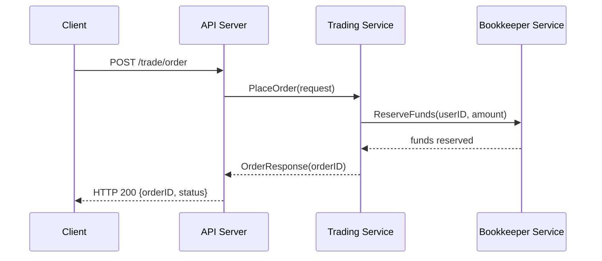
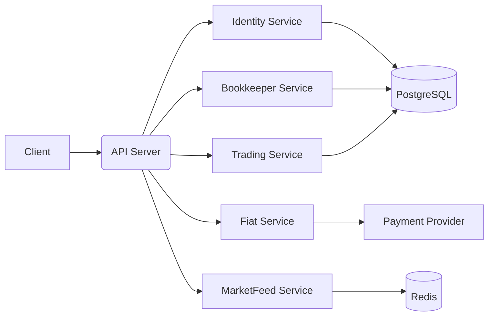

# Pincex Crypto Exchange - Technical Documentation

## Overview

This document provides technical documentation for the Pincex Crypto Exchange platform. It covers the architecture, components, and implementation details of the system.

## Architecture

The Pincex Crypto Exchange is built as a unified GoLang monorepo with a modular architecture. The system is designed to be scalable, maintainable, and high-performance, capable of handling thousands of transactions per second.

### Directory Structure

```plaintext
pincex/
├── cmd/
│   └── pincex/
│       └── main.go           # Main entry point
├── internal/
│   ├── bookkeeper/           # Account and transaction management
│   ├── config/               # Configuration management
│   ├── database/             # Database connections (PostgreSQL, Redis)
│   ├── fiat/                 # Fiat payment processing
│   ├── identities/           # User management and authentication
│   ├── marketfeeds/          # Market data processing
│   ├── server/               # HTTP server and API
│   └── trading/              # Trading engine and order book
├── pkg/
│   ├── logger/               # Logging utilities
│   └── models/               # Shared data models
├── .env.example              # Example environment variables
├── .github/                  # GitHub Actions workflows
├── Dockerfile                # Container definition
├── go.mod                    # Go module definition
├── go.sum                    # Go module checksums
└── README.md                 # Project documentation
```

## Sequence Diagrams



## Component Diagram



### Components

#### Main Application (cmd/pincex/main.go)

The main application is responsible for initializing and starting all services. It:

1. Loads configuration from environment variables
2. Sets up logging
3. Establishes database connections
4. Initializes all services
5. Starts the HTTP server
6. Handles graceful shutdown

#### Configuration (internal/config/config.go)

The configuration system uses Viper to load settings from environment variables and configuration files. It supports:

1. Environment-specific configurations
2. Sensible defaults
3. Validation of required settings
4. Hot reloading of certain settings

#### Database (internal/database)

The database package provides connections to PostgreSQL and Redis:

1. PostgreSQL is used for persistent storage of all data
2. Redis is used for caching and pub/sub messaging
3. Connection pooling is implemented for optimal performance
4. Automatic reconnection is supported

#### Identity Management (internal/identities)

The identity management service handles user accounts and authentication:

1. User registration and login
2. Password hashing and verification
3. Two-factor authentication (2FA)
4. JWT token generation and validation
5. KYC (Know Your Customer) integration
6. API key management

#### Bookkeeper (internal/bookkeeper)

The bookkeeper service manages user accounts and transactions:

1. Account creation and management
2. Balance tracking
3. Transaction processing
4. Locking and unlocking funds
5. Transfer between accounts
6. Transaction history

#### Fiat Payment Processing (internal/fiat)

The fiat payment service handles deposits and withdrawals:

1. Integration with payment providers (e.g., Stripe)
2. Deposit processing
3. Withdrawal management
4. Fee calculation
5. Transaction tracking

#### Market Feeds (internal/marketfeeds)

The market feeds service provides market data:

1. Real-time price updates
2. Historical price data
3. Order book snapshots
4. WebSocket streaming
5. Market summaries

#### Trading Engine (internal/trading)

The trading engine is the core of the exchange:

1. Order placement and management
2. Order matching algorithm
3. Order book maintenance
4. Trade execution
5. Fee calculation
6. Position tracking

#### HTTP Server (internal/server)

The HTTP server provides the API for the exchange:

1. RESTful API endpoints
2. WebSocket connections
3. Authentication middleware
4. Rate limiting
5. Error handling
6. Logging and monitoring

### Data Models (pkg/models)

The data models package defines the shared data structures used throughout the system:

1. User
2. Account
3. Transaction
4. Order
5. Trade
6. Market data
7. Deposits and withdrawals

## High-Performance Components

### Order Book

The order book implementation is optimized for high-performance trading:

1. Uses a hybrid approach with both HashMap and RadixTree for efficient order management
2. Provides O(1) lookups by order ID
3. Provides O(log n) lookups by price level
4. Thread-safe operations with mutex locking
5. Optimized for minimal memory allocation
6. Capable of handling thousands of orders per second

### Matching Engine

The matching engine is designed for high throughput:

1. Implements a price-time priority algorithm
2. Processes orders in microseconds
3. Supports multiple order types (limit, market, stop, etc.)
4. Handles partial fills and cancellations
5. Atomic transaction processing
6. Capable of 3,000-7,000 matches per second

## Database Schema

### Users Table

```sql
CREATE TABLE users (
    id UUID PRIMARY KEY,
    email VARCHAR(255) UNIQUE NOT NULL,
    username VARCHAR(255) UNIQUE NOT NULL,
    password_hash VARCHAR(255) NOT NULL,
    first_name VARCHAR(255),
    last_name VARCHAR(255),
    kyc_status VARCHAR(50) NOT NULL DEFAULT 'pending',
    two_fa_enabled BOOLEAN NOT NULL DEFAULT false,
    two_fa_secret VARCHAR(255),
    created_at TIMESTAMP NOT NULL,
    updated_at TIMESTAMP NOT NULL
);
```

### Accounts Table

```sql
CREATE TABLE accounts (
    id UUID PRIMARY KEY,
    user_id UUID NOT NULL REFERENCES users(id),
    currency VARCHAR(10) NOT NULL,
    balance DECIMAL(30, 8) NOT NULL DEFAULT 0,
    available DECIMAL(30, 8) NOT NULL DEFAULT 0,
    locked DECIMAL(30, 8) NOT NULL DEFAULT 0,
    created_at TIMESTAMP NOT NULL,
    updated_at TIMESTAMP NOT NULL,
    UNIQUE(user_id, currency)
);
```

### Transactions Table

```sql
CREATE TABLE transactions (
    id UUID PRIMARY KEY,
    user_id UUID NOT NULL REFERENCES users(id),
    type VARCHAR(50) NOT NULL,
    amount DECIMAL(30, 8) NOT NULL,
    currency VARCHAR(10) NOT NULL,
    status VARCHAR(50) NOT NULL,
    reference VARCHAR(255),
    description TEXT,
    created_at TIMESTAMP NOT NULL,
    updated_at TIMESTAMP NOT NULL
);
```

### Transaction Entries Table

```sql
CREATE TABLE transaction_entries (
    id UUID PRIMARY KEY,
    transaction_id UUID NOT NULL REFERENCES transactions(id),
    account_id UUID NOT NULL REFERENCES accounts(id),
    type VARCHAR(50) NOT NULL,
    amount DECIMAL(30, 8) NOT NULL,
    currency VARCHAR(10) NOT NULL,
    created_at TIMESTAMP NOT NULL,
    updated_at TIMESTAMP NOT NULL
);
```

### Trading Pairs Table

```sql
CREATE TABLE trading_pairs (
    id UUID PRIMARY KEY,
    symbol VARCHAR(20) UNIQUE NOT NULL,
    base_asset VARCHAR(10) NOT NULL,
    quote_asset VARCHAR(10) NOT NULL,
    min_quantity DECIMAL(30, 8) NOT NULL,
    max_quantity DECIMAL(30, 8) NOT NULL,
    price_precision INTEGER NOT NULL,
    quantity_precision INTEGER NOT NULL,
    status VARCHAR(20) NOT NULL DEFAULT 'active',
    created_at TIMESTAMP NOT NULL,
    updated_at TIMESTAMP NOT NULL
);
```

### Orders Table

```sql
CREATE TABLE orders (
    id UUID PRIMARY KEY,
    user_id UUID NOT NULL REFERENCES users(id),
    symbol VARCHAR(20) NOT NULL,
    side VARCHAR(10) NOT NULL,
    type VARCHAR(20) NOT NULL,
    price DECIMAL(30, 8),
    quantity DECIMAL(30, 8) NOT NULL,
    filled_quantity DECIMAL(30, 8) NOT NULL DEFAULT 0,
    status VARCHAR(20) NOT NULL,
    time_in_force VARCHAR(10) NOT NULL,
    created_at TIMESTAMP NOT NULL,
    updated_at TIMESTAMP NOT NULL
);
```

### Trades Table

```sql
CREATE TABLE trades (
    id UUID PRIMARY KEY,
    order_id UUID NOT NULL REFERENCES orders(id),
    counter_order_id UUID NOT NULL REFERENCES orders(id),
    user_id UUID NOT NULL REFERENCES users(id),
    counter_user_id UUID NOT NULL REFERENCES users(id),
    symbol VARCHAR(20) NOT NULL,
    side VARCHAR(10) NOT NULL,
    price DECIMAL(30, 8) NOT NULL,
    quantity DECIMAL(30, 8) NOT NULL,
    fee DECIMAL(30, 8) NOT NULL,
    fee_currency VARCHAR(10) NOT NULL,
    created_at TIMESTAMP NOT NULL
);
```

### Deposits Table

```sql
CREATE TABLE deposits (
    id UUID PRIMARY KEY,
    user_id UUID NOT NULL REFERENCES users(id),
    currency VARCHAR(10) NOT NULL,
    amount DECIMAL(30, 8) NOT NULL,
    status VARCHAR(20) NOT NULL,
    tx_hash VARCHAR(255),
    network VARCHAR(50) NOT NULL,
    transaction_id UUID REFERENCES transactions(id),
    created_at TIMESTAMP NOT NULL,
    updated_at TIMESTAMP NOT NULL
);
```

### Withdrawals Table

```sql
CREATE TABLE withdrawals (
    id UUID PRIMARY KEY,
    user_id UUID NOT NULL REFERENCES users(id),
    currency VARCHAR(10) NOT NULL,
    amount DECIMAL(30, 8) NOT NULL,
    fee DECIMAL(30, 8) NOT NULL,
    status VARCHAR(20) NOT NULL,
    transaction_id UUID REFERENCES transactions(id),
    address TEXT NOT NULL,
    network VARCHAR(50) NOT NULL,
    tx_hash VARCHAR(255),
    created_at TIMESTAMP NOT NULL,
    updated_at TIMESTAMP NOT NULL
);
```

### KYC Documents Table

```sql
CREATE TABLE kyc_documents (
    id UUID PRIMARY KEY,
    user_id UUID NOT NULL REFERENCES users(id),
    type VARCHAR(50) NOT NULL,
    status VARCHAR(20) NOT NULL DEFAULT 'pending',
    file_path TEXT NOT NULL,
    created_at TIMESTAMP NOT NULL,
    updated_at TIMESTAMP NOT NULL
);
```

### API Keys Table

```sql
CREATE TABLE api_keys (
    id UUID PRIMARY KEY,
    user_id UUID NOT NULL REFERENCES users(id),
    name VARCHAR(255) NOT NULL,
    key VARCHAR(255) UNIQUE NOT NULL,
    secret_hash VARCHAR(255) NOT NULL,
    permissions VARCHAR(255) NOT NULL,
    ip_whitelist TEXT,
    created_at TIMESTAMP NOT NULL,
    updated_at TIMESTAMP NOT NULL
);
```

## API Documentation

The API documentation is available in the [API.md](api.md) file.

## Deployment

### Docker

The platform can be deployed using Docker:

```bash
docker build -t pincex .
docker run -p 8080:8080 --env-file .env pincex
```

### Kubernetes

For production deployments, Kubernetes is recommended:

```yaml
apiVersion: apps/v1
kind: Deployment
metadata:
  name: pincex
spec:
  replicas: 3
  selector:
    matchLabels:
      app: pincex
  template:
    metadata:
      labels:
        app: pincex
    spec:
      containers:
      - name: pincex
        image: pincex:latest
        ports:
        - containerPort: 8080
        env:
        - name: PINCEX_DATABASE_DSN
          valueFrom:
            secretKeyRef:
              name: pincex-secrets
              key: database-dsn
        - name: PINCEX_REDIS_URL
          valueFrom:
            secretKeyRef:
              name: pincex-secrets
              key: redis-url
        - name: PINCEX_JWT_SECRET
          valueFrom:
            secretKeyRef:
              name: pincex-secrets
              key: jwt-secret
```

## Scaling

The platform is designed to scale horizontally:

1. The HTTP server can be scaled by adding more instances
2. The trading engine can be partitioned by trading pair
3. The database can be sharded by user or trading pair
4. Redis can be clustered for higher throughput

## Monitoring

The platform includes monitoring endpoints:

1. Health check endpoint at `/api/v1/health`
2. Prometheus metrics at `/metrics`
3. Structured logging with correlation IDs
4. Tracing with OpenTelemetry

## Security

Security measures implemented in the platform:

1. Password hashing with bcrypt
2. JWT tokens with short expiration
3. Two-factor authentication
4. API key authentication with IP whitelisting
5. Rate limiting
6. Input validation
7. SQL injection protection
8. CSRF protection
9. XSS protection
10. HTTPS enforcement

## Testing

The platform includes comprehensive tests:

1. Unit tests for all components
2. Integration tests for service interactions
3. End-to-end tests for API endpoints
4. Load tests for performance validation
5. Security tests for vulnerability detection

## Conclusion

The Pincex Crypto Exchange platform is a comprehensive, high-performance trading system capable of handling thousands of transactions per second. It is designed to be scalable, maintainable, and secure, making it suitable for production use.
